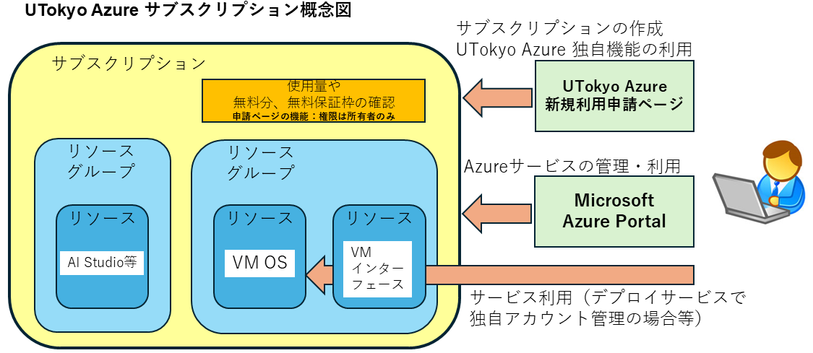

import HelpItem from "@components/utils/HelpItem.astro";

Microsoft Azureでは，**サブスクリプション**と呼ばれる単位でリソースや権限，使用量の集計などが分離されています．この範囲で利用者は様々なサービスを利用することができます．UTokyo Azureでは，申請者のUTokyo Accountが所有者として紐づけられた個別のサブスクリプションを作成し利用します．

{:.center.border}

#### 申請
- UTokyo Azure においては、サブスクリプションは[UTokyo Azure サブスクリプションポータル](https://utokyo-azure-web.japaneast.cloudapp.azure.com/)から申請することで作成されます．それ以外の方法で作成されたサブスクリプションでギフトを利用することはできません．
- UTokyo Azure のサブスクリプションを申請できるのは，ギフトを超過した場合に支払いが発生する可能性があるため，教職員のみとしております．
- 申請後に利用を開始できるようになるまで少し時間がかかります．サブスクリプションポータル上では準備中>設定中>作成完了とステータスが遷移し，作成完了と表示されてから数十分後に Azure Portal に表示されるようになりますので，それまでお待ちください．

#### 表示
- 作成されたサブスクリプションを Azure Portal から参照したステータスは，初期状態では以下のようなになります。
  - 特に，プランIDが`MS-AZR-0136P`，親管理グループが`GiftEAGroup`であることをご確認ください．
  - サブスクリプション名は変更が可能なので、利用するサービスによってはサブスクリプションIDを要求される場合があります．その場合ここに表示されるIDを指定してください．

{:.center.border}

#### 予算
- UTokyo Azure のサブスクリプションには，事前にギフトから一定額の予算が割り当て済みです．その枠内（**無料保証枠**）で自由に Azure のクラウドサービスを利用可能です．
  - Azure クラウドサービスの仕様や UTokyo Azure サポートの管理都合上，利用できないサービスがあります．
- 無料保証枠を超過した場合は，所定の期間毎にサブスクリプション単位で集計し不足分が請求されます．
- Azure Portal の標準機能には無料保証枠を超過した時点で利用を自動停止させる機能がありません．UTokyo Azure サブスクリプションポータルにてその機能を提供いたしますので，無料保証枠を超えたら自動で利用を停止したい場合は，サブスクリプションポータルで設定してください．
  - 一定時間毎の確認で無料保証枠を超えたことを検知し停止処理を行う都合上，無料保証枠を超える場合があります．超過した場合は支払が発生するのであらかじめご承知おきください．
  - 通知を行うだけであれば Azure Portal 標準に機能があります．細かく予算枠管理をしたい場合は Azure の標準機能を利用ください．
- その他，無料保証枠の詳細やギフトの残額，ギフト全体の利用状況等は，[UTokyo Azure サブスクリプション管理](https://utokyo-azure-web.japaneast.cloudapp.azure.com/list)のページに詳細がありますのでご参照ください．

#### 管理・権限
- サブスクリプションは Azure クラウドサービにおける，各ユーザーがサービスを利用する上での管理範囲になります．サブスクリプションの範囲で各種サービスを利用いただけます．
- 申請者のアカウントは、そのサブスクリプションに**所有者**権限として付加されます．
- 初期状態では，ご自身のアカウント以外に以下の権限が設定されています．**これらは本学と Microsoft との契約上必要な登録となり削除できません**ので，あらかじめご承知おきください．(下図参照)
  - 所有者：Azure Gift EA operator（全体用とサブスクリプション用と２つ設定されます）
  - セキュリティ管理者（情報システム本部 玉造准教授名で登録されています），ユーザー アクセス管理者，課金データ閲覧者
- サブスクリプションは共同管理が可能ですが，そのユーザーのアカウントを**共同作成者**としてサブスクリプションに権限付与する必要があります．付与手順の詳細は[FAQの権限付加の仕方](/src/pages/research_computing/utokyo_azure/faq/addrole)を参照ください．
- サブスクリプションに付与した権限は，そのサブスクリプションで作成されたリソースに継承されます．

{:.center.border}
