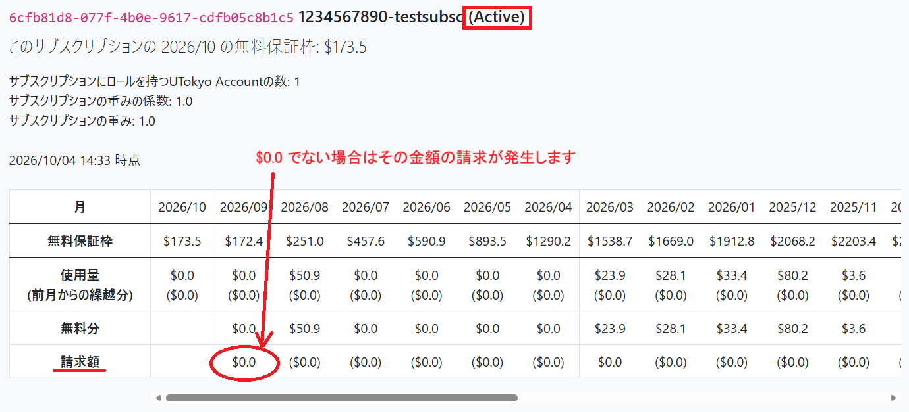
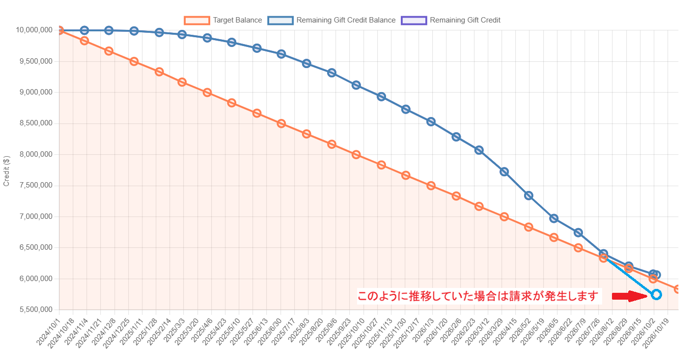
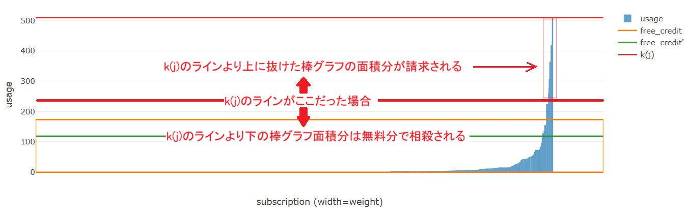

## 各サブスクリプションの請求額確認方法

1. [UTokyo Azure サブスクリプション管理サイト](https://azure.itc.u-tokyo.ac.jp/)にアクセスし，[**使用量タブ**](https://azure.itc.u-tokyo.ac.jp/list/usage)を開く．
2. **Active**なサブスクリプションで9月または3月時点での請求額が **$0.0 ではない場合**は，その金額を日本円に換算したもので翌月請求される．（下図参照）
- 9月及び3月以外の請求額はその月時点での暫定額で，9月及び3月の請求額が確定した請求額となる．

{:.center.border}

## UTokyo Azure 全体で請求が発生する条件とその確認方法

1. [UTokyo Azure サブスクリプション管理サイト](https://azure.itc.u-tokyo.ac.jp/)にアクセスし，[**UTokyo Azure 全体の使用量**](https://azure.itc.u-tokyo.ac.jp/list/whole-usage)タブを開く．
2. １つ目にある折れ線グラフにおいて，以下の条件となった場合に請求が発生する．
   - `Remaining Gift Credit Balance`の青い折れ線グラフが，`Target Balance`の橙のラインを下回った場合，超過額の多いサブスクリプションから順に請求が発生する．（下図参照）
  - 下回らなかった場合，UTokyo Azure 全体で請求は発生しない．

{:.center.border}

## UTokyo Azure 全体でどの程度のサブスクリプションに請求が発生しているかを確認する方法

1. [UTokyo Azure サブスクリプション管理サイト](https://azure.itc.u-tokyo.ac.jp/)にアクセスし，[**UTokyo Azure 全体の使用量**](https://azure.itc.u-tokyo.ac.jp/list/whole-usage)タブを開く．
2. ２つ目にある棒グラフにおいて，以下の条件となったサブスクリプションに請求が発生する．
  - k(j)の赤いラインより棒グラフが上側に突き出ている場合，突き出ている分についてそのサブスクリプションに請求が発生する．（下図参照）
  - 棒グラフ1本が1つのサブスクリプションと対応している．

{:.center.border}

**補足１**：[**UTokyo Azure 全体の使用量**](https://azure.itc.u-tokyo.ac.jp/list/whole-usage)タブの情報は，全体の推移を確認し今後請求が発生しそうかどうかの判断材料として公開している情報となります．具体的にどのサブスクリプションの利用量が多いか等の情報は開示しておりません．ご自身が管理しているサブスクリプションの情報は[**使用量**](https://azure.itc.u-tokyo.ac.jp/list/usage)タブから確認してください．

**補足２**：このページでは必要な説明のみ記載しています．各表やグラフの詳細な説明は以下のURLを参照ください．

  
・[UTokyo Azure 利用料金規則（学内のみアクセス可）](https://drive.google.com/file/d/129vmaJJmDqkUK0iOMOlkICYMWMw_ZiZL/view)

  
・[利用料金（の可能性）について](/events/2025-02-21/slides/2_possible_billing.pdf)

