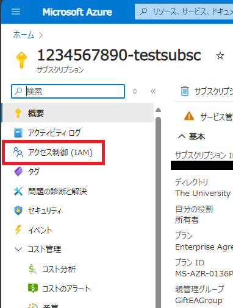
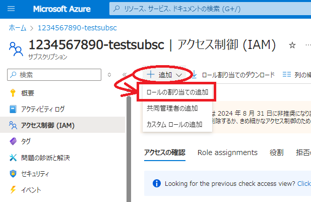
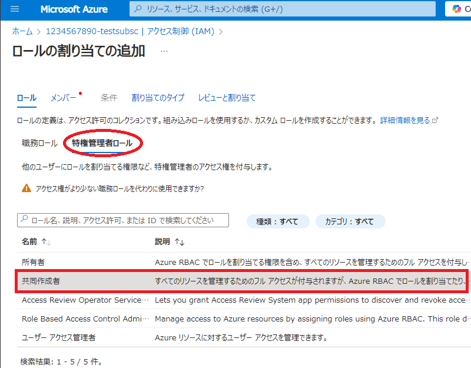
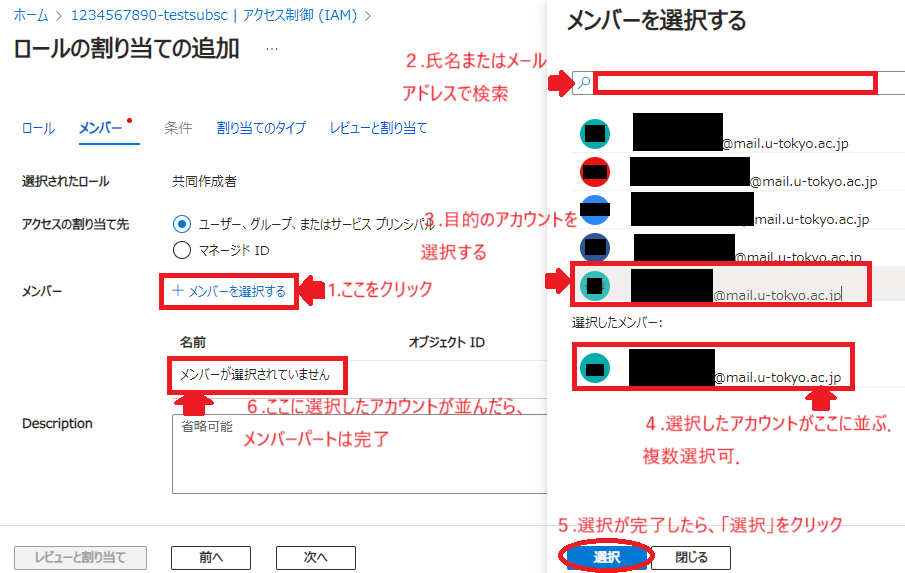
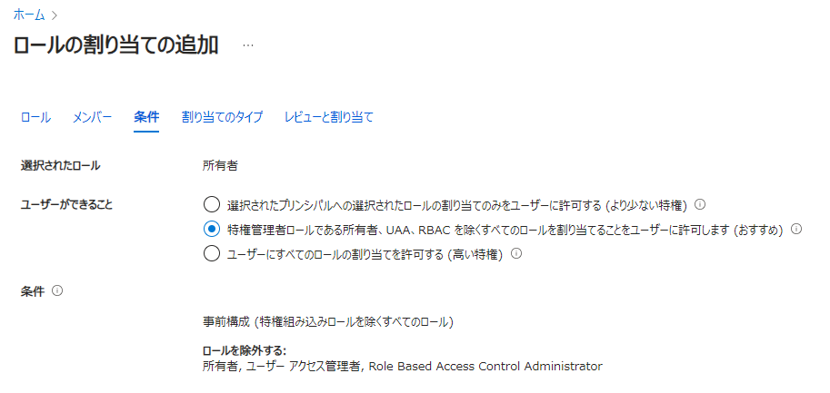
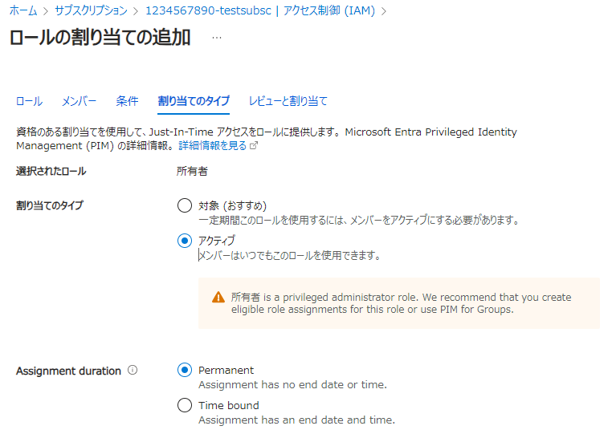
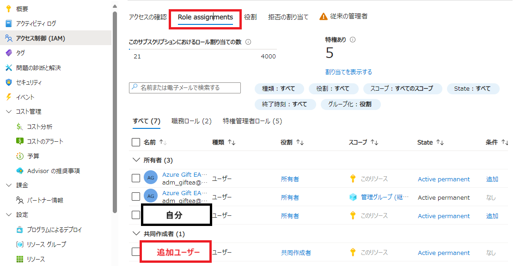

import HelpItem from "@components/utils/HelpItem.astro";

**サブスクリプション**や**リソース**(スコープ)を研究室のメンバーや共同研究者で共有したい場合は，代表者がサブスクリプションを申請し，そのサブスクリプションにメンバーを適切な権限（ロール）で追加することで共有することが可能になります．その際，どのリソースに，誰を，どのロールで割り当てるかで共有者ができることが変わってきます．

## 推奨されるロール割り当て

| 共有する相手  | 共有内容 | 割り当て先スコープ | 割り当てロール |
| ------------ | ------- | ---------------- | ------------- |
| 教員 | サブスクリプションを引き継ぐ | サブスクリプション | 所有者 |
| 主に教員 | 費用やユーザー管理も含めた共有 | サブスクリプション | 所有者 |
| 主に教員 | 費用やユーザー管理は含めない共有 | サブスクリプション | 共同作成者 |
| 主に学生 | 新規リソース構築も任せる | サブスクリプション | 共同作成者 |
| 主に学生 | 既存リソースの管理のみ任せる | リソースまたはリソースグループ | 共同作成者 |
| 教員・学生| デプロイしたサービスの利用のみ | (デプロイしたサービス) | (サービス内で別途権限付与) |

### 所有者と共同作成者の違い

所有者と共同作成者は，いずれも一般的には管理者権限と呼ばれる権限になりますが，主に以下の違いがあります．

- **所有者**：
  - (サブスクリプションへ割り当てた場合のみ) UTokyo Azure 新規申請ページにあるサブスクリプション管理ページにて，無料分や無料保証枠，現在の使用量などの閲覧が可能です．
  - Azure Portal の UI からサブスクリプションやリソースグループ等へ，共有したいユーザーを登録しロールを割り当てることが可能です．
- **共同作成者**：
  - 上記２つの権限が無い以外は所有者と同じ権限を有します．

## ロールの割り当て手順

以下の手順で各スコープにロールを割り当てます．ここでは**共同作成者**の手順を示しますが，**所有者**も同じ手順（一部追加手順あり）なので，所有者の割り当ての場合は読み替えてください．

#### １．Azure Portal のメイン画面から，権限を付与したい**サブスクリプション**または**リソース**をクリックしてください．
#### ２．画面左のリストから`アクセス制御(IAM)`をクリックしてください．

{:.center.border}

#### ３．メイン画面上部に表示された選択肢から`＋追加`をクリックし，`ロールの割り当ての追加`を選択して下さい．

{:.medium.center.border}

#### ４．以下の各パートを順に設定してください．

- ロールパート
  - `職務ロール`と`特権管理者ロール`の２つの選択があるので，`特権管理者ロール`を選択してください．
  - 画面下に選択できるロールが一覧で表示されるので，ここでは`共同作成者`をクリックしてください．
    - セル背景がグレーになれば選択できています．

{:.medium.center.border}

- メンバーパート
  - **選択されたロール**：ロールパートで選択したロールであることを確認してください．
  - **アクセスの割当先**：`ユーザー、グループまたはサービスプリンシパル`を選択してください．
  - **メンバー**：`＋メンバーを選択する`をクリックしてください，右側に権限を付与したいアカウントの検索・選択画面が現れるので，条件を絞って検索し権限を付与したいアカウントを見つけ出して選択してください．最後に選択画面下にある`選択`をクリックすると左のメイン画面に選択したメンバーが表示されます．
    - UTokyo Account 所持者のみ表示されます．
  - **Description**：必要に応じて説明を追加してください．

{:.medium.center.border}

<HelpItem lang="ja" type="details">
  <Fragment slot="problem">選択したいアカウントが見つからない</Fragment>
  <Fragment slot="solution">そのユーザーの UTokyo Account が存在している必要があります．検索可能な文字列は UTokyo Account に登録されている氏名またはメールアドレスです．検索文字列が正しいか確認下さい．あるいは，まだ UTokyo Account に登録されていない可能性がある場合は，そのユーザーに UTokyo Account 登録状況を確認いただいてください．</Fragment>
</HelpItem>

- （所有者のみ）条件パート
  - 所有者ロールの場合のみ，条件パートが挿入されます．
  - **ユーザーができること**：
    - 通常は`特権管理者ロールである所有者，UAA，RBACを除くすべてのロールを割り当てることをユーザーに許可します`を選択してください．
    - サブスクリプションを相手に引き継ぐ場合のみ`ユーザーにすべてのロールの割り当てを許可する`を選択してください．
    

{:.medium.center.border}

- 割り当てのタイプパート
  - **選択されたロール**：ロールパートで選択したロールであることを確認してください．
  - **割り当てのタイプ**：直接ロールを有効にする場合は`アクティブ`，ユーザーにロール割り当てを承認させる場合は`対象`を選択ください．`対象`を選んだ場合は，そのユーザー宛てに権限をアクティブにするかどうかのメールが送信され，それをユーザーが承認した後に権限が付加されます．
  - **Assingment Duration**：期限を設けない場合は`Permanent`，期限を設ける場合は`Time bound`を選択してください．
    - `対象`を選んだ場合は`Permanent`は選択できません．
  - **開始日時 終了日時**：期限を設ける選択をした場合は、具体的な期限を設定してください．

※以下の図は`アクティブ`で`Time bound`を選択した場合の例
{:.medium.center.border}

- レビューと割り当てパート
  - 内容を確認し，問題がなければ画面下にある`レビューと割り当て`をクリックしてください．

#### ５.権限が正しく付与されていることを確認してください．
  - 改めて手順の初めから第２項までを進め，`Role assignments`タブをクリックしてください．
  - 切り替わった画面に，追加したメンバーが正しいロールで追加されていることを確認してください．

{:.medium.center.border}
