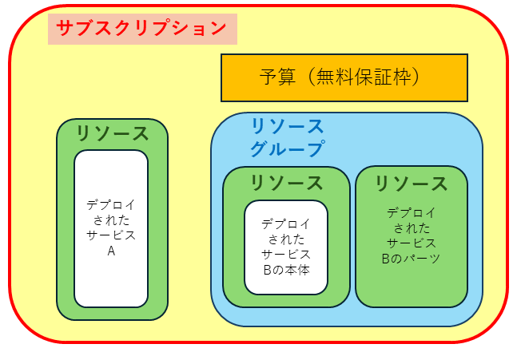

import HelpItem from "@components/utils/HelpItem.astro";

　**サブスクリプション**や**リソース**(スコープ)を研究室のメンバーや共同研究者で共有したい場合は，代表者がサブスクリプションを申請し，そのサブスクリプションにメンバーを適切な権限（ロール）で追加することで共有することが可能になります．

　また，どのリソースに，誰を，どのロールで割り当てるかで共有者ができることが変わってきます．

[権限の割り当て手順は，このリンク先を参照ください．](/research_computing/utokyo_azure/faq/addrole)

## ロールとメンバー（ロールベースアクセス制御：RBAC）

Microsoft Azure では，各スコープにアクセスできる権限を，どの権限（ロール）を，誰（メンバー）に割り当てるかで他のアカウントに権限を付与することができます．これをロールベースアクセス制御（RBAC）と呼び，この機能によって作成したサブスクリプションやリソースを共有します．

## 権限の継承

Microsoft Azure は上位スコープの権限を基本的に下位に継承します．具体的には下図のより内側のスコープはより外側のスコープの権限を継承します．権限は不可逆で，より外側へは継承しません．最上位スコープはサブスクリプションになります．

> 仮想マシン等，デプロイされたサービスについては権限継承の例外になる場合があります．

{:.medium.center.border}

## サブスクリプションに**所有者**ロールでメンバーを割り当てる．

**所有者**はフルアクセスの権限であり，初期設定ではサブスクリプションに申請者の UTokyo Account で割り当てられています．主な権限としては以下があります．

- 他のメンバーをサブスクリプションにロール割り当てをする．
  - ただし，所有者ロールをメンバーに割り当てる際の条件付けによっては，一部の権限が無い場合がある．
- UTokyo Azure 新規申請ページの管理ページで，そのサブスクリプションの詳細を表示する．
- そのサブスクリプションによる新しいサービスのリソースを作成する．
- **無料保証枠を超えた場合は，サブスクリプションに所有者ロールが割り当てられているメンバー宛てに請求がされます．**

基本的に，そのサブスクリプションを引き継ぐ用途以外では，サブスクリプションに他のメンバーを所有者権限で割り当てることは推奨されません．所有者権限が必要な場合は限定条件を割り当て時に選択するなど考慮ください．

## サブスクリプションに**共同作成者**ロールでメンバーを割り当てる．

**共同作成者**は，他のメンバーに権限を割り当てることができないこと以外は所有者とほぼ同じ権限を有します．通常，サブスクリプションを他のメンバーと共有する場合はこちらの権限を付与してください．

- **権限がある**
  - そのサブスクリプションによる新しいサービスのリソースを作成する．
- **権限がない**
  - 他のメンバーをサブスクリプションにロール割り当をする．
  - UTokyo Azure 新規申請ページの管理ページでサブスクリプションの詳細を表示する．

## リソースまたはリソースグループに**所有者**ロールでメンバーを割り当てる．

リソースに関してはフルアクセス権限が割り当てられます．以下のような権限になります．

- **権限がある**
  - 他のメンバーをリソースまたはリソースグループにロール割り当てをする．
    - ただし，所有者ロールをメンバーに割り当てる際の条件付けによっては，一部の権限が無い場合がある．
  - リソースグループの中に、新たなリソースを作成する．
    - 例：仮想マシンに新たなインターフェースを追加する，サブネットワークを新規リソースで追加する等．
- **権限がない**
  - 新しいサービスのリソースまたはリソースグループを作成する．

## リソースまたはリソースグループに**共同作成者**ロールでメンバーを割り当てる．

他のメンバーに権限を付与することができない以外は，所有者とほぼ同じ権限を有します．

- **権限がある**
  - リソースグループの中に、新たなリソースを作成する．
    - 例：仮想マシンに新たなインターフェースを追加する，サブネットワークを新規リソースで追加する等．
- **権限がない**
  - 他のメンバーをリソースまたはリソースグループにロール割り当てをする．
  - 新しいサービスのリソースを作成する．

## デプロイされたサービスの権限について

デプロイされたサービスには，Azure の権限継承が及ばない場合があります．

- 一例として，仮想マシンをデプロイした場合，その OS のシステムアカウントや管理権限は Azure サービスの権限は継承されず別管理となります．
- このようなサービスでメンバーをサービスにのみ追加したい場合は，Azure には設定せずデプロイしたサービスにのみアカウントや権限を設定してください．
