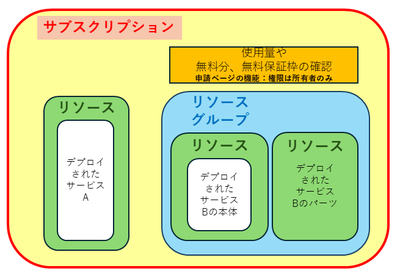

import HelpItem from "@components/utils/HelpItem.astro";

　**サブスクリプション**や**リソース**を研究室のメンバーや共同研究者で共有したい場合は，代表者がサブスクリプションを申請し，メンバーを追加することで共有することが可能になります．
　また，どのリソースに，誰を，どのロールで割り当てるかで共有者ができることが変わってきます．

## ロールとメンバー（ロールベースアクセス制御：RBAC）

Microsoft Azure では，サブスクリプションやリソースにアクセスできる権限を，誰に（メンバー），どの権限（ロール）を割り当てるかで他のアカウントに権限を付与することができます．これをロールベースアクセス制御（RBAC）と呼び，この機能によって作成したサブスクリプションやリソースを共有します．

## 権限の継承

Microsoft Azure は上位リソースの権限を基本的に下位に継承します．具体的には，下図のより内側のリソースはより外側のリソースの権限を継承します。最上位はサブスクリプションになります．

{:.medium.center.border}

## サブスクリプションに**所有者**ロールでメンバーを割り当てる．

**所有者**は最上位の権限であり，申請者と同じ権限が付与されます．主な権限としては以下があります．

- 他のメンバーをサブスクリプションにロール割り当てすることができます．
- UTokyo Azure 新規申請ページの管理ページで，そのサブスクリプションの詳細が表示されます．
- そのサブスクリプションによる新しいサービスのリソースを作成することができます．

基本的に，そのサブスクリプションを引き継ぐ用途以外では，サブスクリプションに他のメンバーを所有者権限で割り当てることは推奨されません．

## サブスクリプションに**共同作成者**ロールでメンバーを割り当てる．

**共同作成者**は，以下の権限が無いこと以外は所有者とほぼ同じ権限を有します．通常，サブスクリプションを他のメンバーと共有する場合はこちらの権限を付与してください．

- 他のメンバーをサブスクリプションにロール割り当てすることができません．
- UTokyo Azure 新規申請ページの管理ページでサブスクリプションの詳細が表示されません．

- そのサブスクリプションによる新しいサービスのリソースを作成することができます．

## リソースまたはリソースグループに**所有者**ロールでメンバーを割り当てる．

サブスクリプションに関する権限はありません．以下のような権限になります．

- 他のメンバーをリソースまたはリソースグループにロール割り当てすることができます．
- リソースグループの中に、新たなリソースを作成することができます．
  - 例：仮想マシンに新たなインターフェースを追加する，サブネットワークを新規リソースで追加する等

- 新しいサービスのリソースを作成することはできません．

## リソースまたはリソースグループに**共同作成者**ロールでメンバーを割り当てる．

他のメンバーに権限を付与することができない以外は，所有者とほぼ同じ権限を有します．

- リソースグループの中に、新たなリソースを作成することができます．
  - 例：仮想マシンに新たなインターフェースを追加する，サブネットワークを新規リソースで追加する等

- 他のメンバーをリソースまたはリソースグループにロール割り当てすることができません．
- 新しいサービスのリソースを作成することはできません．

<HelpItem lang="ja" type="details">
  <Fragment slot="problem">選択したいアカウントが見つからない</Fragment>
  <Fragment slot="solution">そのユーザーの UTokyo Account が存在している必要があります．検索文字列が正しいか確認下さい．あるいは，まだ UTokyo Account に登録されていない可能性がある場合は，そのユーザーに UTokyo Account 登録状況を確認いただいてください．</Fragment>
</HelpItem>

- 割り当てのタイプパート
  - **選択されたロール**：ロールパートで選択したロールであることを確認してください．
  - **割り当てのタイプ**：権限を与える期間をあらかじめ決めてある場合は`対象`を，期間を設けない場合は`アクティブ`を選択してください．
  - **Assingment Duration**：期限を設けない場合は`Permanent`，期限を設ける場合は`Time bound`を選択してください．
  - **開始日時 終了日時**：期限を設ける選択をした場合は、具体的な期限を設定してください．
- レビューと割り当てパート
  - 内容を確認し，問題がなければ画面下にある`レビューと割り当て`をクリックしてください．

#### ５.権限が正しく付与されていることを確認してください．
  - 改めて、このページの初めから第２項まで手順を進め，**このリソースへのアクセス権を表示します**にある`ビュー`をクリックしてください．
  - 切り替わった画面に，追加したメンバーが正しいロールで追加されていることを確認してください．
