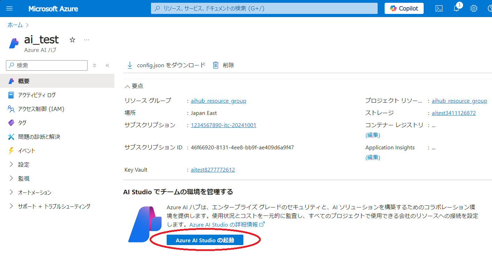
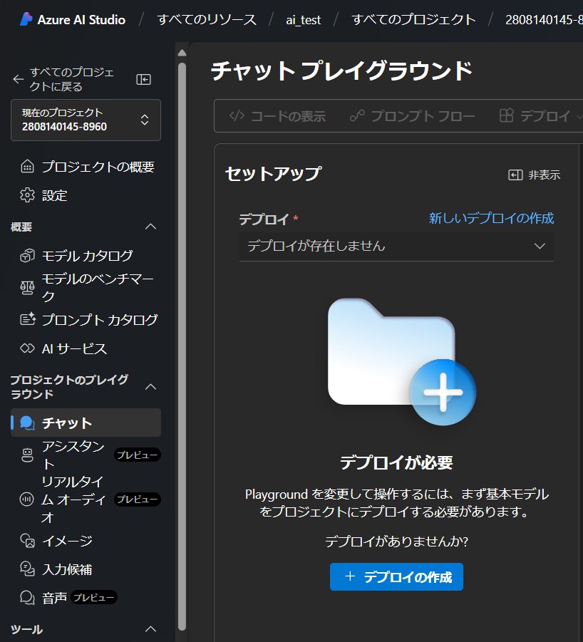

## 概要
{:#about}

Azure AI Studio を本サービスで利用する場合の初期手続き例です．

## １．サービスを選択する
{:#select_service}

- 事前に以下サイトよりサブスクリプションを申請してください．
  - 東京大学 Azureクラウド利用申請ページ(公開時にリンク) ※UTokyo Account 所持者のみアクセス可

- [Azure portal](https://potral.azure.com/)に[UTokyo Account](/utokyo_account/)でログインし、リソースの欄に申請したサブスクリプションがあることを確認してください．

- Azureサービスの一覧の中から`Azure AI Studio`を選択します．
    - 一覧に無い場合、一覧の右にある`その他のサービス`を選択、左側にあるリストから`AI + Machine Learning`を選択すると， 右側に表示されるメイン画面の`Azure AI + Machine Learning platforms`の中にあります．

{:.medium.center.border}

- Azure AI Studio のメインページが表示されたら，画面左上にある`＋作成`またはメイン画面にある`Azure AI の作成`をクリックします．

## ２．Azure AI ハブを構成する
{:#aihub}

> **補足**：説明のない項目は，基本的に初期設定のままで構成することを前提としています．

### 基本パート
{:#base}

#### 組織の詳細

- **サブスクリプション**：事前に申請したサブスクリプションがすでに設定されていますので、通常はそのままで問題ありません．複数のサブスクリプションをお持ちで、想定していないサブスクリプションが表示されている場合はプルダウンメニューから選択しなおしてください．ここを間違えると想定していない予算から支出することになりますので，よくご確認お願いします．
- **[リソースグループ](https://learn.microsoft.com/ja-jp/azure/azure-resource-manager/management/manage-resource-groups-portal)**：ここでは新規に`aihub_resource_group`というリソースグループ名で作成し，以下に作成される各リソースをまとめます．まとめられたリソースは，権限の継承や削除などを一括で対応することが可能となります．
- **リージョン**：AIハブをどの地域（リージョン）にあるデータセンターにデプロイするかを指定します．使いたい機能が特定の国のリージョンにしかない場合は，その国のリージョンを選択ください．パブリッククラウド上での情報管理に不安がある場合は日本国内（`Japan East` か`Japan West`）のリージョンを選択することも可能です．

#### インスタンスの詳細

- **名前**：リソースのポータルでの名称を設定します．ここでは`ai_test`としています．

{:.medium.center.border}

### ストレージパート
{:#storage}

初期設定のまま進めます．

{:.medium.center.border}

### ネットワークパート
{:#network}

初期設定のまま進めます．

### 暗号化パート
{:#encrypt}

初期設定のまま進めます．

### IDパート
{:#network}

初期設定のまま進めます．

### タグパート
{:#tag}

初期設定のまま進めます．

### 確認及び作成パート
{:#execute}

ポータルによる検証が成功したら，画面左下の`作成`ボタンをクリックし，しばらくしてデプロイが正常に完了しましたら，`リソースに移動`をクリックしてください．

{:.medium.center.border}

AI ハブ のトップページに遷移するので，`Azure AI Studioの起動`をクリックしてください．

{:.medium.center.border}

ここからは Azure AI Studio の環境で進めます．

## Azure AI Studio のプロジェクトにモデルをデプロイする

一例として GPT4 チャットモデルをデプロイします．

- トップページ画面左側のリストから，`チャット`を選択します．

{:.medium.center.border}

- メイン画面がセットアップになりますので，`＋デプロイを作成`をクリックしてください．

{:.medium.center.border}

- モデル選択画面になりますので，左側のリストから`gpt-4`を選択し，右下にある`確認`をクリックしてください．

{:.medium.center.border}

- 確認画面になるので，`デプロイ`をクリックしてください．

{:.medium.center.border}

- 下図のようなチャットプレイグランドが表示されたら完了です．
  - `デプロイ`をクリックしてからデプロイ完了まで時間がかかる場合があります．
  - 5分以上待っても変化がない場合は，ブラウザを再読み込みしてみてください．それでもチャットグランドが表示されない場合は，改めてデプロイしなおしてみてください．

{:.medium.center.border}

### 補足

- テキストボックスにメッセージを入力し，三角形をクリック（または「Enter」キーを押す）してモデルに送信します．画面右下のトークン数は，このメッセージのトークンとこのモデルのトークン制限を表します．一例として下図では，このメッセージを送信するには582トークンが使用され，全体のトークン制限は128000トークンです．画面左の**モデルに指示とコンテキストを与える**テキストボックスに「システムプロンプト」（またはGPTへの指示）を入力できます．

{:.medium.center.border}

> **注意**：GPTにメッセージを送信するたびに新しいメッセージと一緒にメッセージ履歴全体が送信され，トークンの消費量はその累積ベースで計算されます．
> 
> たとえば，これまでのメッセージと返信がそれぞれ2，5，1，7，11，1トークンで構成されている場合，新たに9トークンで構成されるメッセージを送信すると，この送信要求は実際には2+5+1+7+11+1+9=36トークンで構成されます．
> 
> この考え方で累積全体のトークン消費を計算すると，(2) + (2+5) + (2+5+1) + (2+5+1+7) + (2+5+1+7+11) + (2+5+1+7+11+1) + (2+5+1+7+11+1+9)=121 トークンとなります．
> 
> OpenAI が提供する ChatGPT アプリケーションとは異なり，Azure OpenAI サービスはトークンによって課金されるため，トークンの消費方法に注意してください．
