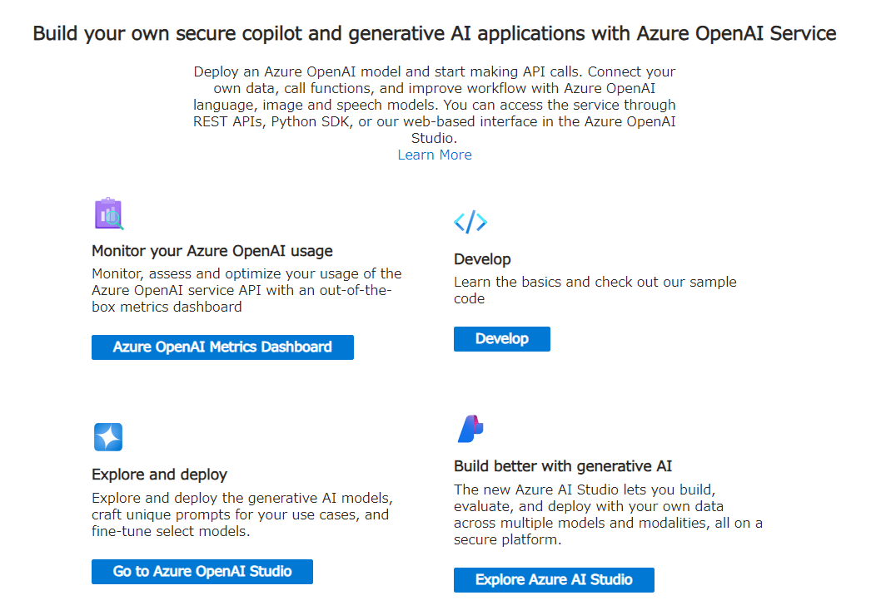

## 概要
{:#about}

Azure OpenAI Studio を本サービスで利用する場合の初期手続き例です．

## １．サービスを選択する
{:#select_service}

- 事前に以下サイトよりサブスクリプションを申請してください．
  - 東京大学 Azureクラウド利用申請ページ(公開時にリンク) ※UTokyo Account 所持者のみアクセス可

- [Azure portal](https://potral.azure.com/)に[UTokyo Account](/utokyo_account/)でログインし、リソースの欄に申請したサブスクリプションがあることを確認してください．

- Azureサービスの一覧の中から`Azure OpenAI Studio`を選択します．
    - 一覧に無い場合、一覧の右にある`その他のサービス`を選択、左側にあるリストから`AI + Machine Learning`を選択すると， 右側に表示されるメイン画面の`Azure AI サービス + API`の中にあります．

{:.medium.center.border}

- Azure OpenAI Studio のメインページが表示されたら，画面左上にある`＋作成`またはメイン画面にある`Azure OpenAI の作成`をクリックします．

## ２．Azure OpenAI のプロジェクトを構成する
{:#aihub}

> **補足**：説明のない項目は，基本的に初期設定のままで構成することを前提としています．

### 基本パート
{:#base}

#### プロジェクトの詳細

- **サブスクリプション**：事前に申請したサブスクリプションがすでに設定されていますので、通常はそのままで問題ありません．複数のサブスクリプションをお持ちで、想定していないサブスクリプションが表示されている場合はプルダウンメニューから選択しなおしてください．ここを間違えると想定していない予算から支出することになりますので，よくご確認お願いします．
- **リソースグループ**：個々のパーツをそれぞれ独立したリソースとして管理するため，同じポリシーで構成されるリソースはリソースグループでまとめて一括管理します．ここでは新規に`openai_resource_group`というリソースグループ名で作成し，そこに以下作成される各リソースをまとめます．

#### インスタンスの詳細

- **リージョン**：AIハブをどの地域（リージョン）にあるデータセンターにデプロイするかを指定します．通常は日本国内（`Japan East` か`Japan West`）のリージョンを選択してください．
- **名前**：リソースのポータルでの名称を設定します．ここでは`openai-utokyoazure-test`としています．
- **価格レベル**：`Standard S0`を選択してください．

{:.medium.center.border}

### ネットワークパート
{:#network}

初期設定(すべて許可) のまま進めます．

### タグパート
{:#tag}

初期設定のまま進めます．

### 確認及び作成パート
{:#execute}

ポータルによる検証が成功したら，画面左下の`作成`ボタンをクリックし，しばらくしてデプロイが正常に完了しましたら，`リソースに移動`をクリックしてください．

{:.medium.center.border}

Azure OpenAI Studio のトップページに遷移するので，`Go to Azure OpenAI Studio`をクリックしてください．

{:.medium.center.border}

## ３．Azure OpenAI Studio でモデルをデプロイする
{:#aistudioproject}

- Azure OpenAI Sutdio に遷移すると，以下のような画面になりますので`＋新しいプロジェクト`をクリックしてください．

{:.medium.center.border}

- プロジェクト名の入力を促されますので，わかりやすい命名で入力し，`プロジェクトを作成する`をクリックしてください．
  - ここでは初期値のまま進めます．

{:.medium.center.border}

- 元の画面に，作成したプロジェクトが表示されたら作成完了です．

{:.medium.center.border}

以下，作成したプロジェクトでのモデル利用例です．

### [モデルをデプロイする](/research_computing/utokyo_azure/openai/gpt4)
### [クォータを管理する](/research_computing/utokyo_azure/openai/quota)
### [Python API で利用する](/research_computing/utokyo_azure/openai/python)
