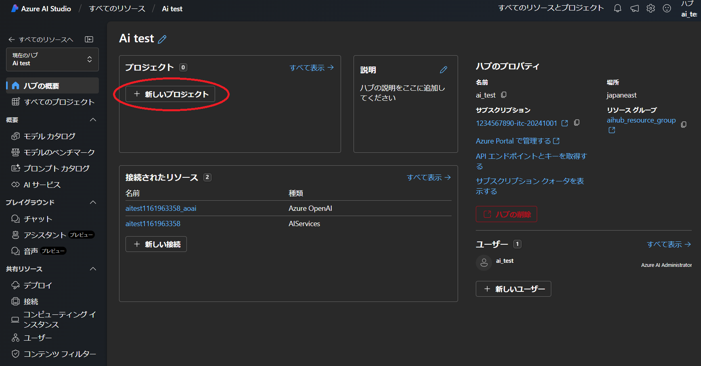

## 概要
{:#about}

Azure AI Studio (https://ai.azure.com/) を本サービスで利用する場合の初期手続き例です．

## １．サービスを選択する
{:#select_service}

- 事前に以下サイトよりサブスクリプションを申請してください．
  - 東京大学 Azureクラウド利用申請ページ(公開時にリンク) ※UTokyo Account 所持者のみアクセス可

- [Azure portal](https://potral.azure.com/)に[UTokyo Account](/utokyo_account)でログインし、リソースの欄に申請したサブスクリプションがあることを確認してください．

- Azureサービスの一覧の中から`Azure AI Studio`を選択します．
    - 一覧に無い場合、一覧の右にある`その他のサービス`を選択、左側にあるリストから`AI + Machine Learning`を選択すると， 右側に表示されるメイン画面の`Azure AI + Machine Learning platform`の中にあります．

{:.medium.center.border}

- Azure AI Studio のメインページが表示されたら，画面左上にある`＋New Azure AI hub`をクリックします．

## ２．Azure AI ハブを構成する
{:#aihub}

**補足**：説明のない項目は，基本的に初期設定のままで構成することを前提としています．

### 基本パート
{:#base}

#### 組織

- **サブスクリプション**：事前に申請したサブスクリプションがすでに設定されていますので、通常はそのままで問題ありません．複数のサブスクリプションをお持ちで、想定していないサブスクリプションが表示されている場合はプルダウンメニューから選択しなおしてください．ここを間違えると想定していない予算から支出することになりますので，よくご確認お願いします．
- **リソースグループ**：個々のパーツをそれぞれ独立したリソースとして管理するため，同じポリシーで構成されるリソースはリソースグループでまとめて一括管理します．ここでは新規に`aihub_resource_group`というリソースグループ名で作成し，そこに以下作成される各リソースをまとめます．
- **リージョン**：AIハブをどの地域（リージョン）にあるデータセンターにデプロイするかを指定します．海外のリージョンを選択することは情報保護上のリスクが発生するので，通常は`Japan East` か`Japan West`を選択してください．

#### リソースの詳細

- **名前**：リソースのポータルでの名称を設定します．ここでは`ai_test`としています．

{:.medium.center.border}

### ストレージパート
{:#storage}

リソース名を基に新規設定が自動入力されていますのでそのまま進めます．

{:.medium.center.border}

### ネットワークパート
{:#network}

初期設定(`パブリック`) のまま進めます．

### 暗号化パート
{:#encryption}

初期設定のまま進めます．

### IDパート
{:#id}

初期設定のまま進めます．

### タグパート
{:#tag}

初期設定のまま進めます．

### 確認及び作成パート
{:#execute}

ポータルによる検証が成功したら，画面左下の`作成`ボタンをクリックし，しばらくしてデプロイが正常に完了しましたら，`リソー スに移動`をクリックしてください．

{:.medium.center.border}

AIハブのリソースに移動しますので，`Azure AI Studioの起動`をクリックしてください．ここからは[Azure AI Studio](https://ai.azure.com/)のサイトに移動して進みます．

{:.medium.center.border}

## ３．Azure AI Studio でプロジェクトを作成する
{:#aistudioproject}

- Azure AI Sutdio に遷移すると，以下のような画面になりますので`＋新しいプロジェクト`をクリックしてください．

{:.medium.center.border}

- プロジェクト名の入力を促されますので，わかりやすい命名で入力し，`プロジェクトを作成する`をクリックしてください．
  - ここでは初期値のまま進めます．

{:.medium.center.border}

- 元の画面に，作成したプロジェクトが表示されたら作成完了です．

{:.medium.center.border}

以下，作成したプロジェクトでのモデル利用例です．

### [モデルをデプロイする](openai/gpt4)
### [クォータを管理する](openai/quota)
### [Python API で利用する](openai/python)
