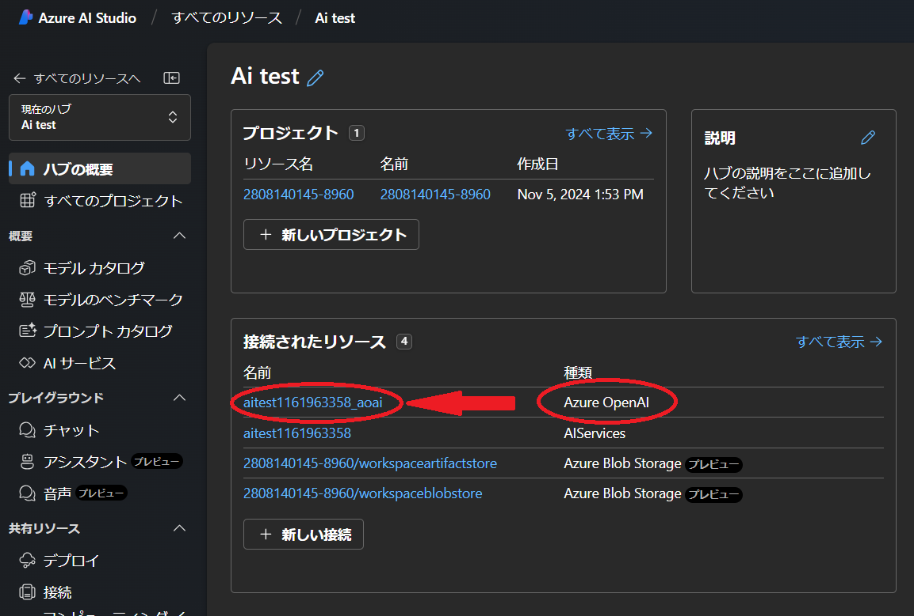
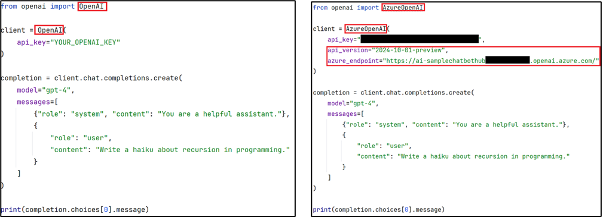

## デプロイしたモデルを Python API で利用する

Azure OpenAI サービスは、OpenAI が提供する Python クライアントと互換性があります．ただし，いくつかの構成が必要です．OpenAI がホストするサービスを使用するには API キーのみで利用可能ですが，Azure AI Studio にデプロイしたモデルを使用するには，API キーに加えて AI ハブへのエンドポイントが必要です．

#### Azure AI Studio の場合
- Azure AI Studio の**AI ハブ概要**のページに移動します．
- **接続されたリソース**の中から，**種類**が**Azure OpenAI**のリソースをクリックします．

{:.medium.center.border}
- 表示されたリソース詳細から，`ターゲット`と`APIキー`をコピーしてメモ帳などにメモしてください．

{:.medium.center.border}

#### Azure OpenAI Studio の場合
- Azure OpenAI Studio のトップページに API キーがあります．

**参考**：[Microsoft Learn:Azure OpenAI API preview lifecycle](https://learn.microsoft.com/en-us/azure/ai-services/openai/api-version-deprecation)で、現在の API バージョンを確認できます。

- ご自身の Python 環境で，openai パッケージをインストールしてください．
  - ``pip install openai`` 等

- Python でコーディングします．以下はコーディングの一例で，左が OpenAI クラスを利用した場合，右が Azure 互換の OpenAI を利用した場合です．
  - クラス名を，Azure OpenAI Studo の場合 `OpenAI` を、Azure AI Studio の場合 `AzureOpenAI` を選択する．
  - コンストラクター パラメーターとして`api_version`と`azure_endpoints`が提供されます．エンドポイントの指定が必要な場合はパラメータを設定してください．

{:.medium.center.border}
