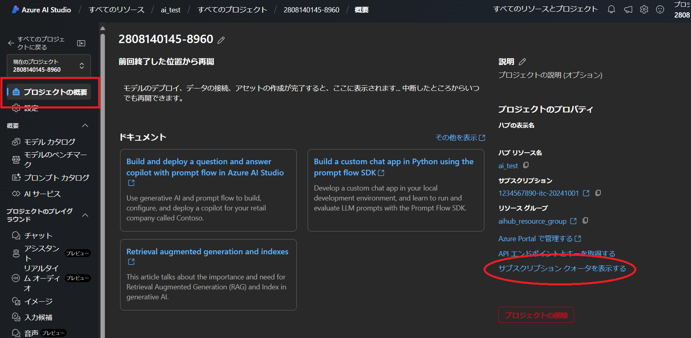

## クォータの管理

**クォータ**とは，各モデルが処理できるトークンの最大数であり，Azure OpenAI サービスのレート制限を表します．この制限を超えるとエラーが発生する可能性があります．そうなった場合は，1 分あたりのトークンが**クールダウン**するのを待つか，クォータ値の増加をリクエストしてください．

- **注意**：
  - この手続きは自動承認ではなく，Microsoft Azure チームにリクエストを送信して承認を得る流れになります．
  - すべてのプロセスが完了するまでに数日かかる場合があります．
  - Microsoft Azure チームからリクエスト内容に対する問い合わせのメールがくる場合がありますので，メールを常にチェックしつつ問い合わせがあった場合は必要な回答を行ってください．

- **プロジェクトの概要**から`サブスクリプション クォータを表示する`をクリックしてください．

{:.medium.center.border}

**注意**：初期状態では，デプロイしていないモデルも含めてすべてのモデルツリーが表示されます．自分がデプロイしているモデルだけを表示するようにさせたい場合は，`すべてのクォータを表示する`スイッチをOFFにしてください．

{:.medium.center.border}

本ページの例では以下のような表示になります．

{:.medium.center.border}

- **Azure OpenAI Service: Request for Quota Increase**のページに遷移するので，必要な項目を入力してください．

**注意**：サブスクリプションIDはサブスクリプション名では**ありません**．ご自身のサブスクリプションIDの確認方法はこちらを参照ください．
