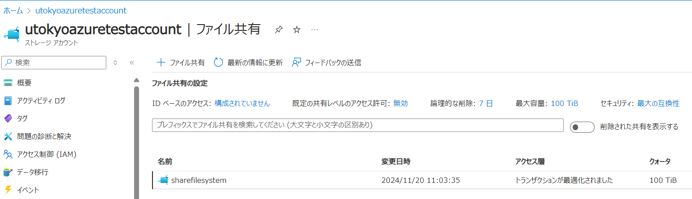
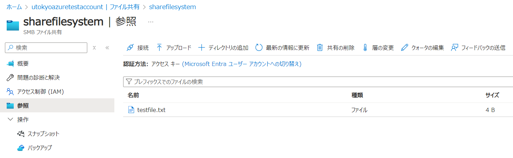
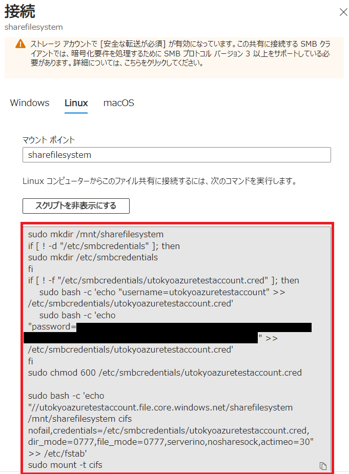
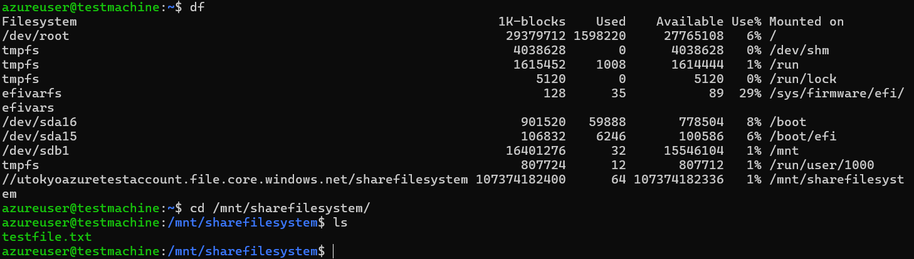

import HelpItem from "@components/utils/HelpItem.astro";

## 概要
{:#about}

Network File System (NFS) や Server Message Block (SMB) などのネットワークファイルシステムを利用する手順です．

## ストレージアカウントの作成 
{:#storage_account}

[Azure Blob Storage](/research_computing/utokyo_azure/storage/) と同じ手順です．そちらを参照ください．

## 共有フォルダの作成
{:#access}

1. 作成したストレージアカウントの概要で，左側にあるリストから`データストレージ > ファイル共有`を選択してください．
2. メイン画面左上の`＋ファイル共有`をクリックして，新しい共有フォルダを作成します．
  - **名前**：適当な共有フォルダ名を入力ください．
  - **バックアップの有効化**：チェックを外して構いません．
3. 最後に`作成`をクリックすると作成されます． 

{:.medium.center.border}

## 共有フォルダへのアクセスとファイル作成

1. ストレージアカウントの概要で，左側にあるリストから`データストレージ > ファイル共有`を選択してください．
2. 作成した共有フォルダ名をクリックしてください．
3. 画面左の機能リストから，`参照`をクリックしてください．
4. メイン画面上部にある`アップロード`をクリックして，アップロードしたいファイルをアップロードしてください．
  - `ディレクトリの追加`をすることで，フォルダを作成することも可能です．

{:.medium.center.border}

## リモートからのマウント

UTokyo Azure で作成した仮想マシンからネットワークファイルシステムとしてリモートマウントできます．

1. リモートマウントしたい共有フォルダを選択してください．
2. 画面上部にある`接続`をクリックしてください．
3. 左側に別窓が現れ、`Windows` `Linux` `macOS` のいずれからマウントをするか選択します．ここでは`Linux`の想定で進めます．
4. `スクリプトの表示`というボタンがあるのでクリックしてください．
5. そのスクリプトの内容をコピーし，マウントしたい仮想マシン側の作業アカウントでスクリプトを作成してください．

{:.medium.center.border}

- 上記スクリプトを実行すると，自動的に選択した共有フォルダがマウントされます．

{:.medium.center.border}
