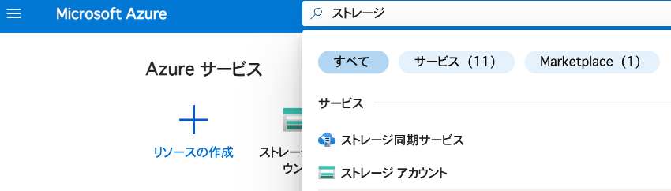
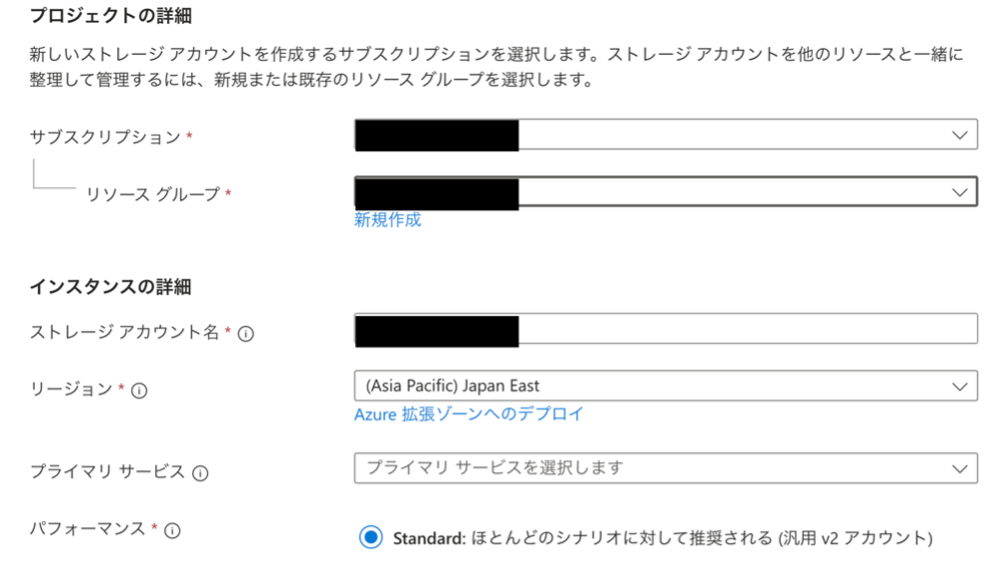
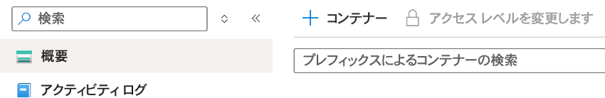

import HelpItem from "@components/utils/HelpItem.astro";

## 概要
{:#about}

Microsoft Azureのサービスの一つであるAzure Blob Storage上に大容量データを保存し，手元のブラウザや計算機からアクセスする手順を説明します．使用量あたりの料金は[こちら](https://azure.microsoft.com/ja-jp/pricing/details/storage/blobs/)を参考にしてください．

## １．ストレージアカウントの作成 
{:#storage_account}

> **補足**：説明のない項目は，基本的に初期設定のままで構成することを前提としています．

- 事前に以下サイトよりサブスクリプションを申請してください．
  - 東京大学 Azureクラウド利用申請ページ(公開時にリンク) ※UTokyo Account 所持者のみアクセス可


- [Azure portal](https://potral.azure.com/)に[UTokyo Account](/utokyo_account)でログインし，リソースの欄に申請したサブスクリプションがあることを確認してください．


- Azureサービスの検索で“ストレージ”と検索すると表示される，`ストレージアカウント`を選択します．

{:.medium.center.border}


- 適切なサブスクリプション，リソースグループを選択し，ストレージアカウント名を入力します．

{:.medium.center.border}


- `次へ`を押して詳細を設定します．特に，「詳細」や「ネットワーク接続」はセキュリティに関わる項目があるため十分に注意して設定してください． 

- 最後に`作成`を押すと数分でストレージアカウントが作成されます．

## ２．手元の計算機等からのアクセス 
{:#access}

### コンテナーの作成（*この操作はPython等で自動化可能です。例えば[こちら](https://learn.microsoft.com/ja-jp/azure/storage/blobs/storage-quickstart-blobs-python?tabs=managed-identity%2Croles-azure-portal%2Csign-in-azure-cli&pivots=blob-storage-quickstart-scratch/)）

ファイルシステムのディレクトリに相当する，コンテナーを作成します． 

ブラウザのAzureトップページから「ストレージアカウント」=>「上で作成したストレージアカウント」=>「概要」=> 「Blob service」へアクセスします． 

{:.medium.center.border}

`+コンテナー`からコンテナーを作成します．

### データのアップロード/ダウンロード 

ブラウザ上で作成したコンテナーを選択し，`アップロード`からファイルをアップロード可能です．ダウンロードはファイル名の右端の`…`から可能です．

Python等を使って，手元の計算機から直接アップロードすることも可能です．以下はPythonを用いる場合です． 

- 必要なライブラリのインストール 
  - `$pip install azure-storage-blob azure-identity`


- アクセスキーの取得 
  ブラウザ上で作成したストレージアカウントへアクセスし，左端のメニューから`アクセスキー`を選択，キーをメモしておきます．アクセスキーは厳重に管理してください．


- Pythonによるアクセス 
  取得したアクセスキーによる認証で，ローカルのファイルをアップロード可能です．以下はサンプルです． 


```
import os 
from azure.identity import DefaultAzureCredential 
from azure.storage.blob import BlobServiceClient, ContainerClient, BlobBlock, BlobClient, StandardBlobTier 

account_url = "https://<Paste-Your-Storage-Account-Name>.blob.core.windows.net" 

access_key = "<Paste-Access-Key-For-Your-Storage-Account>" 

# Create the BlobServiceClient object 
blob_service_client = BlobServiceClient(account_url, credential=access_key) 

def upload_blob_file(blob_service_client: BlobServiceClient, container_name: str): 
    container_client = blob_service_client.get_container_client(container=container_name) 
    filepath = "<Paste-Your-File-Path>" 
    filename = "<Paste-Your-File-Name>" 
    with open(file=os.path.join(filepath, filename), mode="rb") as data: 
        blob_client = container_client.upload_blob(name=filename, data=data, overwrite=True) 
container_name = "<Paste-Your-Container-Name>" 
upload_blob_file(blob_service_client,container_name) 
```

- Pythonを用いたデータのダウンロードやファイル一覧の表示，コンテナーの作成などのより高度な利用方法，Python以外の言語の利用に関しては[こちら](https://learn.microsoft.com/ja-jp/azure/storage/blobs/)を参照してください．
