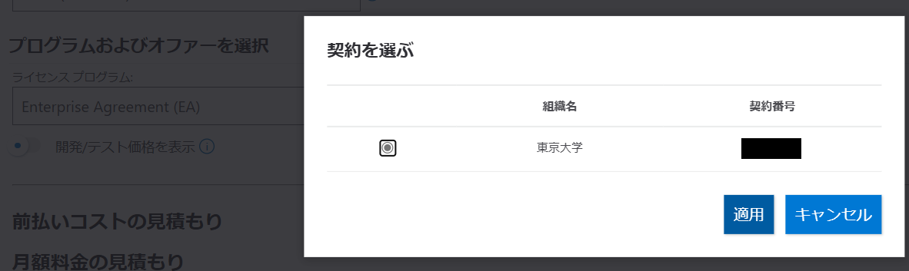
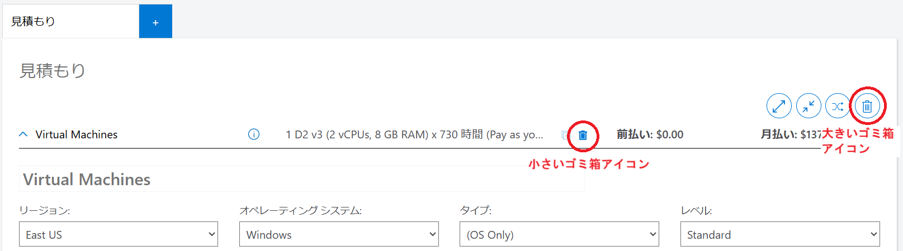

Microsoft Azure では，各サービスでどのくらいの使用料がかかるかを大まかに見積もることができる料金計算ツールが用意されています．できるだけ無料保証枠を超えないようにサービスを利用するために事前に料金がどのくらいかかりそうかを計算したい場合や，サービスを利用していて想定以上に利用料金がかかったため原因確認のために検算したい等の用途でご利用ください．ここでは，料金計算ツールを UTokyo Azure のサービスで利用する場合の手順や注意点を説明します．
- [Microsoft Azure 料金計算ツール](https://azure.microsoft.com/ja-jp/pricing/calculator/)

## 事前準備

※ **この手順は必ずしも実施しなくても構いません**．東大のEA契約として厳密に計算したい場合は実施してください．スキップする場合は次の**利用手順**に進んでください．

- UTokyo Account でログインしてください．これは最後にある`プログラムおよびオファーを選択`で EA 契約を選択するための準備になります．
- 仮想マシンなどの適当なサービスを選択して，追加された見積もりシートの一番下にある`プログラムおよびオファーを選択`で，`Enterprise Agreement`を選択してください．
- 東京大学の Agreement かどうかの確認が表示されるので，`適用`してください．

{:.medium.center.border}

- 価格データが追加されるまで時間がかかりますので，表示された画面ではそのまま何もせずお待ちください．通常数分程度で終わります．
- 計算機マークが消えたら完了ですので，次の手順に進んでください．

## 利用手順

**事前準備**で既に適当なサービスを選択していた場合は，先にその項目を削除しておいてください．

1. `製品`タブが選択されていることを確認してください．
2. 検索ボックス(Search Products)に，計算したいサービス名またはキーワードを入力してください．
3. 表示された中に計算したいサービスがありましたら，そのサービスをクリックしてください．見た目には何も起きませんが，画面下にスクロールすると`見積もり`の下に選択したサービスが追加されています．
  - 連打すると連打した分追加されます．余計に追加してしまった場合は，追加項目の一番上の真ん中あたりにある`小さいゴミ箱アイコン`をクリックすると，その項目のみを削除できます．なお，右上にある`大きなゴミ箱アイコン`をクリックすると，追加されている全項目をまとめて削除できます．

{:.medium.center.border}

4. 追加された項目に，利用予定の情報を入力すれば，料金を見積もることが可能です．

## 注意点

どのサービスの計算でも共通となる注意点は以下の通りです．

- 支払方法が選択できる場合，UTokyo Azure では従量課金しか利用できないので，**従量課金以外は選択しないでください**．
- 全体の最後でサポート及びライセンスの入力がありますが．通常は以下が初期値となっていてそのままで問題ありません．もし違う選択になっていましたら選択しなおしてください．
  - サポート：Basic
  - プログラムおよびオファーを選択：
    - 事前準備を実施していた場合：Enterprise Agreement （既に選択状態になっています）
    - 事前準備をスキップした場合：Microsoft Customer Agreement(MCA)
- サービス選択の際，サービス名では表示されないケースがあります（Azure AI Foundry 等）．その場合は，サービス名ではなくそのサービスで行う予定の機能等キーワードで検索してみてください．
