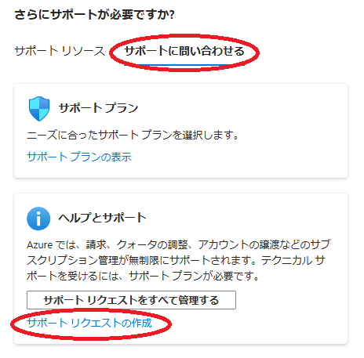
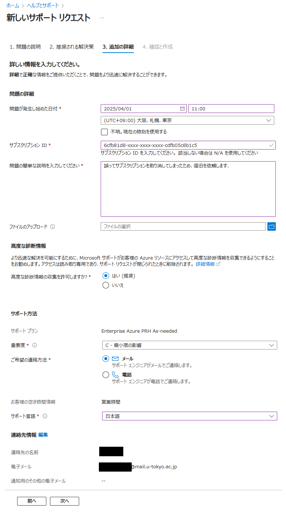

## 概要
{:#about}

Microsoft Azure の各サービスに関する詳細は Azure のサポートリクエストを活用してください，Microsoft の担当者に対応いただ けます．

## １．サービスを選択する
{:#select_service}

- Azureサービスの一覧の中から`ヘルプとサポート`を選択します．
    - 一覧に無い場合，一覧の右にある`その他のサービス`を選択，現れたページの左側リストから`全般`を選択すると，右側に表示されるメイン画面の**Help and support**の中にあります．

{:.medium.center.border}

- ヘルプとサポートのメインページが表示されたら，`サポートリクエストの作成`をクリックします．

{:.medium.center.border}

## ２．問い合わせ内容を入力する
{:#request}

Azureのサポートは，入力された問い合わせから内容を切り分け，サポートリソースから該当すると思われるドキュメントやヘルプサ イトをまず提案します，いずれの対応でも解決しなかった場合に最終的にリクエストを作成しMicrosoftの担当者に問い合わせます．

- テキストボックスに問い合わせ内容の簡単な説明を入力してください．どのサービスを使って，どの段階で何が起きたかをなるべく簡潔に入力の上，`移動`ボタンをクリックしてください．

- 入力内容から類推されるサービス名がサジェストされるので，該当するサービスを選択してください．

{:.medium.center.border}

- 問い合わせる事象が発生した`Subscription`及び`Resource`を選択してください．リソースを作成する前に発生した問題の場合は，`全般的な質問`を選択してください．

{:.medium.center.border}

- `Next`をクリックするとサポートリソースが表示されるので，これらを検索して問題が解決するかどうか確認してください．
- 解決しなかった場合は`サポートに問い合わせる`のタブをクリックし，下部にある`サポートリクエストの作成`をクリックしてください．

{:.medium.center.border}

## ３．サポートリクエストを作成する

サポートリソースの検索で解決しなかった場合は，サポートリクエストを作成してMicrosoftに問い合わせます．

### 問題の説明
- 前項までの入力から，ある程度自動入力されます．必須項目で足りてない項目は入力または選択してください

{:.medium.center.border}

### 推奨される解決策
- ヘルプシステム側から解決の提案がある場合はここで表示されます．解決しなかった場合は戻って先に進んでください．

### 追加の詳細

問い合わせ内容の詳細を入力してください．

- **問題が発生したのはいつですか**：ある程度発生時期がわかる場合は入力してください．不明な場合は`不明，現在の時刻を使用 する`にチェックを入れてください．
- **説明**：問い合わせ内容の詳細を入力してください．
- **ファイルのアップロード**：状況を補足できる画像（ハードコピー等）やファイル等がありましたら添付してください．
- **高度な診断情報**：Microsoftの担当者にご自身の環境への特権アクセスを許可する場合は`はい`を選択してください．より解決 しやすくなります．
- **重要度**：Microsoftの担当者へこの問い合わせの重要度を通知します．サブスクリプションのレベルによって選択できる重要度 に制限があります．不明点の質問など通常の問い合わせは`C`を，障害等で緊急度が高い場合は`B`を選択してください．
- **ご希望の連絡方法**：通常は`メール`を選択し，障害で対応を急ぎたい場合等は`電話`を選択ください．
- **サポート言語**：問い合わせのやり取りに希望する言語を選択してください．

その他の項目は正しいことを確認ください．

{:.medium.center.border}

リクエスト作成が完了し`作成`をクリックすると完了します．

## ４．リクエストの管理

作成後のリクエストの管理は**ヘルプとサポート**のトップページにこれまでに作成したリクエストの一覧が並びますので，管理したいリクエストをクリックすると，進行状況を確認できます．

{:.medium.center.border}

> **状態**が`オープン`である間は，問い合わせ者またはMicrosoftのいずれかでまだ未解決事項がある状態です．問題が解決しましたら`クローズ`になりますが，このステータスはMicrosoft側で操作するため，ご自身の認識と合ってない場合は担当者に確認ください．
