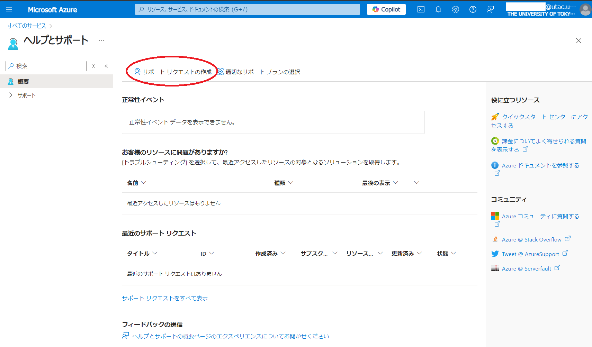
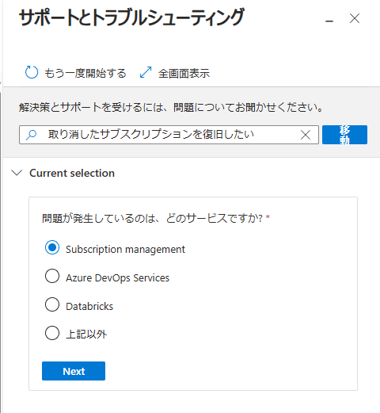
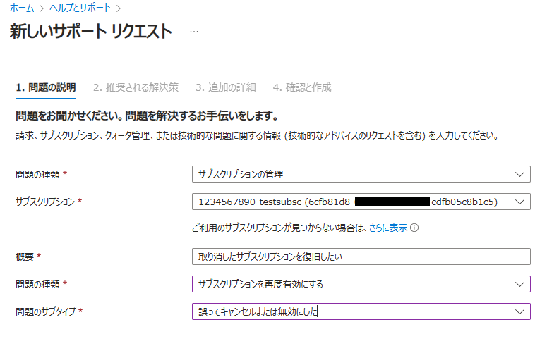

2025.09 更新

Microsoft Azure の UTokyo Azure との契約の再確認が行われ，UTokyo Azure の利用者（所有者権限ユーザー含む）から起票ができるサービスリクエストの内容に認識の齟齬が確認されたため，本ページの内容が更新されております．ご注意ください．

## 概要
{:#about}

~~誤ってサブスクリプションを取り消してしまった場合，UTokyo Azure 担当では復旧対応ができません．Microsoft の担当者にサポートリクエストを送って復旧を依頼してください．また，クォータ要求の依頼も同様にリクエストを送って依頼ください．~~

UTokyo Azure 利用者から起票できるサービスリクエストの範囲と，起票の仕方を説明しています．

## UTokoy Azure における利用者プランと、利用者が起票できるサービスリクエスト範囲

- UTokyo Azure で作成されるサブスクリプションは Basic プランとして作成されます。ご自身のサブスクリプションのプランが何に該当するかは，以下の Azure のページにアクセスして確認ください．
  - [Azure Portal: ヘルプとサポート｜サポートプラン](https://portal.azure.com/#view/Microsoft_Azure_Support/HelpAndSupportBlade/~/supportPlans)
- UTokyo Azure における Basic プランの場合，サービスリクエストを起票できるのは以下の図の通りになります．

{:.medium.center.border}

- 一般的な契約の場合と一部内容が異なります．
- サポートリクエストの起票は，所有者の権限を持つアカウントからのみ可能です．
- UTokyo Azure は Microsoft 社から直接利用者へ請求を行ないませんので，**請求に関しては UTokyo Azure サポート担当にお問い合わせいただき，ここから起票して問い合わせないようお願いします．**
  - サービス価格に関する問い合わせは可能です．
- **不具合や技術的な問い合わせは推奨される対応策の提示までになります．**サービスリクエストの起票はできませんので，さらに詳細に問い合わせたい場合は，UTokyo Salck に用意された UTokyo Azure 関連のチャネルや utelecon サービス窓口，Microsoft が用意するコミュニティーなどをご活用ください．

## サービスリクエストの起票

### １．サービスを選択する
{:#select_service}

- Azureサービスの一覧の中から`ヘルプとサポート`を選択します．
    - 一覧に無い場合，画面上部にある検索欄から検索するか，一覧の右にある`その他のサービス`を選択，現れたページの左側リストから`全般`を選択すると，右側に表示されるメイン画面の**Help and support**の中にあります．

{:.medium.center.border}

- ヘルプとサポートのメインページが表示されたら，`サポートリクエストの作成`をクリックします．

{:.medium.center.border}

### ２．問い合わせ内容を入力する
{:#request}

Azureのサポートは，入力された問い合わせから内容を切り分け，サポートリソースから該当すると思われるドキュメントやヘルプサイトをまず提案します．いずれの対応でも解決しなかった場合に最終的にリクエストを作成しMicrosoftの担当者に問い合わせます．

- テキストボックスに問い合わせ内容の簡単な説明を入力してください．どのサービスを使って，どの段階で何が起きたかをなるべく簡潔に入力の上，`移動`ボタンをクリックしてください．

- 入力内容から類推されるサービス名がサジェストされるので，該当するサービスを選択してください．

{:.medium.center.border}

- 問い合わせる事象が発生した`Subscription`及び`Resource`等を選択してください．リソースを作成する前に発生した問題の場合は，`全般的な質問`を選択してください．ここは、選択したサービス等によって選択肢等が変化します．

{:.medium.center.border}

- `Next`をクリックするとサポートリソースが表示されるので，これらを検索して問題が解決するかどうか確認してください．
- 解決しなかった場合は`サポートに問い合わせる`のタブをクリックし，下部にある`サポートリクエストの作成`をクリックしてください．

{:.medium.center.border}

### ３．サポートリクエストを作成する

サポートリソースの検索で解決しなかった場合は，サポートリクエストを作成してMicrosoftに問い合わせます．

#### 問題の説明
- 前項までの入力から，ある程度自動入力されます．必須項目で足りてない項目は入力または選択してください．

・**無料分や無料保証枠など請求に関する問い合わせは Microsoft にはリクエストせず，UTokyo Azure 担当までお願いします．** サービスにかかる価格等の問い合わせをリクエストすることは問題ありません．

・「技術」を選択した場合は，「推奨される解決策」の提示までになります．リクエストは作成できませんのであらかじめご承知ください．

{:.medium.center.border}

#### 推奨される解決策
- ヘルプシステム側から解決の提案がある場合はここで表示されます．解決しなかった場合は`サポートリクエストに戻る`をクリックして戻り，先に進んでください．
- *問題の説明*で`技術`を選んだ場合はここまでになります．

#### 追加の詳細

問い合わせ内容の詳細を入力してください．

- **問題が発生したのはいつですか**：ある程度発生時期がわかる場合は入力してください．不明な場合は`不明，現在の時刻を使用する`にチェックを入れてください．
- **説明**：問い合わせ内容の詳細を入力してください．
- **ファイルのアップロード**：状況を補足できる画像（ハードコピー等）やファイル等がありましたら添付してください．
- **高度な診断情報**：Microsoftの担当者にご自身の環境への特権アクセスを許可する場合は`はい`を選択してください．より解決しやすくなります．
- **重要度**：Microsoftの担当者へこの問い合わせの重要度を通知します．サブスクリプションのレベルによって選択できる重要度に制限があります．通常は`C`を選択してください．
- **ご希望の連絡方法**：通常は`メール`を選択してください．
- **サポート言語**：問い合わせのやり取りに希望する言語を選択してください．

その他の項目は，内容が正しいことを確認ください．

{:.medium.center.border}

リクエスト作成が完了し`作成`をクリックすると完了します．

### ４．リクエストの管理

作成後のリクエストの管理は**ヘルプとサポート**のトップページにこれまでに作成したリクエストの一覧が並びますので，管理したいリクエストをクリックすると，進行状況を確認できます．

{:.medium.center.border}

**状態**が`オープン`である間は，問い合わせ者またはMicrosoftのいずれかでまだ未解決事項がある状態です．問題が解決しましたら`クローズ`になりますが，最終的なステータスはMicrosoft側で操作するため，ご自身の認識と合ってない場合は担当者に確認ください．

