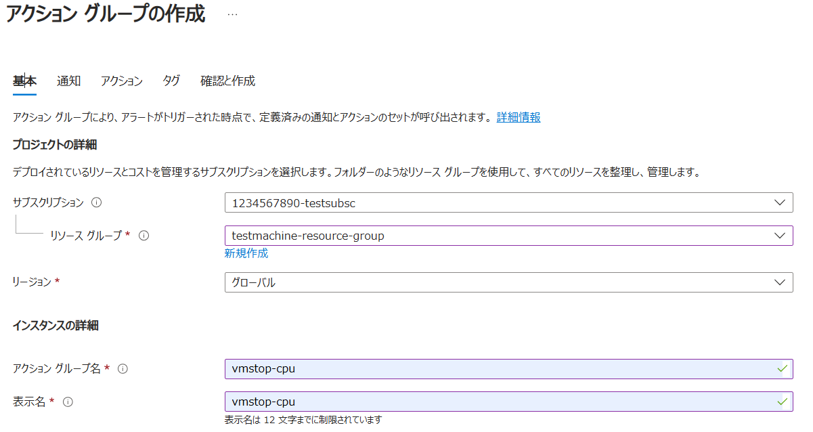

import HelpItem from "@components/utils/HelpItem.astro";

仮想マシンは起動させているだけで使用料を消費し続ける仕様となっており，特に多くの資源を必要とするAIサービスでは数日放置するだけで無料保証枠を使い切る可能性もあります．
それを防止するためには利用をしていない間は仮想マシンを停止させておく必要がありますが，うっかり停め忘れると気が付いたら無料保証枠を使い切り，自動停止を無効にし忘れていた場合はサブスクリプションごと全て削除されてしまいます．

ここでは，そのようなことにならないよう，CPU使用率が一定期間一定値以下だった場合に，自動的に仮想マシンをシャットダウンさせる設定例を紹介します．

無料保証枠の約9割を使うと自動的にサブスクリプションを削除する自動停止機能と混同しないようにご注意ください．このページでは，特に明示しない限り仮想マシンの停止はシャットダウンと呼称します．

## 概要

この設定例では，主に３つのサービスで構成されます．
- 自動シャットダウンさせる対象．ここでは[Virtual Machines](/research_computing/utokyo_azure/virtualmachine/)や[Azure Machine Learning](/research_computing/utokyo_azure/ai/aml)，[Azure AI Studio](/research_computing/utokyo_azure/ai/azureai)で作成したVMを想定しています．
  - Azure Machine Laearning は独自のidle停止機能を持っています．細かい条件でシャットダウンさせたい場合はこちらの手順を利用ください．
- 自動シャットダウンさせる対象を監視するサービス（Azure Moniter）
- 仮想マシンのシャットダウンを自動化するサービス（Automation アカウント）

{:.center.border}

### 補足
- この例では，自動シャットダウンさせる仮想マシンのリソースとして以下のものが事前に用意されているものとします．
  - リソースグループ名：testmachine-resource-group
  - リソース名：testmachine
  - デプロイしたOS：ubuntu OS
- Azure Moniter 及び Automation アカウントも，この例では testmachine-resource-group 内に設定します．

## １.自動化の構成（Automation アカウント）

### Automation アカウントの作成 
- Azureサービスの一覧の中から`Automation アカウント`を選択し，`Automation アカウントの作成`をクリックします
- 一覧に無い場合、画面上部にある検索欄で検索するか，一覧の右にある`その他のサービス`を選択、左側にあるリストから`Management and governance`を選択すると，右側に表示されるメイン画面の`Azure のガバナンスと最適化`の中にあります．

{:.medium.center.border}

### 各パートの設定
- `基本`パート
  - **サブスクリプション**：自動シャットダウン対象の仮想マシンが所属しているサブスクリプションを設定してください．
  - **[リソースグループ](https://learn.microsoft.com/ja-jp/azure/azure-resource-manager/management/manage-resource-groups-portal)**：ここでは既存のリソースグループ`testmachine-resource-group`を指定します．
  - **Automation アカウント名**：自由に命名してください．ここでは`utokyoazure-automation`としています．
  - **地域**：どのリージョンに設定するかを指定します．どのリージョンでも動作はしますが，基本的に自動シャットダウン対象の仮想マシンと同じリージョンにしてください．
 
{:.medium.center.border}

- `詳細設定`，`ネットワーク`，`タグ`の各パート
  - 初期設定のまま進めますが，以下の設定になっていることを確認ください．
    - 詳細設定：マネージドIDで`システム割り当て`にチェックが入っており有効化されること．
    - ネットワーク：`パブリックアクセス`が選択されていること．

- `確認及び作成`パート
  - 検証に成功と表示され，内容に間違いがなければ`作成`をクリックしてください．

- デプロイが正常に成功しましたら、`リソースに移動`します．

### automation アカウントに仮想マシンへのアクセス権限を設定する

- automationアカウントのトップページで，画面左側にある一覧から`アクセス権限`>`ID` を選択する．
- システム割り当てのアクセス許可から`Azureロールの割り当て`をクリックする．

{:.medium.center.border}

- 遷移した先で，サブスクリプションの選択が正しいことを確認し，`＋ロール割り当ての追加（プレビュー）`をクリックする．
- 追加された窓で，以下の通り設定する．
  - **スコープ**：`リソースグループ`を選択
  - **サブスクリプション**：現在作業中のサブスクリプションであることを確認
  - **リソースグループ**：現在作業中のサブスクリプションを選択
  - **役割**：`仮想マシン共同作成者`を選択
- 最後に`保存`をクリックし，登録されたら完了

{:.medium.center.border}

### パブリックアクセスを有効化する

前項のネットワークパートで`パブリックアクセス`を選択していた場合，作成された Automation アカウントのパブリックアクセスが無効化されていると実行に失敗するため，有効化します．

- automationアカウントのトップページで，画面左にある一覧から`アカウント設定`>`ネットワーク`と選択し，パブリックネットワークアクセスが`無効化`だった場合，`有効化`に切り替える．

{:.center.border}

## ２.監視の構成（Azure Monitor）

### アラートの作成
- Azureサービスの一覧の中から`監視`を選択し，画面左側の一覧から`アラート`を選択，さらに画面上部に表示された中から`アラートルール` > `作成`と進みます．
- 一覧に無い場合、画面上部にある検索欄で検索するか，一覧の右にある`その他のサービス`を選択、左側にあるリストから`モニター`を選択すると，右側に表示されるメイン画面の`監視ツール`の中にあります．

{:.medium.center.border}

### アラートルールの作成

- `スコープ`パート
  - どのスコープが監視対象かを選択します．ここでは`testmachine`を選択します．
  - `選択されたリソース`に監視対象のリソースが選択されていることを確認の上、`適用`をクリックしてください．

{:.center.border}

- `条件`パート
  - **シグナル名**：監視するステータスを選択します．ここではCPU使用率を監視するので、`Percentage CPU`を選択します．ここで追加の選択肢が表示されます．
  - **しきい値の種類**：`Static`を選択します．
  - **集計の種類**：`平均`を選択します．
  - **値は**：`次の値より小さい`または`次の値以下`を選択します．
  - **しきい値**：ご自身の環境によって選択してください．ここでは例として`5%`として設定します．
  - **確認する感覚**：監視の間隔を設定します．ここでは`5分`で設定します．
  - **ルックバック期間**：判定する期間を設定します．ここで設定した期間の平均がしきい値以下であればアラートがトリガーされます．ここでは`1時間`とします．

<HelpItem lang="ja" type="details">
  <Fragment slot="problem">ルール設定の考え方</Fragment>
  <Fragment slot="solution">
仮想マシンはバックグラウンドでも動作しているため，あまり低いCPU使用率を閾値として設定するといつまでも条件にヒットしません．かといって高すぎると常時ヒットしてしまい，コンソール作業中等でも問答無用でシャットダウンされるようになってしまいます．条件パート画面では，画面右側に過去６時間（初期設定）の監視結果のグラフが表示されます．また，AI等の計算を実行している時は常に100%に近いCPU使用率になります．それらを参考にしきい値を決めてください．

この例では 5% 以下が１時間継続した場合としましたが，簡単に自動シャットダウンがかかってほしくない場合はCPU使用率を低く設定するか，ルックバック期間を長めに設定するなどしてください．逆に計算以外の作業はしないのでできるだけ節約したい場合は，CPU使用率を数十パーセントに設定しルックバック期間も短めにすると，CPU使用率が落ち着いたらすぐにシャットダウンするようになります．
</Fragment>
</HelpItem>

{:.center.border}

- `アクション`パート
- ここで，アラートがトリガーされた場合に何を実行するかを定義する**アクショングループ**作成がインタラプトされます．
  - `基本`パート
    - **サブスクリプション**：自動シャットダウン対象の仮想マシンが所属しているサブスクリプションを設定してください．
    - **[リソースグループ](https://learn.microsoft.com/ja-jp/azure/azure-resource-manager/management/manage-resource-groups-portal)**：ここでは既存のリソースグループ`testmachine-resource-group`を指定します．
    - **リージョン**：グローバルのままで構いません．
    - **アクショングループ名，表示名**：自由に設定ください．ここでは両方とも`vmstop-cpu`とします．

{:.center.border}

  - `通知`パート
    - ここでは初期状態のままで進めます．
    - シャットダウンの際にメール通知も行いたい場合はここで宛先等を設定します．

  - `アクション`パート
    - **アクションタイプ、名前**：`Automation Runbook`を選択してください．画面右側に設定項目が表示されるので，以下の通り設定します．名前は自由に設定ください．
      - **Runbookソース**：`ビルトイン`を選択します．
      - **Runbook**：`StopVM`を選択して下さい．
      - **サブスクリプション**：項目が追加されるので，Runbook を作成した Automation アカウントを作成したサブスクリプションを選択してください．
      - **Automation アカウント**：項目が追加されるので，Runbook を作成した Automation アカウントを選択してください．
    
 {:.center.border}

  - `作成と確認`パート
    - 検証に成功して内容に問題が無ければ`作成`をクリックしてください．

ここでアラートルールの作成に戻ります．`アクション`パートに，今作成したアクショングループがリストされていることを確認ください．

- `詳細`パート
  - **重大度**：`3.情報`のままで問題ありません．
  - **アラートルール名**：監視リソース名になります．自由に設定可能ですがここでは`idle-cpu`とします．
  - **アラートルールの説明**：必要に応じて説明を記載ください．
 
 {:.center.border}

- `確認及び作成`パートで内容に問題なければ`作成`をクリックします．

この時点から監視が有効になり，アラートの条件がそろった場合に Runbook が実行され対象の仮想マシンがシャットダウンされます．

## ３．動作確認

想定通り動作しない場合は，以下の項目をチェックしてください．

#### アクティビティログ
- アラートルール，アクショングループ，Runbook，automationアカウントや仮想マシンの各リソーストップページ画面左側一覧の，およそ上から２番目，概要の下にあります．起動したはずの時間帯にログが残っていることを確認ください．

#### 履歴
- アラートルールのトップページ画面左側一覧にあります．トリガーされた場合履歴に残るので，トリガーされたはずの時間に履歴が残っていることを確認ください．

#### 手動による動作確認
- アクショングループはトップページ画面上部にある`テスト`から，アラートルールに関係なく手動で起動させることができます．実行して仮想マシンがシャットダウンされるかどうか確認ください．
