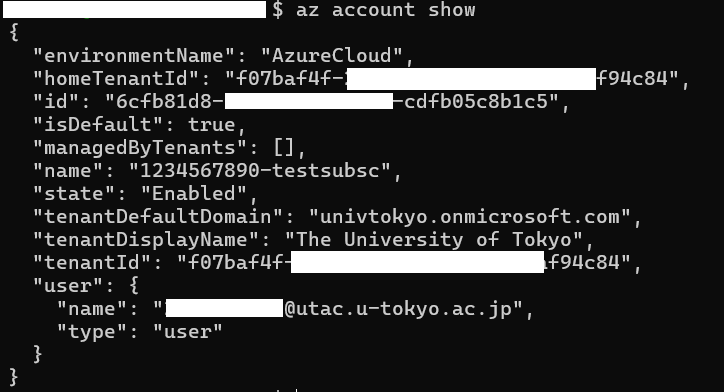

## 概要

Microsoft Azure には、リソースへのリモートからのアクセスや操作をターミナルコマンドラインから行うことができる Azure CLI というサービスが用意されています．
このページでは，Azure CLI を利用する準備手順を説明します．

## Azure CLI のインストール

1. Azure CLI は，さまざまなOSプラットフォームでパッケージマネージャーから容易にインストールすることができるようになっています．以下のリンクからご自身の環境にあう方法でインストールしてください．

　※ 以下のリンクはいずれも Microsoft Learn のドキュメントへの外部リンクです．

- [Windows Powershell](https://learn.microsoft.com/ja-jp/cli/azure/install-azure-cli-windows?pivots=winget)
- [Mac OS](https://learn.microsoft.com/ja-jp/cli/azure/install-azure-cli-macos)
- [Debian 系 Linux(ubuntu等)](https://learn.microsoft.com/ja-jp/cli/azure/install-azure-cli-linux?pivots=apt)
- [Redhat 系 Linux(CentOS等)](https://learn.microsoft.com/ja-jp/cli/azure/install-azure-cli-linux?pivots=dnf)
- [その他のプラットフォーム等](https://learn.microsoft.com/ja-jp/cli/azure/install-azure-cli)

2. "az" というコマンドが使えるようになりますので，ターミナルからバージョン情報を出力してみて以下のような出力が得られたらインストール完了です．

```
$ az version
{
  "azure-cli": "2.71.0",
  "azure-cli-core": "2.71.0",
  "azure-cli-telemetry": "1.1.0",
  "extensions": {
    "ssh": "2.0.6"
  }
}
```

## UTokyo Account で事前に認証する

UTokyo Azure サービスで利用するためには，あらかじめ UTokyo Account で事前に認証された状態にしておく必要があります．

### 通常の手順

1. ターミナルを立ち上げ，`az login`を実行する．
2. UTokyo Account のログイン画面がポップアップするので，UTokyo Azure で利用しているアカウントを選択する．
3. ログインに成功すると，紐づいているサブスクリプション名やID，テナント名の確認用出力がされるので，そのままでよければそのままエンターキーを押下し，別のサブスクリプションを操作したい場合は

{:.medium.center.border}

4. `az account show`コマンドを実行し，選択したサブスクリプションの情報が出力されればログイン成功．

{:.medium.center.border}

- もし選択したサブスクリプションが間違っていたら，以下のコマンドで変更が可能．
`az account set -s <サブスクリプション名かID>`

### ログイン画面がポップアップしない環境の場合

Linux 環境等で，そのままではポップアップされない環境の場合，別途ブラウザを立ち上げて認証する手順となります．

1. ターミナルを立ち上げ，`az login --use-device-code`を実行する．
2. 別途ブラウザを立ち上げて，前項のコマンド実行で出力された URL にアクセスする．
3. デバイスコードの入力を促されるので、同じく出力されたコードを入力する．
4. UTokyo Account のログイン画面に遷移するので，以降は**通常の手順の2.以降**と同じ手順を行う．

{:.medium.center.border}
