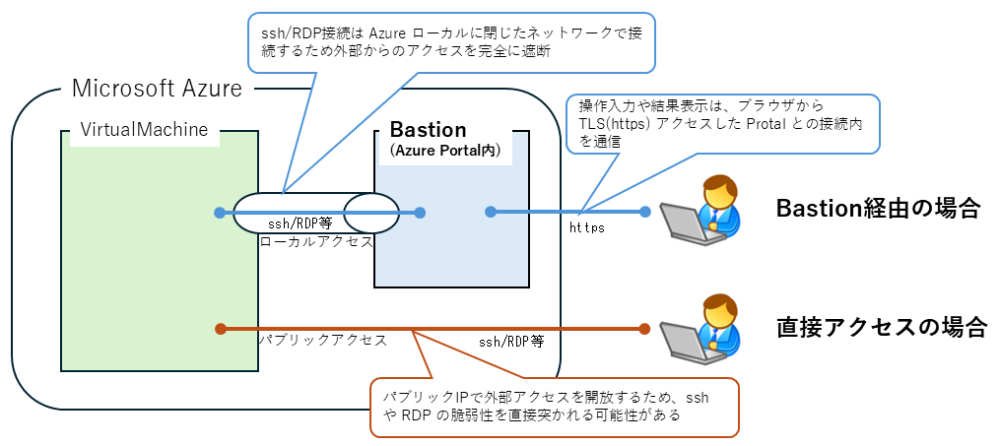
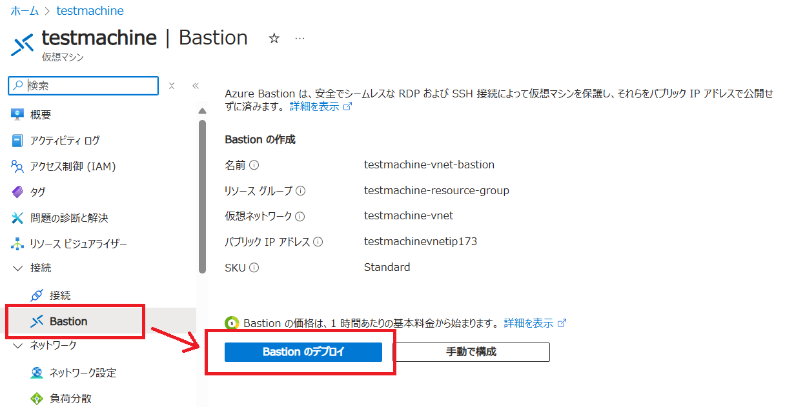
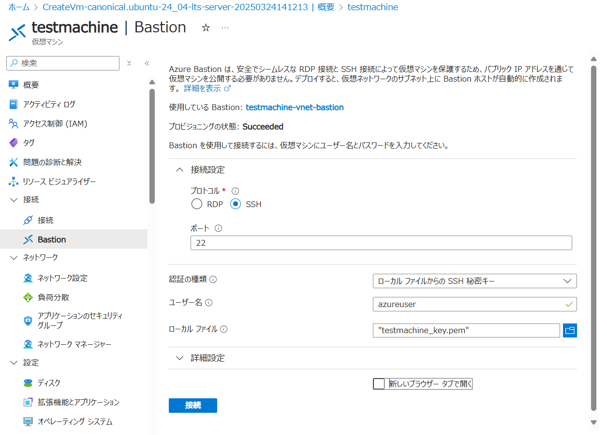
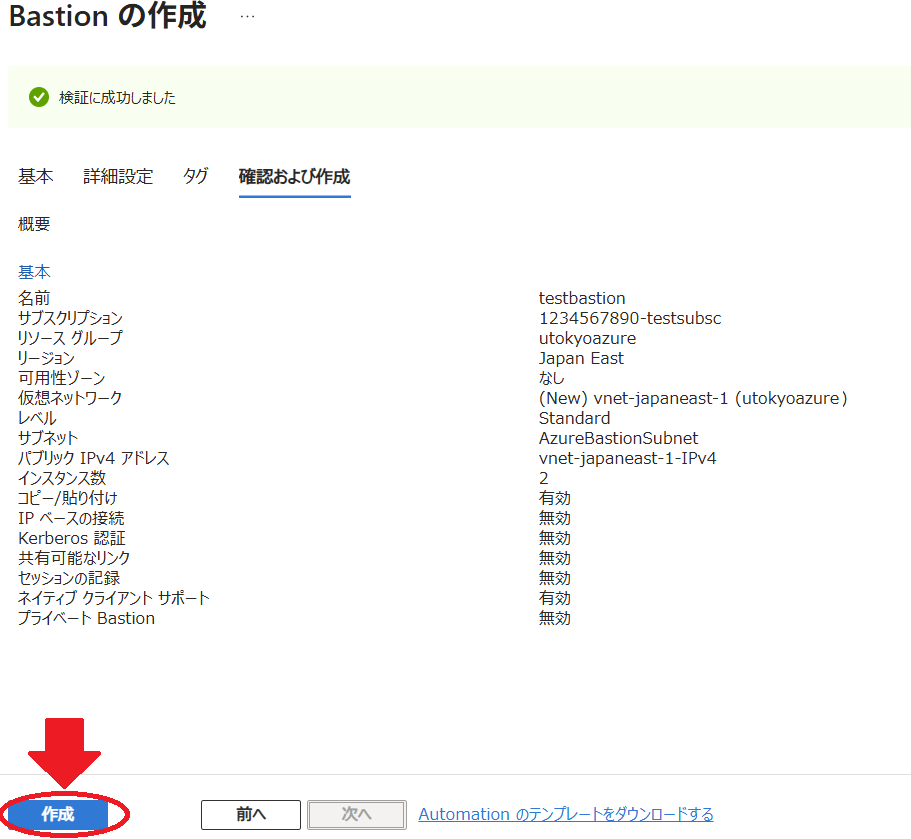
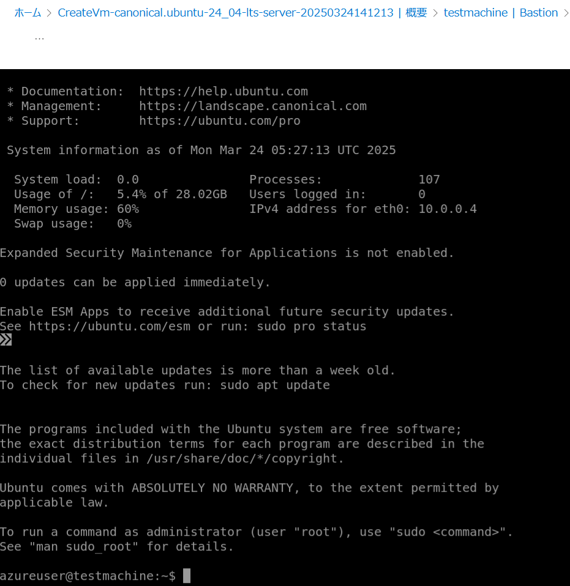
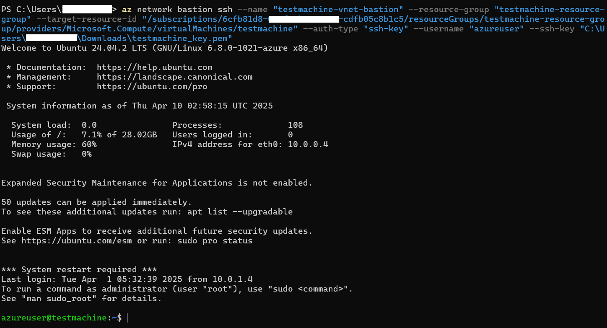

import HelpItem from "@components/utils/HelpItem.astro";

仮想マシンにリモートからアクセスする方法としては UNIX 系 OS であれは ssh，Windows OS であれば RDP(Remote Desktop Protocol) を利用することが一般的ですが，クラウドサービスへのリモートアクセスに直接これらのプロトコルでパブリックアクセスを許可することは，セキュリティ上のリスクが高く原則するべきではありません．

Azure サービスでは Bastion という踏み台サービスがあり，これらプロトコルによる直接のパブリックアクセスを回避し，よりセキュアに接続を行うことができるようになる仕組みがあります．

以下は，Bastion を利用した仮想マシンへのアクセス方法について説明します．

## １．Bastion 概要

Bastion は Azure Portal に構成され、Web ブラウザ上で仮想マシンの操作が可能になるアクセスを提供します．
- Azure Portal 内に踏み台サーバとして構成され，仮想マシンへのアクセスは Bastion 経由で行う形になります．（下図参照）
- ssh や RDP によるリモート接続のために，仮想マシンにパブリックアクセス用の IP を設定する必要がなくなるので，これらプロトコルの脆弱性を突いた不正アクセスの懸念が無くなります．
- 端末から Azure Portal 間は，強固な認証を経たブラウザによる https (TLS) 接続内を通信するので、より安全に仮想マシンへのリモートアクセスが可能になります．
- Bastion サービスは有料なのでギフトを消費します．1時間でおよそ 0.2 ドルから 0.5 ドル 程度で，5GB/月以上のデータ送受信には別途通信料がかかります．詳細は以下の URL を参照ください．
  - [Azure Bastion の価格](https://azure.microsoft.com/ja-jp/pricing/details/azure-bastion/)

{:.center.border}

## ２.Bastion の構成

本ページでは，Azure Virtual Machines を Linux OS で構成した直後に，初期アクセスをする手順として進めます．
 
2-1. 仮想マシンリソース（この例では testmachine）の左側一覧にある，`接続` > `Bastion` を選択する．

2-2. 画面右側，主画面に Bastion の作成が表示されるので，以下の設定を行う．

{:.medium.center.border}

  - **認証の種類**：`ローカルファイルからのSSH秘密キー`
    - 仮想マシン構成時に新規作成，または選択した ssh 秘密鍵を利用する想定．
  - **ユーザー名**：ssh 鍵を新規作成している場合は`azureuser`，既存 ssh 鍵を選択している場合は，鍵作成時のアカウント名を設定してください．
  - **ローカルファイル**：ssh 秘密鍵が含まれているファイルをここに選択してください．この例では，仮想マシン構成時に新規に`testmachine_key.pem`という鍵を作成，ダウンロードしている想定です．
  - **詳細設定**：既存の ssh 秘密鍵を選んだ場合は，その鍵のパスフレーズを入力してください．新規作成鍵の場合はそのままで構いません．
  - **新しいブラウザタブで開く**：いずれでもかまいません．

  一部設定の変更が必要なので　Bastion の作成で `手動で構成` をクリックする．

{:.medium.center.border}

2-3. 以下の設定を追加する．
  - 基本パート
    - `インスタンス詳細` の名前が空欄なので，適当な名前を入力．
    - `インスタンス詳細` のレベルが Standard ではない場合は Standard に変更する。（通常は初期値で Standard）
  - 詳細設定パート
    - **ネイティブクライアントサポート** にチェックを入れる．

2-4. 全て入力を終えたら，画面左下にある`作成`をクリック．

{:.medium.center.border}

2-5. 作成後，接続に成功したらプロンプトが表示され，仮想サーバの操作ができるようになる．

{:.medium.center.border}

## Azure CLI を利用した Bastion 経由での接続

Bastion サービスはブラウザ上で VM のコマンドラインインターフェース(CLI)にアクセスすることが想定されていますが，Azure CLI の機能を使うと，ローカル端末のターミナルからコマンドで接続することが可能です．

1. **2. Bastion の構成**の 2-3 までを進める．
2. ローカル端末に Azure CLI 機能をインストールする．インストール方法は[コマンドラインインターフェースでリソースを利用する](/research_computing/utokyo_azure/virtualmachine/azcli/)を参照．
3. 上記のリンク先にある**UTokyo Account で事前に認証する**までを実行しておく．
3. `az network bastion ssh`コマンドを，以下の引数で実行する．
```
$ az network bastion ssh \
    --name [Bastion のリソース名] \
    --resource-group [Bastion を構成したリソースグループ名] \
    --target-resource-id [接続先 VM のリソースID]\
    --auth-type "ssh-key"\
    --username [ログイン先の username]\
    --ssh-key [ssh 秘密鍵ファイル名（パス含む）]
```

例：Windows Powershell ターミナルから実行
{:.medium.center.border}

### リソースIDの確認方法

Azure Portal で ID を知りたいリソース（この場合は接続先VMのリソース）のページで，画面右上に`JSONビュー`という小さいリンクがあるので，そこをクリックして表示される中にある`id`項目に記載されている．
