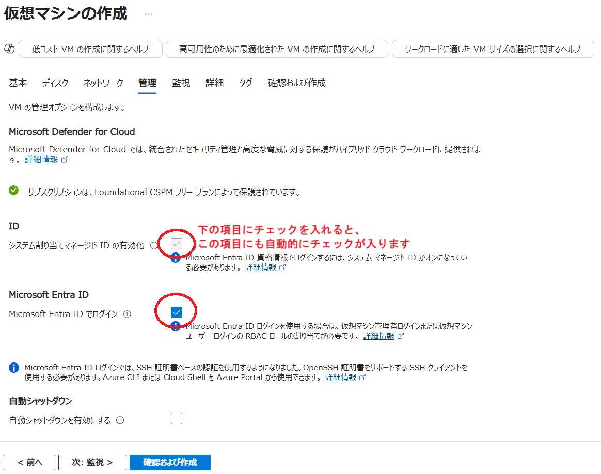
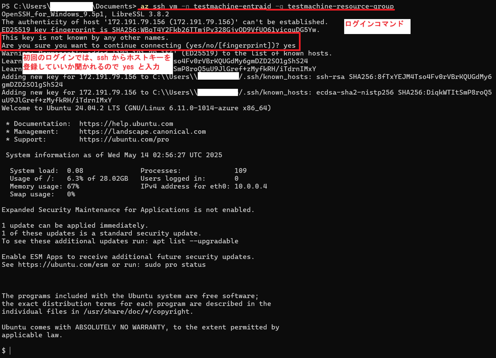

## 概要

Azure 仮想マシンへのログインには，仮想マシンの作成時に予め必要な設定をすることによって UTokyo Account を使って ssh ログインすることもできます．

## １. Azure Cli をインストール

仮想マシンへは Azure Cli を使ってアクセスします．なので予め仮想マシンにアクセスする端末等の環境に Azure Cli をインストールしてください．
- 既にインストール済みの場合は，この項目はスキップしてください．
- [コマンドラインインターフェースでリソースを利用する](/research_computing/utokyo_azure/virtualmachine/azcli/)
  - **Azure CLI のインストール**を進めてください．**UTokyo Account で事前に認証する**はこの後に説明がありますが，同じ手順ですのでここで行ってしまっても問題ありません．

## ２．仮想マシンの構成

以後は Linux OS の場合の説明になります。Windows OS の場合は以下の Microsoft Learn の記事を参照ください。
[Microsoft Learn:パスワードレスを含む Microsoft Entra ID を使用して Azure の Windows 仮想マシンにサインインする](https://learn.microsoft.com/ja-jp/entra/identity/devices/howto-vm-sign-in-azure-ad-windows)

[Virtual Machines : UTokyo Azure 利用例](/research_computing/utokyo_azure/virtualmachine/)とほぼ同じ手順で仮想マシンを作成します．一か所だけ，管理パートで`Microsoft Entra ID でログイン`にチェックを入れる必要がありますので，忘れずにチェックを入れてください． 

{:.medium.center.border}

## ３．仮想マシンへログイン

- Azure Cli でまだ UTokyo Account の認証が済んでいない場合は，Azure Cli をインストールしたローカル環境で`az login`コマンドを実行し，UTokyo Account で認証を行ってください．
- 認証手順の詳細は、[コマンドラインインターフェースでリソースを利用する](/research_computing/utokyo_azure/virtualmachine/azcli/)の**UTokyo Account で事前に認証する**を参照ください．

準備が整いましたら，以下の Azure Cli コマンドを実行してください．

`az ssh vm -n [仮想マシンのリソース名] -g [仮想マシンリソースがあるリソースグループ名]`

問題なければ、以下の図のようにログインができます．

{:.medium.center.border}

## 補足

- 仮想マシンにはローカル環境から仮想マシンのグローバル IP へ ssh プロトコルでアクセスします．仮想マシンには最低限，ローカル環境の IP から ssh アクセスが許可されている必要があります．
- 仮想マシンの作成時に設定した初期アカウント（変更していなければ`azureuser`）は利用されず，以下のアカウントが自動作成されます．
  - アカウント名：[UTokyo Account](../https://utelecon.adm.u-tokyo.ac.jp/utokyo_account/)の@以降を含めた文字列
  - グループ名：アカウント名と同じ
  - ホームディレクトリ：/home/[数字10桁の共通ID]
- 今後初期アカウントを利用しない場合は，初期アカウントを`deluser [初期アカウント名]`コマンドで削除してください．
