import HelpItem from "@components/utils/HelpItem.astro";
import FirstTimeUsing from "@components/ja/systems/utokyo_azure/FirstTimeUsing.mdx";

## 概要
{:#about}

本サービスで多く利用されると思われる，仮想マシンの作成を最低限の構成で行う一例です．詳細な設定，構築方法は以下の Microsoft Lean の記事もご参照ください．
- [クイック スタート:Azure portal で Linux 仮想マシンを作成する](https://learn.microsoft.com/ja-jp/azure/virtual-machines/linux/quick-create-portal?WT.mc_id=UI_empg&tabs=ubuntu)
- [クイック スタート:Azure Portal で Windows 仮想マシンを作成する](https://learn.microsoft.com/ja-jp/azure/virtual-machines/windows/quick-create-portal?WT.mc_id=UI_empg)

参考： [**仮想マシンを作ろう -13BのLlama-3モデルをLoRA fine-tuningしたい-**](https://utelecon.adm.u-tokyo.ac.jp/events/2025-02-21/slides/5-3_create_VM.pdf) (2025.02.21 UTokyo Azure 説明会資料)

## １．サービスを選択する
{:#select_service}

<FirstTimeUsing type="details" />

- Azureサービスの一覧の中から`仮想マシン`を選択します．
    - 一覧に無い場合、画面上部にある検索欄で検索するか，一覧の右にある`その他のサービス`を選択、左側にあるリストから`コンピューティング`を選択すると，右側に表示されるメイン画面の`Infrastructure as a Service(IaaS)`の中にあります．

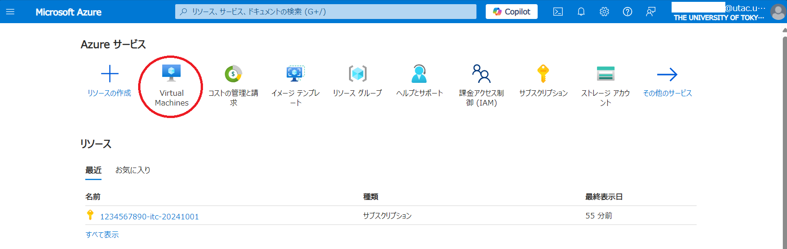{:.medium.center.border}

- Virtual Machines のメインページが表示されたら，`＋作成`をクリックし`Azure仮想マシン`を選択ます．

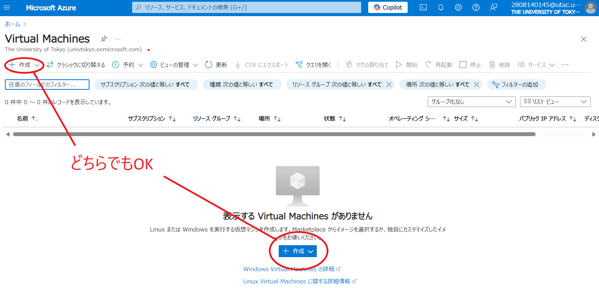{:.medium.center.border}

**補足**：複数マシンによるクラスタ構成を組みたい場合は[スケールセット(VMSS)](https://learn.microsoft.com/ja-jp/azure/virtual-machine-scale-sets/overview)を選択ください．その場合のこの後の構成手順はリンク先をご参照ください．

## ２．仮想マシンを構成する
{:#vmconfig}

**補足**：説明のない項目は，基本的に初期設定のままで構成することを前提としています．

<HelpItem lang="ja" type="details">
  <Fragment slot="problem">UTokyo Account で仮想マシンに ssh ログインさせたい場合</Fragment>
  <Fragment slot="solution">
仮想マシンに UTokyo Account の認証を使ってログインすることができます．手順は以下のURLを参照ください．

[UTokyo Account で仮想マシンに ssh ログインする](/research_computing/utokyo_azure/virtualmachine/entraid_login/)
</Fragment>
</HelpItem>

### 基本パート
{:#base}

#### プロジェクトの詳細

- [**サブスクリプション**](/research_computing/utokyo_azure/faq/subscription/)：事前に申請したサブスクリプションがすでに設定されていますので、通常はそのままで問題ありません．設定が無い場合はサブスクリプションが作成完了しているかどうか確認ください．
- **[リソースグループ](https://learn.microsoft.com/ja-jp/azure/azure-resource-manager/management/manage-resource-groups-portal)**：ここでは新規に`resource_group`というリソースグループ名で作成し，以下に作成される各リソースをまとめます．まとめられたリソースは，権限の継承や削除などを一括で対応することが可能となります．

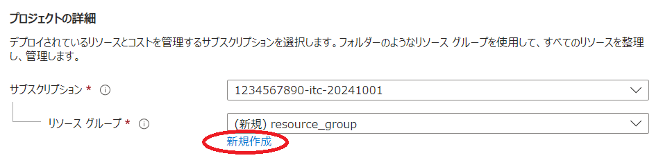{:.medium.center.border}

#### インスタンスの詳細

- **仮想マシン名**：仮想マシンをAzure Portal 内で管理する際の名称です．わかりやすい名称を入力してくだささい．ここでは`testmachine`と入力しています．
- **リージョン**：仮想マシンをどの地域（リージョン）にあるデータセンターにデプロイするかを指定します．使いたい機能が特定の国のリージョンにしかない場合は，その国のリージョンを選択ください．海外のパブリッククラウド上での情報管理に不安がある場合は日本国内（`Japan East` か`Japan West`）のリージョンを選択することも可能です．
- **可用性オプション**：特段の必要が無ければ`インフラストラクチャ冗長は必要ありません`を選択してください．
<HelpItem lang="ja" type="details">
  <Fragment slot="problem">可用性ゾーンとは</Fragment>
  <Fragment slot="solution">
同一リージョン内で，ネットワーク，電源，冷却装置等が独立しているデータセンターの集合で，イメージとしては，隣接している複数のビルそれぞれに独立して構築されているデータセンター（ゾーン）が一つの可用性ゾーンを形成している感じになります．

可用性ゾーンは通常3ゾーン以上で構成されていて，ゾーンを複数指定するとそのゾーン間でプライマリバックアップやHAを構成することが可能になります．

※ 本利用例の通りに設定した場合は冗長構成はとられず，いずれかのゾーン内に単独で構成されます．
</Fragment>
</HelpItem>
- **イメージ**：利用したいＯＳを選択してください．ここでは ubuntu OS を選択しています．
<HelpItem lang="ja" type="details">
  <Fragment slot="problem">WindowsOS を選択した場合</Fragment>
  <Fragment slot="solution">
ページ最下部に**マルチテナントをホストする権利を持つ有効な Windows 10/11 ライセンスを所有しています**という項目があるのでチェックを入れてください．UTokyo Azure では [UTokyo Microsoft License](/microsoft/) で認証されたOSを利用できます．

また，WindowsOS は必要最小スペックが高めですので、VMサイズを選択する際は Windows 10/11 での最小スペックにご注意ください．特に Windows11 を選択する場合は [Microsoft Learn：Azure 仮想マシンでの Windows 11 のサポート](https://learn.microsoft.com/ja-jp/troubleshoot/azure/virtual-machines/windows/windows-11-support-azure-virtual-machines)を事前に参照ください．
</Fragment>
</HelpItem>
- **サイズ**：CPUコア数やメモリ量などの組み合わせを選択してください．右側にある金額は，それを選択した際にかかると予想される費用試算（月額）です．その他の選択や利用状況により増減するので、ご参考程度にお考え下さい．

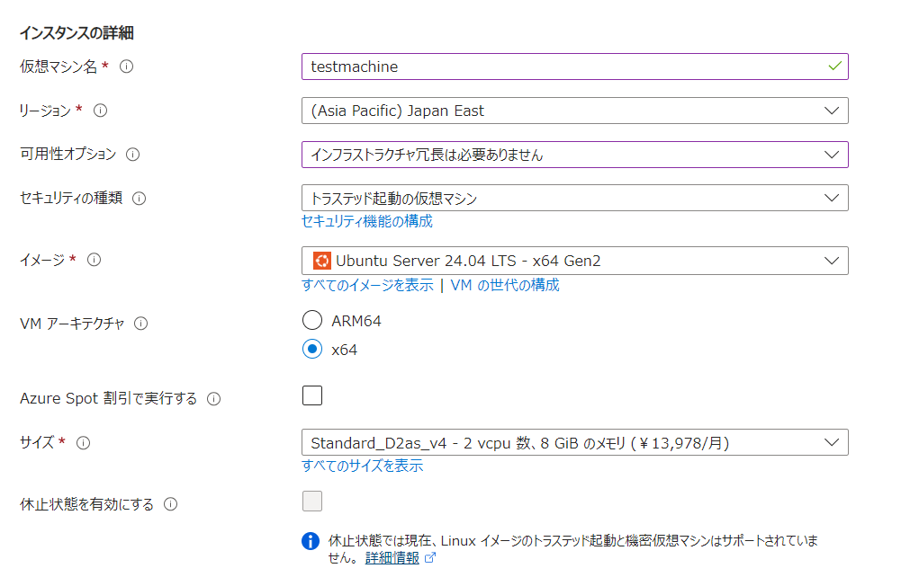{:.medium.center.border}

#### 管理者アカウント

**認証の種類**が`SSH公開キー`になっていない場合は必ず`SSH公開キー`を選択してください．安易なパスワードを設定するとすぐに侵入されます。そのような事件が後を絶ちませんので「パスワード」は選択しないで下さい。 
<HelpItem lang="ja" type="details">
  <Fragment slot="problem">すでにお使いのSSH公開鍵を使いたい場合</Fragment>
  <Fragment slot="solution">**SSH 公開キーのソース**を`既存の公開キーを使用`に切り替え，**SSH公開キー**欄に，使いたい公開キーをコピー＆ペーストしてください．</Fragment>
</HelpItem>

#### 受信ポートの規則

- ここでは初期設定のままで進めます．既にご希望がある場合は設定を変更してください．

<HelpItem lang="ja" type="details">
  <Fragment slot="problem">Bastion サービス（踏み台サーバサービス）を利用する場合</Fragment>
  <Fragment slot="solution">[Bastion サービス](/research_computing/utokyo_azure/virtualmachine/bastion/) を利用してリモートコンソール接続を行う場合，**パブリック受信ポート**は`なし`を選択してください．</Fragment>
</HelpItem>
<HelpItem lang="ja" type="details">
  <Fragment slot="problem">運用開始後の受信ポート規則について</Fragment>
  <Fragment slot="solution">ここで選択する受信ポート規則はVM作成直後の接続用の設定なので，運用中に通信するポート規則は仮想マシン作成後，[ネットワークセキュリティグループ](/research_computing/utokyo_azure/virtualmachine/nsg/)機能で改めて設定してください．</Fragment>
</HelpItem>

### ディスクパート
{:#disk}

#### VMディスクの暗号化

ここでは初期設定のままで進めます．既にご希望がある場合は設定を変更してください．

#### OSディスク

- **OSディスクサイズ**：いくつかのサイズから選択できますので，必要な容量を選択ください．
- **OSディスクの種類**：初期選択の`Premium SSD`は Standard HDD の約３～５倍，`Standard SSD`は約２倍の費用がかかるので．**ディスクに高性能を求める構成でなければ`Satndard HDD`をご選択ください．**

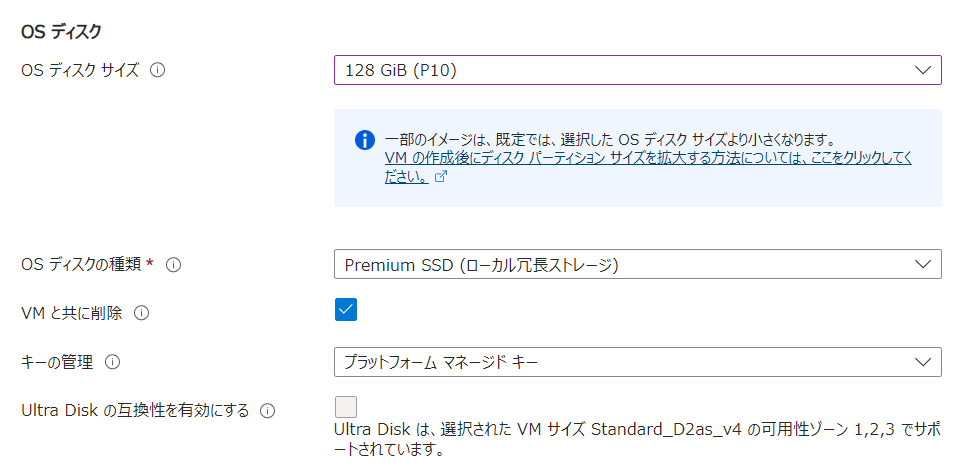{:.medium.center.border}

### ネットワーク，管理，監視，詳細，タグの各パート
{:#eachpart}

- ここでは初期設定のままで進めます．既にご希望がある場合は設定を変更してください．
<HelpItem lang="ja" type="details">
  <Fragment slot="problem">Bastion サービス（踏み台サーバサービス）を利用する場合</Fragment>
  <Fragment slot="solution">[Bastion サービス](/research_computing/utokyo_azure/virtualmachine/bastion/) を利用し，かつデータ転送用に外部からの接続を許可する必要が無い場合は，**パブリック受信ポート** は`なし`を設定してください．</Fragment>
</HelpItem>
<HelpItem lang="ja" type="details">
  <Fragment slot="problem">運用開始後の受信ポート設定について</Fragment>
  <Fragment slot="solution">ここで選択する受信ポート規則はVM作成直後の接続用の設定なので，運用中に通信するポート規則は仮想マシン作成後，[ネットワークセキュリティグループ](/research_computing/utokyo_azure/virtualmachine/nsg/)機能で改めて設定してください．</Fragment>
</HelpItem>
<HelpItem lang="ja" type="details">
  <Fragment slot="problem">定期的に仮想マシンをシャットダウンさせたい場合</Fragment>
  <Fragment slot="solution">毎日定期であれば，**管理**パートの`自動シャットダウン`に条件を入力して下さい．もう少し複雑な操作（平日だけや自動起動も行わせる等）をさせたい場合は，**監視**サービスを利用してください．</Fragment>
</HelpItem>
<HelpItem lang="ja" type="details">
  <Fragment slot="problem">一定時間利用をしなかった場合に自動でシャットダウンさせたい場合</Fragment>
  <Fragment slot="solution">[CPU使用率が一定時間に一定値以下だった場合の構成例](/research_computing/utokyo_azure/virtualmachine/autostop/)を参照ください．</Fragment>
</HelpItem>

### 確認及び作成パート
{:#execute}

構成内容の検証結果，１時間ごとの予想費用，使用条件及びここまで設定してきた内容の詳細の確認の画面が表示されるので，問題が無ければ画面左下の`確認及び作成`ボタンをクリックしてください．

<HelpItem lang="ja" type="details">
  <Fragment slot="problem">「優先する電話番号」という項目がある場合</Fragment>
  <Fragment slot="solution">本サービス契約担当者の電話番号が自動入力されていますので変更しないようお願いします．この項目が表示されない場合はそのまま進めて問題ありません．</Fragment>
</HelpItem>

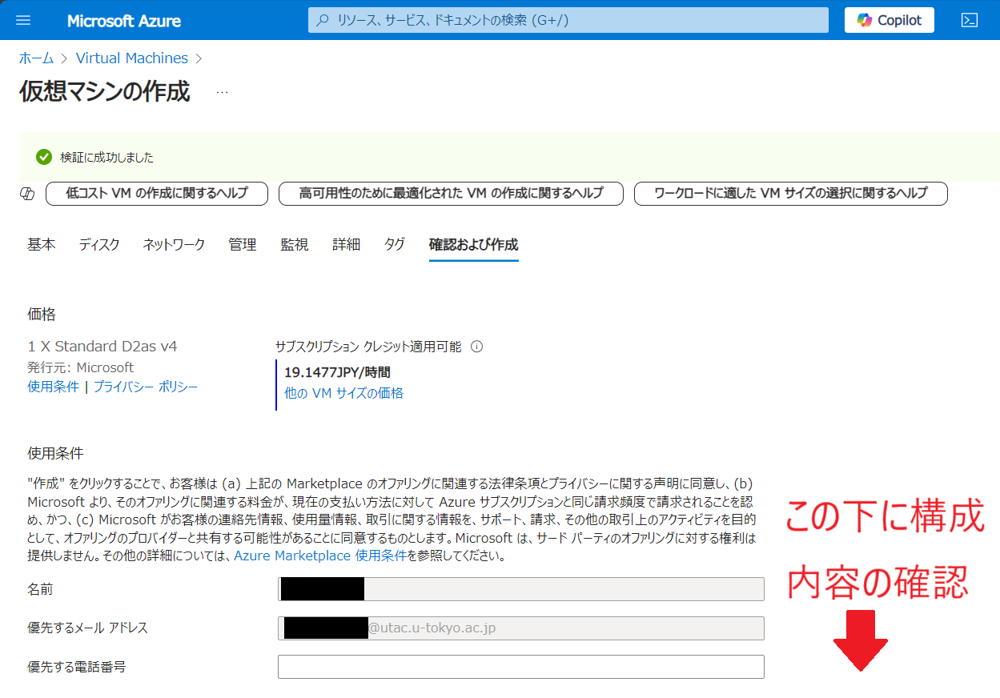{:.medium.center.border}

## ３．仮想マシンを作成する
{:#vmmake}

`確認及び作成`をクリックするとVM作成が実行されます．

- SSH鍵の新規作成を選択した場合，SSH鍵ペアの秘密鍵をダウンロードするかどうかの選択が表示されるので，ダウンロードしてください．リモートから初期アクセスする際にこの秘密鍵を使ってログインします．作成した仮想マシンにログインするリモート端末の適切な場所に，秘密鍵を事前に配置してください．

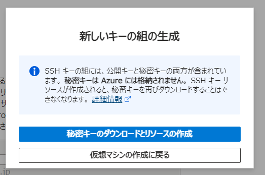{:.medium.center.border}

デプロイが完了しましたと表示されたら作成終了です．

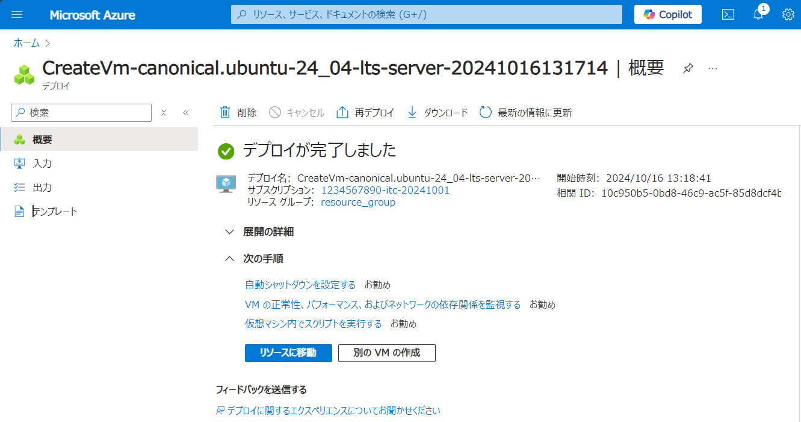{:.medium.center.border}

## ４．仮想マシンにログインする
{:#login}

以下はパブリックIPに直接 ssh でアクセスする例です．できる限り[Bastion](/research_computing/utokyo_azure/virtualmachine/bastion/)等の機能を使ってアクセスするようにしてください．

`リソースに移動`または仮想マシンリソース名のリンクをクリックすると，割り当てられたグローバルIPアドレスが画面右側に表示されていますので，そのIPアドレスに対してご自身の端末からSSHログインを行いログインできたら完了です．

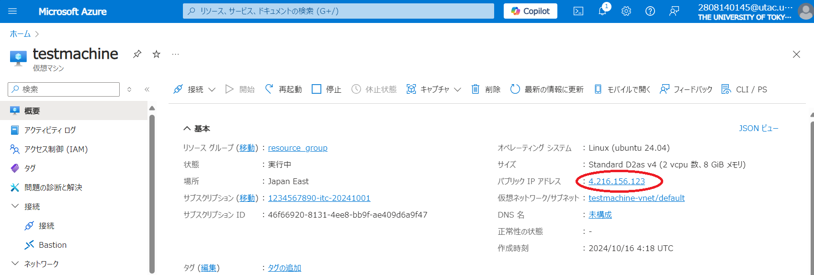{:.medium.center.border}

  - `ssh -i [ダウンロードした秘密鍵] azureuser@[IPアドレス]`

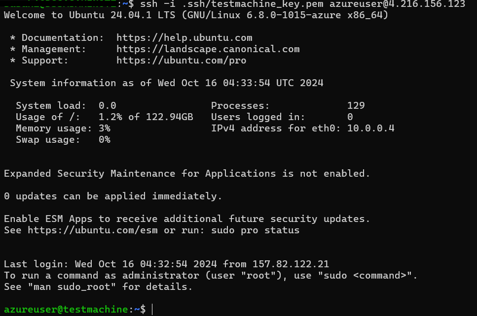{:.small.center.border}

ログイン成功後は必要に応じて，作業用アカウントの作成や /etc/sudoers の編集などを行ってください．

## 補足．仮想マシンの一時休止
{:#suspend}

**仮想マシンはそのままにするとCPU，GPUの利用に課金され続ける**ので．常時起動が不要な場合，利用しない時間は仮想マシンを止めておきます．

- 仮想マシンリソースの詳細で上部に、`停止`ボタンがあるのでクリックする．

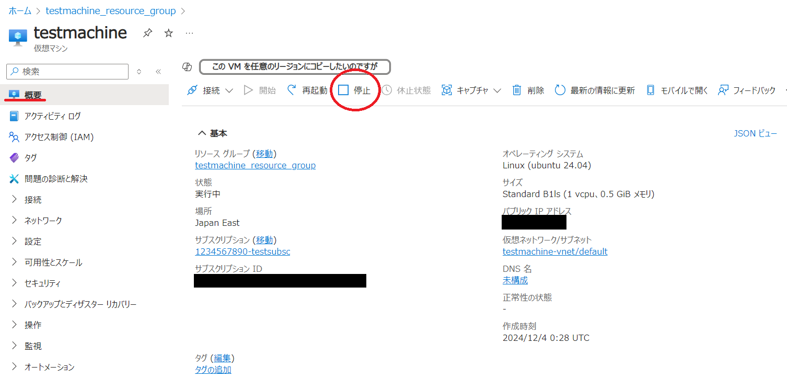{:.small.center.border}

- 確認のウィンドウが表示されるので，`はい`をクリックして停止する．

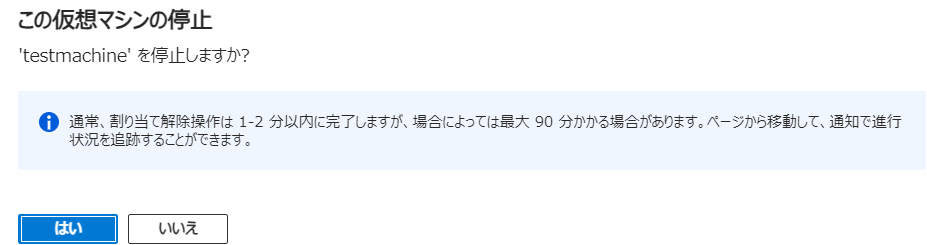{:.small.center.border}

- 利用が完全に終了した仮想マシンであれば，仮想マシン自体を削除することでもギフトクレジットの消費は停止します．
- デプロイしたマシンから`halt`や`shotdown`を実施してもマシンは停止しますが，Azure Portal のリソース上は起動したままの表示になっていますので，改めて起動したい場合は`再起動`をクリックしてください．
- ストレージは，VMの状態に関わらずストレージサービス自体を停止または削除しない限り常にギフトクレジットを消費し続けます．ご注意ください．

