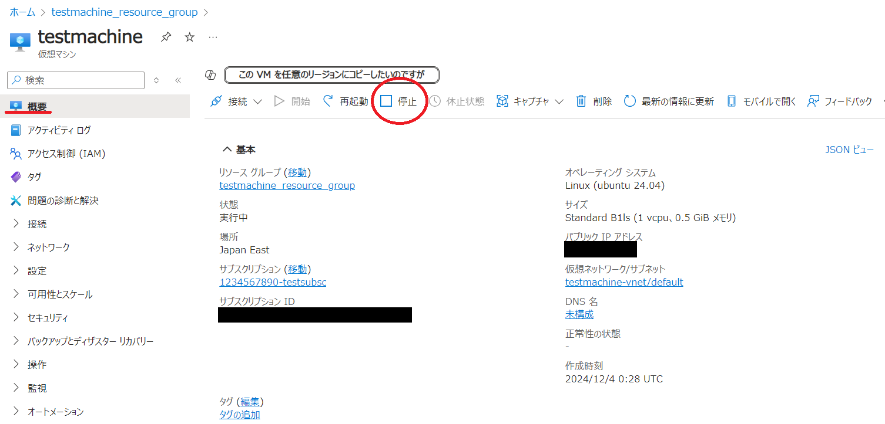
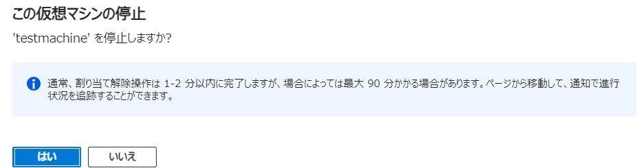

import HelpItem from "@components/utils/HelpItem.astro";
import FirstTimeUsing from "@components/ja/systems/utokyo_azure/FirstTimeUsing.mdx";

## 概要

本サービスで多く利用されると思われる，仮想マシンの作成手順です．以下の Microsoft Learn の記事をご参照ください．

- [クイック スタート:Azure portal で Linux 仮想マシンを作成する](https://learn.microsoft.com/ja-jp/azure/virtual-machines/linux/quick-create-portal?WT.mc_id=UI_empg&tabs=ubuntu)
- [クイック スタート:Azure Portal で Windows 仮想マシンを作成する](https://learn.microsoft.com/ja-jp/azure/virtual-machines/windows/quick-create-portal?WT.mc_id=UI_empg)

参考： [**仮想マシンを作ろう -13BのLlama-3モデルをLoRA fine-tuningしたい-**](/events/2025-02-21/slides/5-3_create_VM.pdf) (2025.02.21 UTokyo Azure 説明会資料)

## 補足事項

<FirstTimeUsing type="details" />

**補足**：複数マシンによるクラスタ構成を組みたい場合は[スケールセット(VMSS)](https://learn.microsoft.com/ja-jp/azure/virtual-machine-scale-sets/overview)を選択ください．その場合のこの後の構成手順はリンク先をご参照ください．

<HelpItem lang="ja" type="details">
  <Fragment slot="problem">UTokyo Account で仮想マシンに ssh ログインさせたい場合</Fragment>
  <Fragment slot="solution">
仮想マシンに UTokyo Account の認証を使ってログインすることができます．手順は以下のURLを参照ください．

[UTokyo Account で仮想マシンに ssh ログインする](/research_computing/utokyo_azure/virtualmachine/entraid_login/)
</Fragment>
</HelpItem>

<HelpItem lang="ja" type="details">
  <Fragment slot="problem">可用性ゾーンとは</Fragment>
  <Fragment slot="solution">
同一リージョン内で，ネットワーク，電源，冷却装置等が独立しているデータセンターの集合で，イメージとしては，隣接している複数のビルそれぞれに独立して構築されているデータセンター（ゾーン）が一つの可用性ゾーンを形成している感じになります．

可用性ゾーンは通常3ゾーン以上で構成されていて，ゾーンを複数指定するとそのゾーン間でプライマリバックアップやHAを構成することが可能になります．

※ 本利用例の通りに設定した場合は冗長構成はとられず，いずれかのゾーン内に単独で構成されます．
</Fragment>
</HelpItem>

<HelpItem lang="ja" type="details">
  <Fragment slot="problem">仮想マシン OS に Windows OS のテンプレートを選択した場合</Fragment>
  <Fragment slot="solution">
ページ最下部に**マルチテナントをホストする権利を持つ有効な Windows 10/11 ライセンスを所有しています**という項目があるのでチェックを入れてください．UTokyo Azure では [UTokyo Microsoft License](/microsoft/) で認証されたOSを利用できます．※Server エディションは適用外です．ご注意ください．

Windows 10 は 2025年10月に公式のサポートは終了しております．互換性等の事情で必須である場合以外は Windows 11 を選択してください．

WindowsOS は必要最小スペックが高めですので、VMサイズを選択する際は最小スペックにご注意ください．特に Windows11 を選択する場合は [Microsoft Learn：Azure 仮想マシンでの Windows 11 のサポート](https://learn.microsoft.com/ja-jp/troubleshoot/azure/virtual-machines/windows/windows-11-support-azure-virtual-machines)を事前に参照ください．
</Fragment>
</HelpItem>

<HelpItem lang="ja" type="details">
  <Fragment slot="problem">Bastion サービス（踏み台サーバサービス）を利用する場合</Fragment>
  <Fragment slot="solution">[Bastion サービス](/research_computing/utokyo_azure/virtualmachine/bastion/) を利用してリモートコンソール接続を行う場合，**パブリック受信ポート**は`なし`を選択してください．</Fragment>
</HelpItem>
<HelpItem lang="ja" type="details">
  <Fragment slot="problem">運用開始後の受信ポート規則について</Fragment>
  <Fragment slot="solution">ここで選択する受信ポート規則はVM作成直後の接続用の設定なので，運用中に通信するポート規則は仮想マシン作成後，[ネットワークセキュリティグループ](/research_computing/utokyo_azure/virtualmachine/nsg/)機能で改めて設定してください．</Fragment>
</HelpItem>

**OSディスクの種類**：初期選択の`Premium SSD`は Standard HDD の約３～５倍，`Standard SSD`は約２倍の費用がかかるので．**ディスクに高性能を求める構成でなければ`Satndard HDD`をご選択ください．**

<HelpItem lang="ja" type="details">
  <Fragment slot="problem">定期的に仮想マシンをシャットダウンさせたい場合</Fragment>
  <Fragment slot="solution">毎日定期であれば，**管理**パートの`自動シャットダウン`に条件を入力して下さい．もう少し複雑な操作（平日だけや自動起動も行わせる等）をさせたい場合は，**監視**サービスを利用してください．</Fragment>
</HelpItem>
<HelpItem lang="ja" type="details">
  <Fragment slot="problem">一定時間利用をしなかった場合に自動でシャットダウンさせたい場合</Fragment>
  <Fragment slot="solution">[CPU使用率が一定時間に一定値以下だった場合の構成例](/research_computing/utokyo_azure/virtualmachine/autostop/)を参照ください．</Fragment>
</HelpItem>

<HelpItem lang="ja" type="details">
  <Fragment slot="problem">「優先する電話番号」という項目がある場合</Fragment>
  <Fragment slot="solution">本サービス契約担当者の電話番号が自動入力されていますので変更しないようお願いします．この項目が表示されない場合はそのまま進めて問題ありません．</Fragment>
</HelpItem>

## 仮想マシンの一時休止

**仮想マシンはそのままにするとCPU，GPUの利用に課金され続ける**ので．常時起動が不要な場合，利用しない時間は仮想マシンを止めておきます．

- 仮想マシンリソースの詳細で上部に、`停止`ボタンがあるのでクリックする．

{:.small.center.border}

- 確認のウィンドウが表示されるので，`はい`をクリックして停止する．

{:.small.center.border}

- 利用が完全に終了した仮想マシンであれば，仮想マシン自体を削除することでもギフトクレジットの消費は停止します．
- デプロイしたマシンから`halt`や`shutdown`を実施してもマシンは停止しますが，Azure Portal のリソース上は起動したままの表示になっていますので，改めて起動したい場合は`再起動`をクリックしてください．
- ストレージは，VMの状態に関わらずストレージサービス自体を停止または削除しない限り常にギフトクレジットを消費し続けます．ご注意ください．

