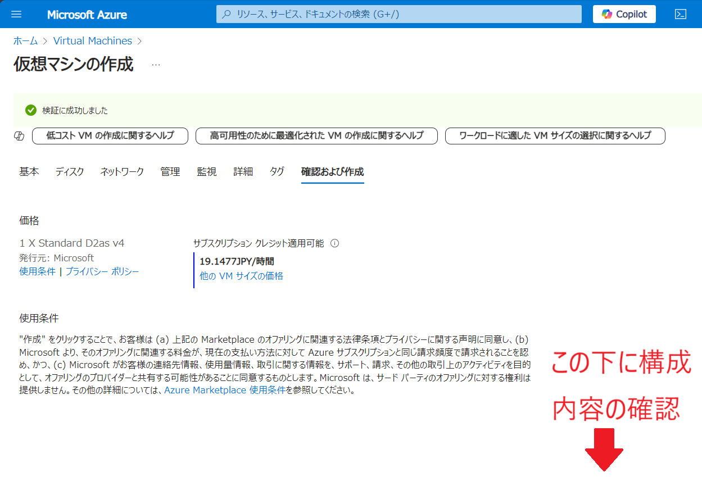

import HelpItem from "@components/utils/HelpItem.astro";

## 概要
{:#about}

本サービスで多く利用されると思われる，仮想マシン（Azure のサービス名はVirtual Machines）の作成を最低限の構成で行う一例です．

## １．サービスを選択する
{:#select_service}

- 事前に以下サイトよりサブスクリプションを申請してください．
  - 東京大学 Azureクラウド利用申請ページ(公開時にリンク) ※UTokyo Account 所持者のみアクセス可

- [Azure portal](https://portal.azure.com/)に[UTokyo Account](/utokyo_account)でログインし、リソースの欄に申請したサブスクリプションがあることを確認してください．

{:.medium.center.border}

- Azureサービスの一覧の中から`Virtual Machines`を選択します．
    - 一覧に無い場合、一覧の右にある`その他のサービス`を選択、左側にあるリストから`コンピューティング`を選択すると，右側に表示されるメイン画面の`Infrastructure as a Service(IaaS)`の中にあります．

{:.medium.center.border}

- Virtual Machines のメインページが表示されたら，`＋作成`をクリックします．

{:.medium.center.border}

- どの方法で仮想マシンを作成するかの選択肢が出てきますが，以下`Azure仮想マシン`を選択したものとしています．

## ２．仮想マシンを構成する
{:#vmconfig}

> **補足**：説明のない項目は，基本的に初期設定のままで構成することを前提としています．

### 基本パート
{:#base}

#### プロジェクトの詳細

- **サブスクリプション**：事前に申請したサブスクリプションがすでに設定されていますので、通常はそのままで問題ありません．複数のサブスクリプションをお持ちで、想定していないサブスクリプションが表示されている場合はプルダウンメニューから選択しなおしてください．ここを間違えると想定していない予算から支出することになりますので，よくご確認お願いします．
- **[リソースグループ](https://learn.microsoft.com/ja-jp/azure/azure-resource-manager/management/manage-resource-groups-portal)**：ここでは新規に`resource_group`というリソースグループ名で作成し，以下に作成される各リソースをまとめます．まとめられたリソースは，権限の継承や削除などを一括で対応することが可能となります．

{:.medium.center.border}

#### インスタンスの詳細

- **仮想マシン名**：仮想マシンをAzure Portal 内で管理する際の名称です．わかりやすい名称を入力してくだささい．ここでは`testmachine`と入力しています．
- **リージョン**：仮想マシンをどの地域（リージョン）にあるデータセンターにデプロイするかを指定します．使いたい機能が特定の国のリージョンにしかない場合は，その国のリージョンを選択ください．パブリッククラウド上での情報管理に不安がある場合は日本国内（`Japan East` か`Japan West`）のリージョンを選択することも可能です．
- **可用性オプション**：特段の必要が無ければ`インフラストラクチャ冗長は必要ありません`を選択してください．
- **イメージ**：利用したいＯＳを選択してください．ここでは`ubuntu`を選択しています．
- **サイズ**：CPUコア数やメモリ量などの組み合わせを選択してください．右側にある金額は，それを選択した際にかかると予想される費用試算（月額）です．その他の選択や利用状況により増減するので、ご参考程度にお考え下さい．

{:.medium.center.border}

#### 管理者アカウント

初期設定のままで構いません．**認証の種類**が`SSH公開キー`になっていない場合は選択してください．安易なパスワードを設定するとすぐに侵入されます。そのような事件が後を絶ちませんので「パスワード」は選択しないで下さい。 
<HelpItem lang="ja" type="details">
  <Fragment slot="problem">すでにお使いのSSH公開鍵を使いたい場合</Fragment>
  <Fragment slot="solution">**SSH 公開キーのソース**を`既存の公開キーを使用`に切り替え，**SSH公開キー**欄に，使いたい公開キーをコピー＆ペーストしてください．</Fragment>
</HelpItem>

#### 受信ポートの規則

初期設定のままで構いません．既にご希望がある場合は設定を変更してください．

### ディスクパート
{:#disk}

#### VMディスクの暗号化

初期設定のままで構いません．既にご希望がある場合は設定を変更してください．

#### OSディスク

- **OSディスクサイズ**：いくつかのサイズから選択できますので，必要な容量を選択ください．
- **OSディスクの種類**：初期選択の`Premium SSD`は Standard HDD の約３～５倍，`Standard SSD`は約２倍の費用がかかるので．ディスクに高性能を求める構成でなければ`Satndard HDD`をご選択ください．

{:.medium.center.border}

### ネットワークパート
{:#network}

初期設定のままで構いません．既にご希望がある場合は設定を変更してください．

### 管理パート
{:#management}

初期設定のままで構いません．既にご希望がある場合は設定を変更してください．

### 監視パート
{:#monitoring}

初期設定のままで構いません．既にご希望がある場合は設定を変更してください．

### 詳細パート
{:#addconfig}

初期設定のままで構いません．既にご希望がある場合は設定を変更してください．

### タグパート
{:#tag}

初期設定のままで構いません．既にご希望がある場合は設定を変更してください．

### 確認及び作成パート
{:#execute}

構成内容の検証結果，１時間ごとの予想費用，使用条件及びここまで設定してきた内容の詳細の確認の画面が表示されるので，問題が無ければ画面左下の`確認及び作成`ボタンをクリックしてください．

{:.medium.center.border}

## ３．仮想マシンを作成する
{:#vmmake}

`確認及び作成`をクリックするとVM作成が実行されます．

**（仕様問い合わせ中）**

> - `優先する電話番号`欄に電話番号が自動入力されている場合，ご自身の番号であるかどうかご確認ください．ご自身の番号ではない，あるいは電話番号を入力したくない場合は削除してください．

- SSH鍵の新規作成を選択した場合，SSH鍵ペアの秘密鍵をダウンロードするかどうかの選択が表示されるので，ダウンロードしてください．リモートから初期アクセスする際にこの秘密鍵を使ってログインします．作成した仮想マシンにログインするリモート端末の適切な場所に，秘密鍵を事前に配置してください．

{:.medium.center.border}

デプロイが完了しましたと表示されたら作成終了です．

{:.medium.center.border}

## ４．仮想マシンにログインする

`リソースに移動`または仮想マシンリソース名のリンクをクリックすると，割り当てられたグローバルIPアドレスが画面右側に表示されていますので，そのIPアドレスに対してご自身の端末からSSHログインを行いログインできたら完了です．

{:.medium.center.border}

  - `ssh -i [ダウンロードした秘密鍵] azureuser@[IPアドレス]`

{:.small.center.border}

ログイン後は必要に応じて，作業用アカウントの作成や /etc/sudoers の編集などを行ってください．
