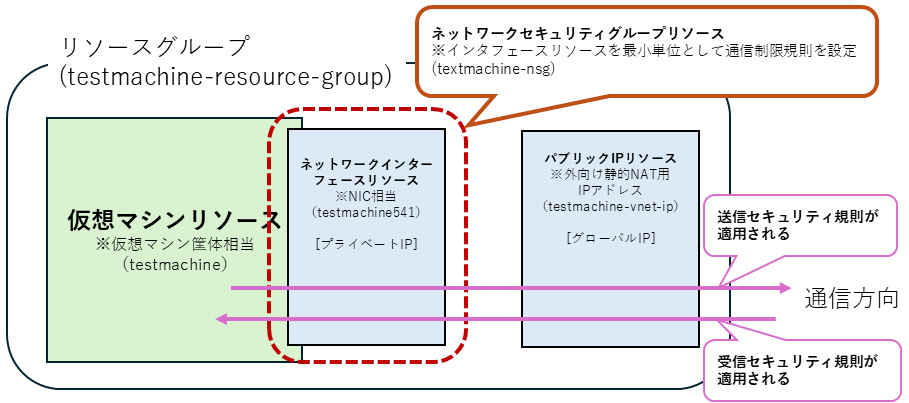
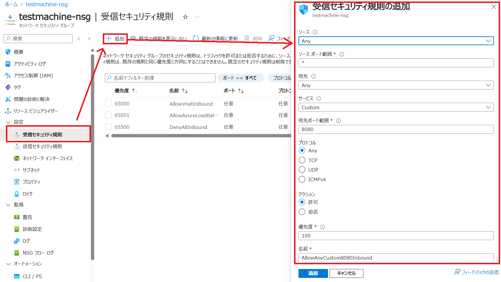

import HelpItem from "@components/utils/HelpItem.astro";

Microsoft Azure には、ネットワークインターフェースリソースレベルで、Windows OS であればパーソナルファイアウォール、Linux であれば iptables や ufw，firewalld のような通信制御の仕組みがあり，適切に設定することによってよりセキュアに通信することができます。

以下は Microsoft Azure のネットワークセキュリティグループについて説明します．

## １．ネットワークセキュリティグループ（NSG） 概要

ネットワークセキュリティグループは，仮想マシンが通信するために必要なネットワークインターフェースリソース単位で設定し，以下の要素で通信を制御します．
- IN/OUT 方向それぞれについて，送信元，送信元ポート，宛先，宛先ポート，プロトコルの5要素
- IPによる制御だけでなく，サービス単位などの要素で指定し，より少ない設定で適切な通信制御を行えます．

{:.center.border}

## ２.ネットワークセキュリティグループの設定

### 初期設定
 
ネットワークセキュリティグループは，仮想マシンを構成した際に`[仮想マシンのリソース名]-nsg`というリソース名で自動作成されます．初期設定では，以下のように設定されています．

受信側セキュリティ規則
| 優先度 | 名前 | ポート | プロトコル | ソース | 宛先 | アクション |
| ----- | ----- | ----- | ----- | ----- | ----- | ----- |
| 65000 | AllowVnetInBound | 任意 | 任意 | VirtualNetwork | VirtualNetwork | allow |
| 65001 | AllowAzureLoadBalancerInBound | 任意 | 任意 | AzureLoadBalancer | 任意 | allow |
| 65002 | DenyAllInBound | 任意 | 任意 | 任意 | 任意 | deny |

送信側セキュリティ規則
| 優先度 | 名前 | ポート | プロトコル | ソース | 宛先 | アクション |
| ----- | ----- | ----- | ----- | ----- | ----- | ----- |
| 65000 | AllowVnetOutBound | 任意 | 任意 | VirtualNetwork | VirtualNetwork | allow |
| 65001 | AllowInternetOutBound | 任意 | 任意 | 任意 | Internet | allow |
| 65002 | DenyAllOutBound | 任意 | 任意 | 任意 | 任意 | deny |

### 規則の追加

1. ネットワークセキュリティグループリソースの左側に表示される一覧で，`設定` > `受信（または送信）セキュリティ規則`を選択
2. メイン画面の左上にある`＋追加`をクリック
3. 設定画面がポップアップするので，設定したい内容を設定する

#### ソース
- 送信元の種類を選択します．
  - **any**：いずれの条件にも該当させたい場合に指定します．
  - **IP addresses**：IPアドレスで指定します．
  - **My IP Address**：Portal にアクセスしている端末のIPが入力されます．
  - **Service Tag**：サービスタグで指定します．指定できるサービスタグ一覧は[こちら](https://learn.microsoft.com/ja-jp/azure/virtual-network/service-tags-overview)
  - **Application security group**：別途設定した、[アプリケーションセキュリティグループ](https://learn.microsoft.com/ja-jp/azure/virtual-network/application-security-groups)を指定できます．

#### ソースポート範囲
- 選択した`ソース`の種類によってこの項目は変化します．具体的な範囲を設定します．

#### 宛先
- 送信先の種類を選択します．**My IP Address**が無い以外は`ソース`と同じです．

#### (宛先の詳細)
- `宛先`に**Any**以外を選んだ場合に項目が追加され，選択した種類に合わせた範囲を設定します．

#### サービス
- 初期設定は`Custom`で，ここを制御したいサービスプロトコルに変更すると，以下の宛先ポート範囲とプロトコルが自動選択されます．

#### 宛先ポート範囲
- サービスで`Custom`にした場合は，ここで具体的なポート範囲を指定します．

#### プロトコル
- サービスで`Custom`にした場合は，ここで具体的なプロトコルを選択します．

#### アクション
- ここまで設定した規則の内容で、通信を`許可`するか`拒否`するかを選択します．

#### 優先度
- 設定した規則の優先度を数字で指定します．小さい数字ほど優先度が高くなります．
- 複数の規則に重複する内容があった場合，より優先度の高い規則が優先されます．
- 初期設定の規則は削除することができませんが，優先度が最低値で設定されているので，優先度の高い設定でオーバーライドすることができます．

#### 名前
- 設定した規則にわかりやすい名前を付けてください．

#### 説明
- 必要に応じて，規則の説明を記載ください．

{:.medium.center.border}

4.最後に`追加`をクリックすると，設定した規則が有効になります．

### 規則の削除

`設定` > `受信（または送信）セキュリティ規則` で，削除したい規則にチェックを入れ，画面上部にある`削除`をクリックするとその規則を削除できます．
- 初期設定されている規則は削除できません．
