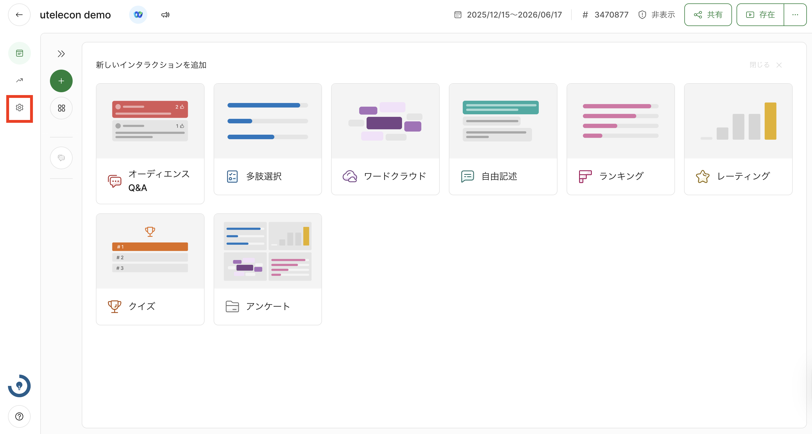
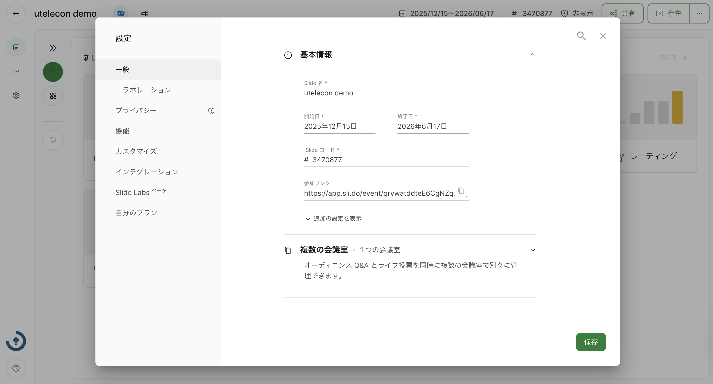

[東京大学のアカウントでSlidoを利用する](../login/)場合，無料のアカウントと比べて，イベントの設定を細かく変更することができます．

設定はイベントの主催者側画面左上の「Settings」（歯車アイコン）を選択することで行うことができます．主催者側画面には，[イベントの一覧ページ](https://admin.sli.do/events)からアクセスしてください．

このページでは，特に授業でSlidoを利用する場合に確認が必要な設定項目について説明します．

* **General（一般的な設定）**
  * **Basic information**：イベントの名前や開始日，終了日などの基本的な情報を編集することができます．
  * **Multiple rooms**：1つのイベントの中で，複数のグループを作成することができます．
* **Collaboration（共同作業に関する設定）**
   * **Add co-hosts**：Co-hosts（Zoomにおける代替ホストのように，イベントの運営を共同で行うメンバーのこと）を追加することができます．授業で利用する場合はTAなどを設定しておくと良いでしょう．
* **Privacy（プライバシーに関する設定）**
  * **Hidden from search**：Googleなどの検索結果に表示されないようにする設定です．授業で利用する場合は，オンにすることを推奨します．
  * **Require authentication**：イベントに参加する際に，名前やメールアドレス，イベントごとに設定するパスワードの入力を必要とすることができる設定です．
* **Features（機能に関する設定）**
  * **Live polls（投票機能に関する設定）**
    * **Fixed order of options**：この設定をオンにすると，投票時の選択肢が作成した通りの順番に固定されます．
    * **Vote counter**：この設定をオンにすると，投票した人数を表示させることができます．
    * **Poll results**：この設定をオンにすると，投票結果をパーセント表示（%）から実数表示（〇〇票）に変えることができます．
