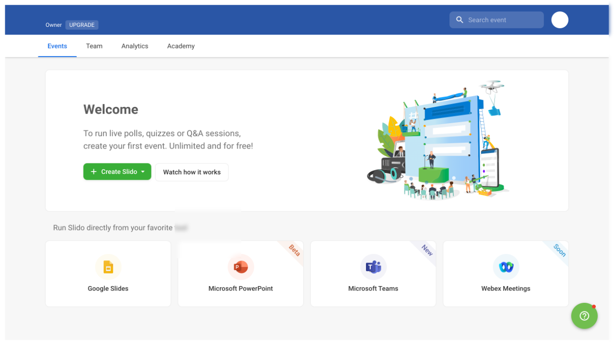
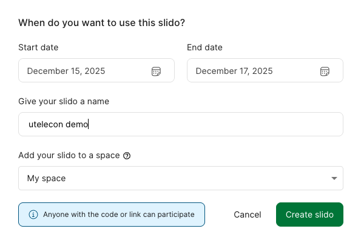
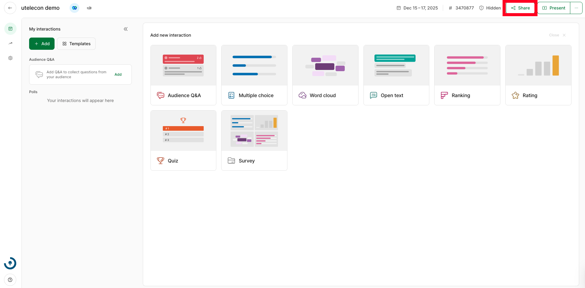

このページでは，Slidoでイベントを作成する方法を説明します．

1. Slidoにサインインした状態で，[イベントの一覧ページ](https://admin.sli.do/events)にアクセスしてください．
   * Slidoは無料でも使うことができますが，[東京大学のアカウントでサインイン](login)することで，さまざまな機能を追加で使えるようになります．授業でSlidoを利用する場合には，東京大学のアカウントでサインインすることをおすすめします．
2. 画面上の「Create Slido」あるいは「New Slido」を選択してから，「Event name」（イベントの名前）と「Start date」（イベントの開始日）を入力します．
   * 「Advanced settings」を選択することで，「End date」（イベントの終了日）や「Event code」（ZoomにおけるミーティングIDのような，イベントを区別するための文字列），「Invite collaborators」（Zoomにおける代替ホストのように，イベントの運営を共同で行うメンバーのこと）の設定ができます．
3. 「Create Slido」あるいは「Schedule Slido」をクリックすると，イベントが作成されます．イベント画面右上の「Share」ボタンをクリックすると，イベントに参加するための専用ページのURLがクリップボードにコピーされるので，このURLを参加者に共有してください．参加者はURLにアクセスすることで，イベントに参加できます．なお，イベント情報の共有は，以下のような方法でも行うことができます．
   * QRコードで共有する: イベント画面右上の「Share」ボタンにマウスを重ねると，「Download QR Code」というボタンが表示されます．このボタンをクリックすると，イベントに参加するための専用ページにアクセスできるQRコードが保存されます．参加者はこのQRコードを読み取ることで，イベントに参加できます．
   * イベントコードで共有する: イベント画面上部に表示されている`#`から始まる6桁の数字を参加者に共有してください．参加者は，[Slidoのサイト](https://app.sli.do/)にイベントコードを入力することで，イベントに参加できます．

イベントを作成した後，イベントの設定画面にアクセスすることで，より詳細な設定を行うことができます．詳しくは「[Slidoでイベントの設定を変更する](change_event_settings)」を確認してください．