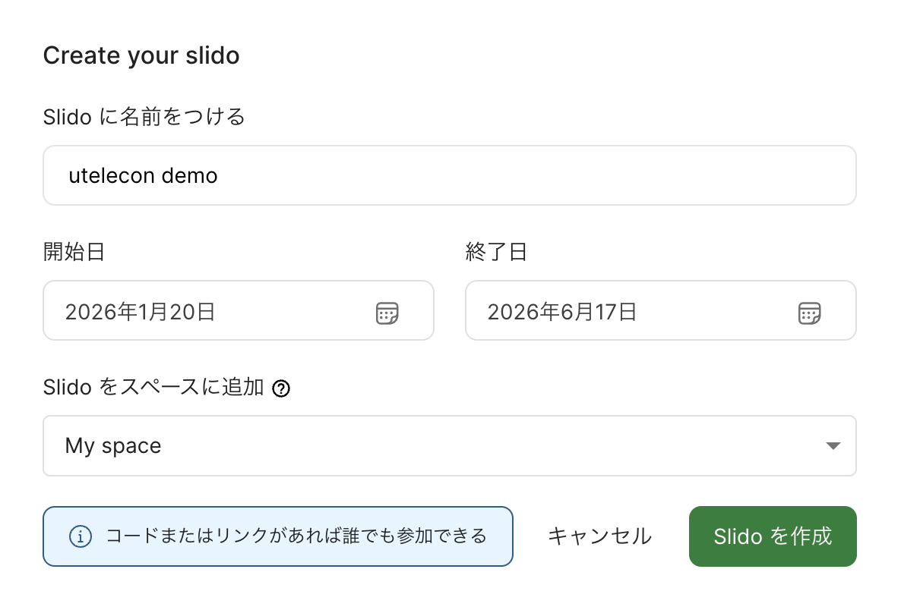
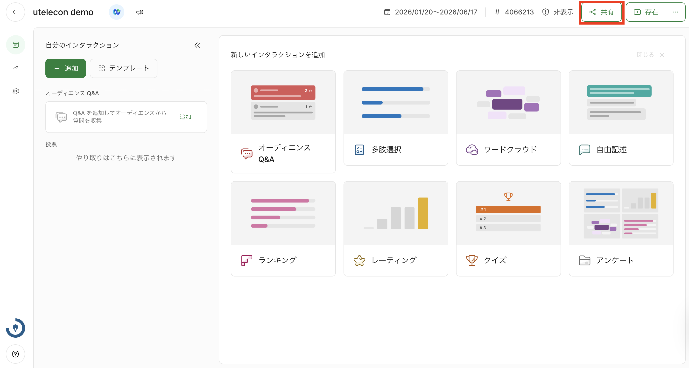

import SetLang from "./_SetLang.mdx"

このページでは，Slidoでイベントを作成する方法を説明します．

  
管理画面を日本語で表示するには

  <SetLang />

1. Slidoにサインインした状態で，[イベントの一覧ページ](https://admin.sli.do/events)にアクセスしてください．{:.medium.border}
   * Slidoは無料でも使うことができますが，[東京大学のアカウントでサインイン](../login/)することで，さまざまな機能を追加で使えるようになります．授業でSlidoを利用する場合には，東京大学のアカウントでサインインすることをおすすめします．
2. 画面上の「Slido を作成」を選択してから，「Slido に名前をつける」にイベントの名前，「開始日」にイベントの開始日，「終了日」にイベントの終了日を入力します．「Slido をスペースに追加」を選択することで，イベントを行うスペース（イベントを整理できる共有ワークスペースのこと）を選択することができます．
   {:.medium.border}
3. 「Slido を作成」をクリックすると，イベントが作成されます．イベント画面右上の「共有」ボタンをクリックし，表示されたポップアップ内の「参加リンクをコピー」ボタンを押すと，イベントに参加するための専用ページのURLがクリップボードにコピーされるので，このURLを参加者に共有してください．参加者はURLにアクセスすることで，イベントに参加できます．{:.medium.border}なお，イベント情報の共有は，以下のような方法でも行うことができます．
   * QRコードで共有する: イベント画面右上の「共有」ボタンをクリックすると，ポップアップが表示されます．ポップアップ内の「QRコードをダウンロード」というボタンをクリックすると，イベントに参加するための専用ページにアクセスできるQRコードが保存されます．参加者はこのQRコードを読み取ることで，イベントに参加できます．
   * イベントコードで共有する: イベント画面上部に表示されている`#`から始まる7桁の数字を参加者に共有してください．参加者は，[Slidoのサイト](https://app.sli.do/)にイベントコードを入力することで，イベントに参加できます．
4. **イベントを作成した段階では，Q&Aや投票は作成されていません**．必要に応じて，手動で作成してください．作成手順については，「[Slidoで主催者ができること](../how_to_use_host/)」を参照してください．

イベントを作成した後，イベントの設定画面にアクセスすることで，より詳細な設定を行うことができます．詳しくは「[Slidoでイベントの設定を変更する](../change_event_settings/)」を確認してください．
