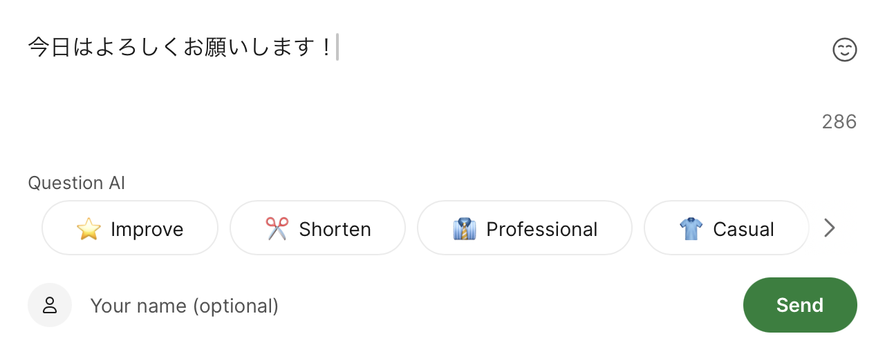
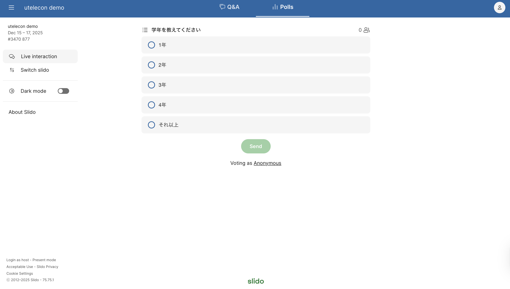

このページでは，Slidoで受講者（学生）ができる操作を説明しています．

イベントの主催者としてSlidoを使う場合の使い方は，「[Slidoで主催者ができること](how_to_use_host)」を確認してください．

## Q&A機能を使う

画面上部の「Q&A」を選択すると，他の人が送信した質問・感想を確認したりすることができます．また，他の人が送信した質問・感想には「いいね」をすることもできます．「いいね」をすることで，自分もこの投稿に関心があることを示すことができます．

他の人が送信した質問・感想は，それぞれの投稿に付けられた「いいね」の数の順番に表示されており，表示は自動的に更新されます（「Popular」：人気順）．画面上の「Recent」を選択することで，新着順の表示に変更することもできます．

### 質問や感想を送信する

質問・感想を送信するときには，「Q&A」画面上の「Type your question」あるいは画面右下の「Ask」をクリックしてください．

画面上に表示されるテキスト入力欄に質問・感想を入力して「Send」を押すことで，質問・感想が送信されます．

質問・感想は匿名で送信できますが，名前を入力したい場合は，テキスト入力欄右下の「Your name (optional)」の欄を使ってください．ここで入力した名前は，他の参加者にも共有されます．

## 投票機能を使う

画面上部の「Polls」を選択すると，主催者からの質問やアンケートに答えることができます．

主催者が投票を設定していない場合は，「Polls」の画面には何も表示されません．

