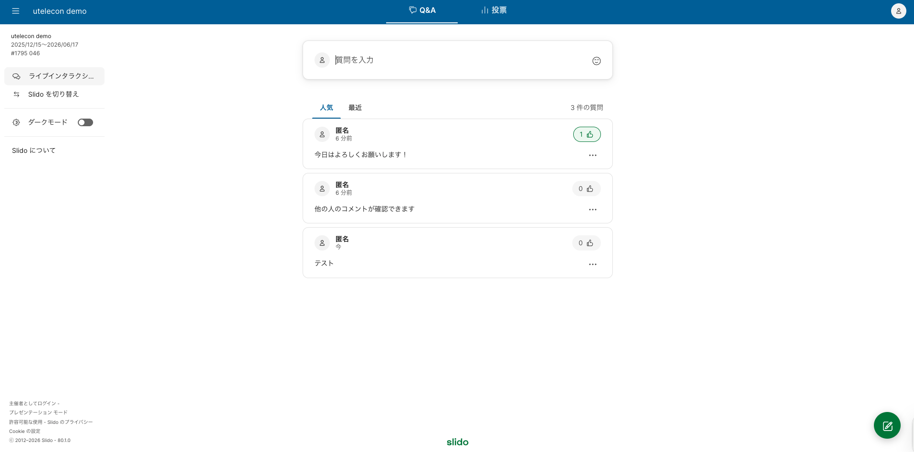
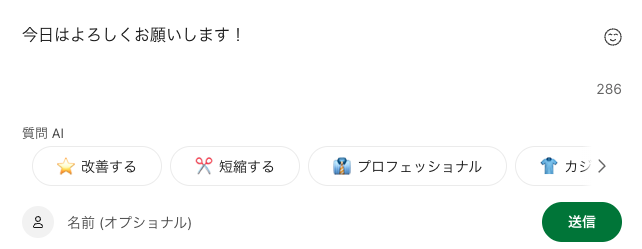
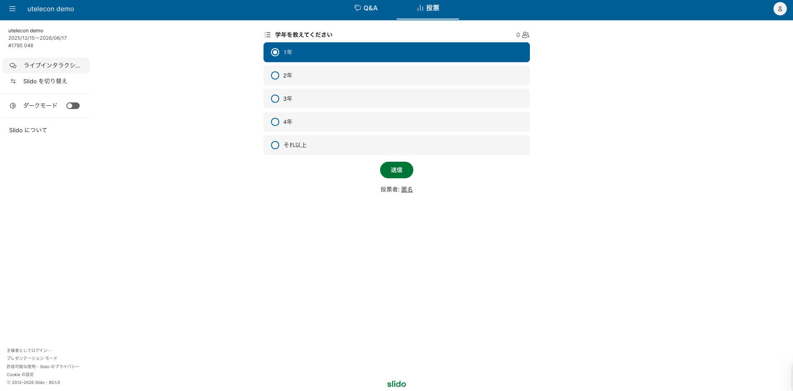

このページでは，Slidoで受講者（学生）ができる操作を説明しています．

イベントの主催者としてSlidoを使う場合の使い方は，「[Slidoで主催者ができること](../how_to_use_host/)」を確認してください．

## 表示言語を日本語にする

Slidoの画面が英語で表示されている場合は，以下の手順で言語を日本語に変更することができます．

1. ①画面右上のアイコンをクリックし，②「My profile」を選択します．
2. 「Your language」から「日本語」を選択し，「Save」をクリックしてください．

## Q&A機能を使う

画面上部の「Q&A」を選択すると，他の人が送信した質問・感想を確認したりすることができます．また，他の人が送信した質問・感想には「いいね」をすることもできます．「いいね」をすることで，自分もこの投稿に関心があることを示すことができます．

他の人が送信した質問・感想は，それぞれの投稿に付けられた「いいね」の数の順番に表示されており，表示は自動的に更新されます．画面上の「最近」を選択することで，新着順の表示に変更することもできます．

### 質問や感想を送信する

質問・感想を送信するときには，「Q&A」画面上の「質問を入力」あるいは画面右下の緑のアイコン（ペンのマーク）をクリックしてください．

画面上に表示されるテキスト入力欄に質問・感想を入力して「送信」を押すことで，質問・感想が送信されます．

「質問AI」の欄の各項目を選択すると，入力した文章がAIによって以下のように書き換えられます．
* **改善する**: 文章の誤字脱字を直したり，より自然で分かりやすい表現に整えてくれます．
* **短縮する**: 長文を要約して，要点だけのシンプルな質問にしてくれます．（文字数制限がある時に便利です）
* **プロフェッショナル**: 目上の人や公式な場にふさわしい，礼儀正しい「敬語」や「硬い表現」に変換します．
* **カジュアル**: 少し砕けた，親しみやすい表現に変換します．
* **楽しい**: 文末に絵文字を追加して，元気で楽しげな表現に変換します．

質問・感想は匿名で送信できますが，名前を入力したい場合は，テキスト入力欄下部の「名前（オプショナル）」の欄を使ってください．ここで入力した名前は，他の参加者にも共有されます．

## 投票機能を使う

画面上部の「投票」を選択すると，主催者からの質問やアンケートに答えることができます．

主催者が投票を設定していない場合は，「投票」の画面には何も表示されません．

