import SetLang from "./_SetLang.mdx"

このページでは，Slidoの主催者側画面において，主催者ができることを説明しています．主催者側画面には，[イベントの一覧ページ](https://admin.sli.do/events)からアクセスしてください．

Slidoに参加者として参加する場合の操作方法は「[Slidoで参加者ができること](../how_to_use_audience/)」を確認してください．

<SetLang />

## Q&A機能を使う

Slidoでは，Q&A機能を使うことで，学生が自由に質問・感想を送ることができます．

### Q&Aを作成する

Q&Aを作成するには，画面左上または「新しいインタラクションを追加」内の「オーディエンス Q&A」を選択してください．

<figure>

</figure>

### Q&Aの機能設定

Q&A画面の右上にある「Q&A 設定」をクリックすると，質問の受付にある詳細設定を変更できます．授業の性質に合わせて事前に設定しておくとスムーズです．
* **モデレーション**：投稿された質問を教員側が承認するまでスクリーンに表示しないようにします．不適切な投稿を防ぐ場合に有効です．
* **返信**：この設定をオンにすると，学生が他の人の質問に対して返信コメントを書けるようになります．
* **文字数制限**：質問に入力できる最大文字数を設定します．
* **ラベル**：この設定をオンにすると，質問を分類・管理するためのタグ（ラベル）機能を使用できます．また，「ラベルを新規作成」欄から，新しいラベルを作成することができます．
* **反対票**：この設定をオンにすると，学生が質問に対して「反対（低評価）」の意思表示を行えるようになります．なお，「いいね」機能は常に有効です．

<figure>
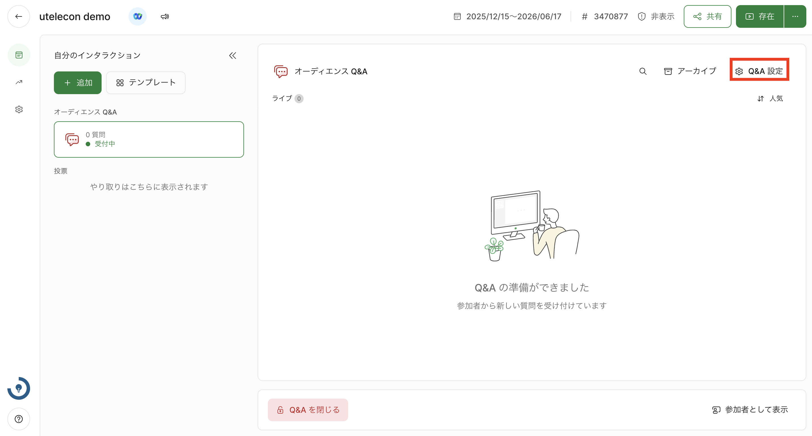
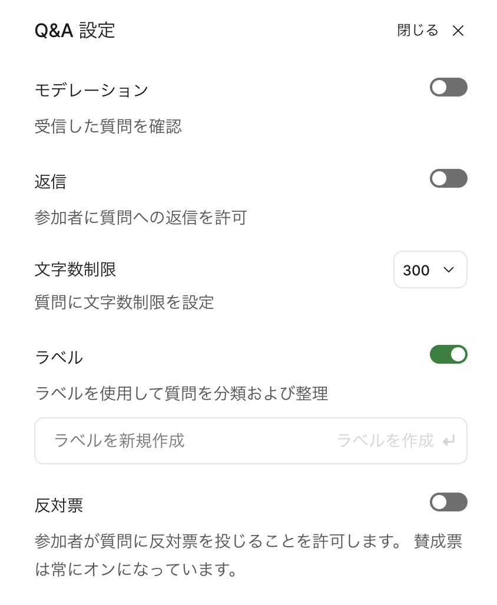
</figure>

### 学生の質問を確認する

学生からの質問・感想は，画面右側の「ライブ」欄に表示されます．

標準では，それぞれの投稿に付けられた「いいね」の数の順番に質問・感想が表示されており，自動的に更新されます．
画面右上の上下矢印（「⇅」マーク）を選択することで，「最近」：投稿順 に変更することもできます．

<figure>
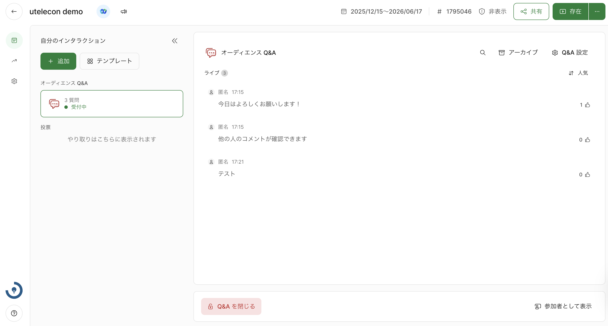
</figure>

それぞれの質問・感想にカーソルを重ねることで，以下のようなボタンが表示され，質問・感想に対する操作を行うことができます．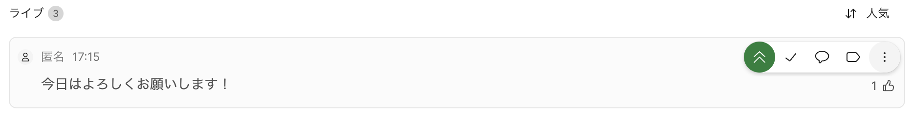
* **ハイライト（緑のアイコン）**：特定の質問・感想を画面の上部に固定することができます．ここで設定した投稿は，全ての参加者の画面でも上部に固定されます．
* **回答済みとしてマーク（チェックマーク）**：このボタンを選択することで，質問・感想を回答済みとしてアーカイブできます．アーカイブした質問は学生から見えなくなりますが，教員側からは常に確認できます．
* **返信（吹き出しのマーク）**：質問・感想に対して返信をすることができます．
* **ラベル（タグのマーク）**：Slidoでは新しい質問・感想が送信されるたびに表示が入れ替わるため，質問・感想を見失いやすくなっています．「あとで」や「重要」といったラベル（付箋）を作って貼ることで，学生からの質問を分類・管理することができます．なお，主催者がラベルをつけたことは参加者にはわかりません．

また，右側の三点リーダーをクリックして表示されるそのほかの選択肢には，以下のようなものがあります．
* **☑︎を選択**：学生からの質問・感想を選択し，ラベルやアーカイブなどの動作を一括して行うことができます．
* **編集**：学生からの質問・感想を編集します．
* **アーカイブ**：学生からの質問・感想をアーカイブに入れます．アーカイブに入れられた質問・感想は，学生から見えなくなりますが，教員側からは常に確認できます．
* **削除する**：学生からの質問・感想を消去します．

なお，画面右上の **アーカイブ** を押すと．アーカイブに入れられた質問・感想の一覧が表示されます。それぞれの質問・感想にカーソルを重ねると，（既に述べたもの以外に）以下のようなボタンが表示され，質問・感想に対する操作を行うことができます．

* **復元（反時計回りの矢印）**：質問・感想を再度アーカイブから取り出すことができます．
 
## 投票機能を使う

Slidoでは，投票機能を使うことで，教員から学生に対して質問やクイズを行うことができます．

<figure>
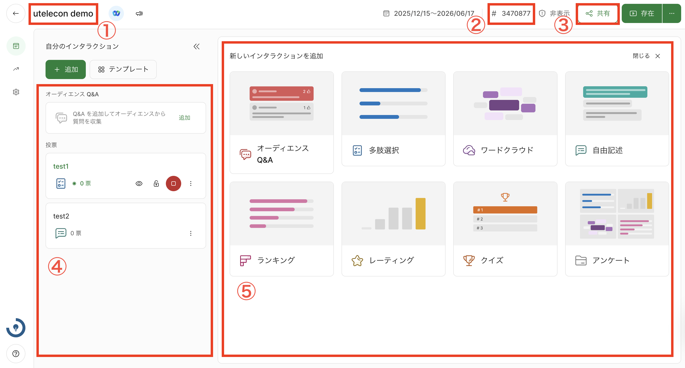
</figure>

①イベント名・日時 
②イベントのコード 
③イベントのQRコードを表示・ダウンロードする 
④学生に表示されている投票の表示（後述） 
⑤投票の作成（後述）

### 投票を作成する

投票を作成するには，画面左上の「+ 追加（新しいインタラクションを追加）」を選択してください．

投票には以下の**6種類の単発質問**と，それらをまとめて実施する**アンケート**があります．投票機能の画面から，各機能のアイコンのボタンをクリックすることで新規の投票を作成できます．

* 多肢選択ー選択形式で答える質問を設定する
  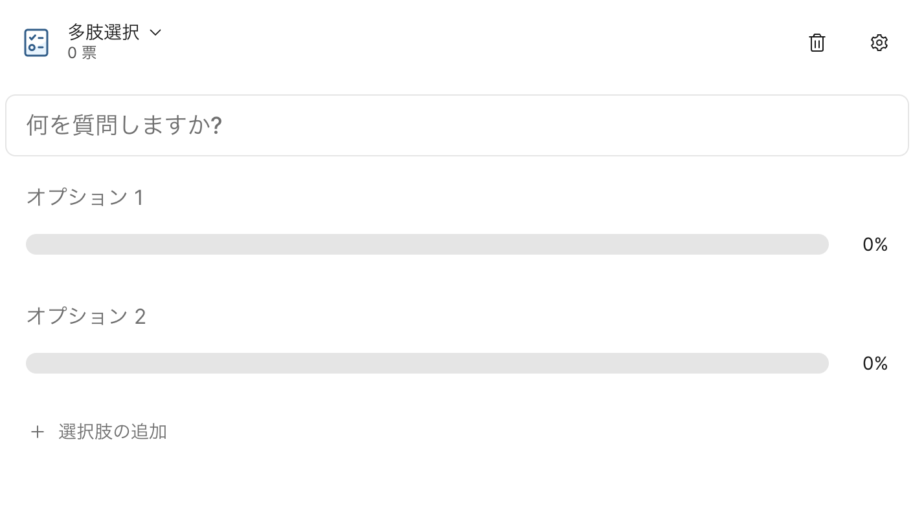
* ワードクラウドー参加者の回答が「クラウド」として可視化される質問を設定する（参加者は短文形式で答える）
  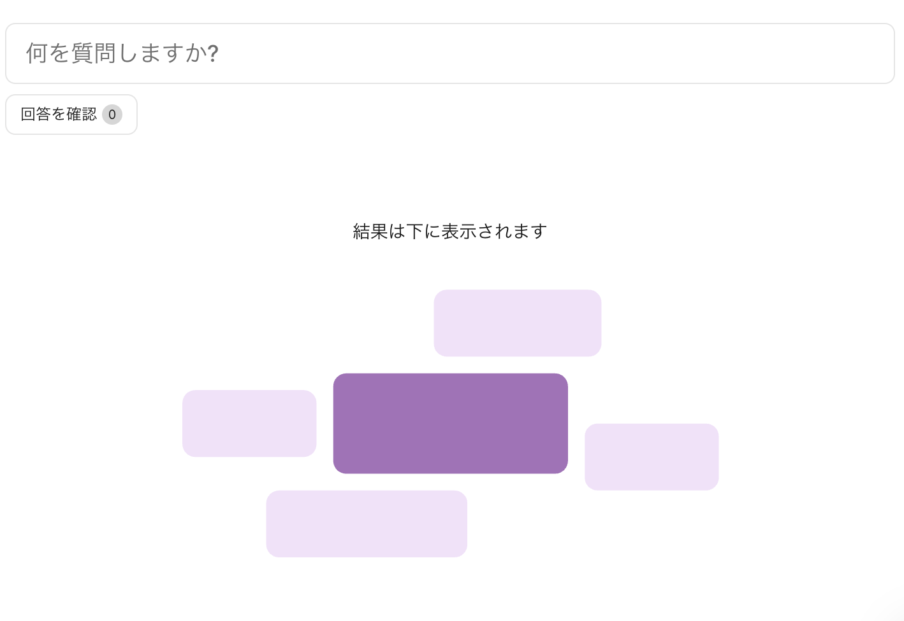
  * 回答が図のように表示されます．同一の回答が複数あった場合，その単語が大きく表示されます．（学生側の表示）
    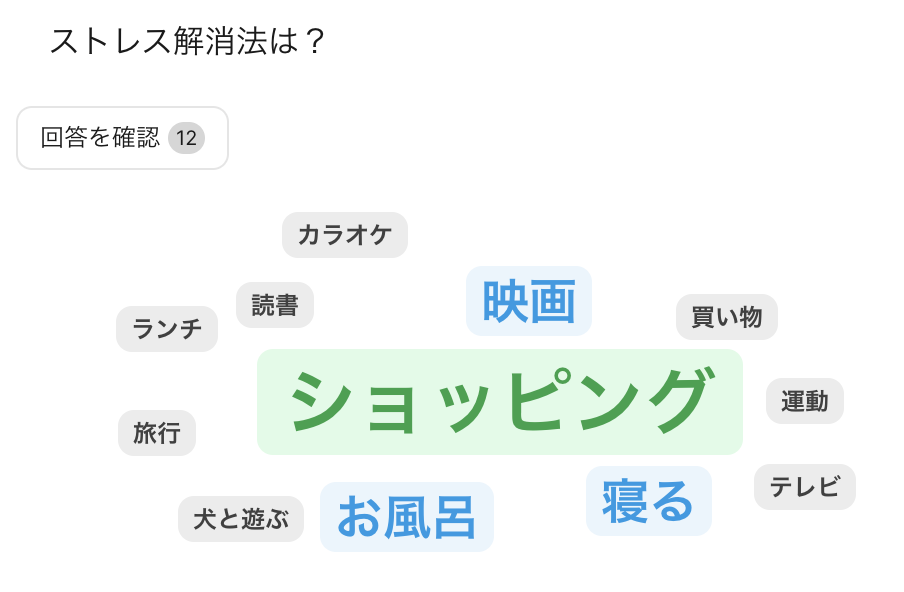
* 自由記述ー短文形式で答える質問を設定する
  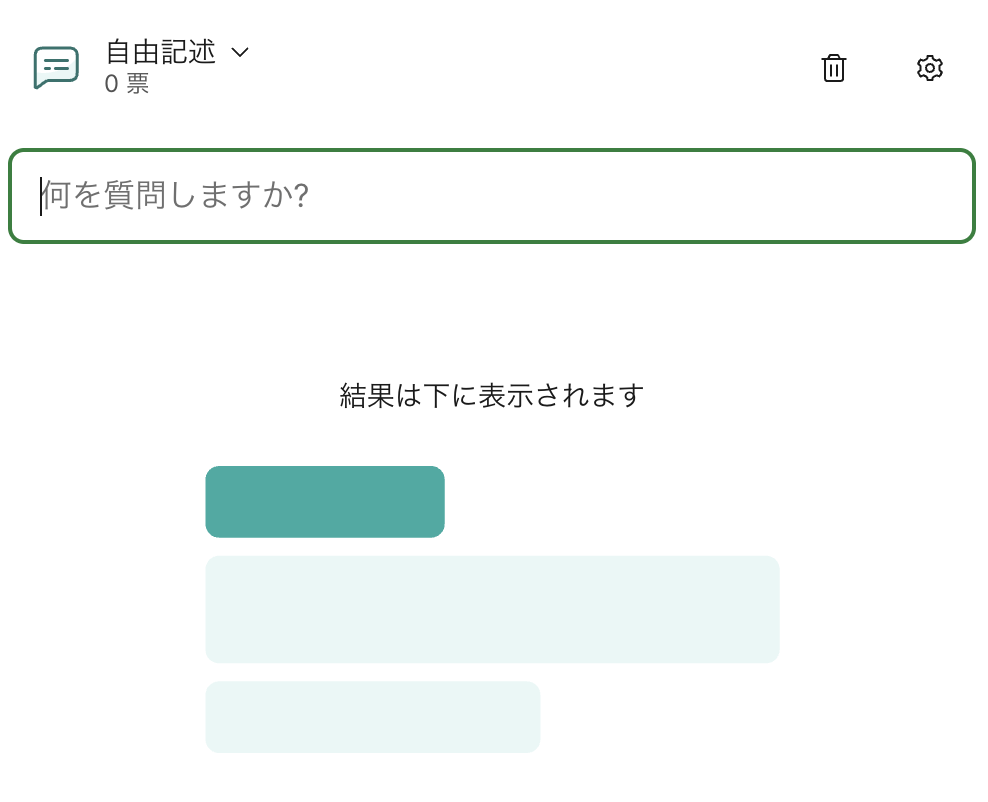
* ランキングー参加者に順位付けしてもらうための複数の項目を設定する
  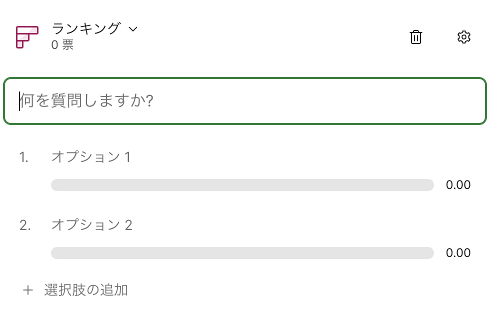
* レーティングー最大10段階で評価される評価軸を設定する
  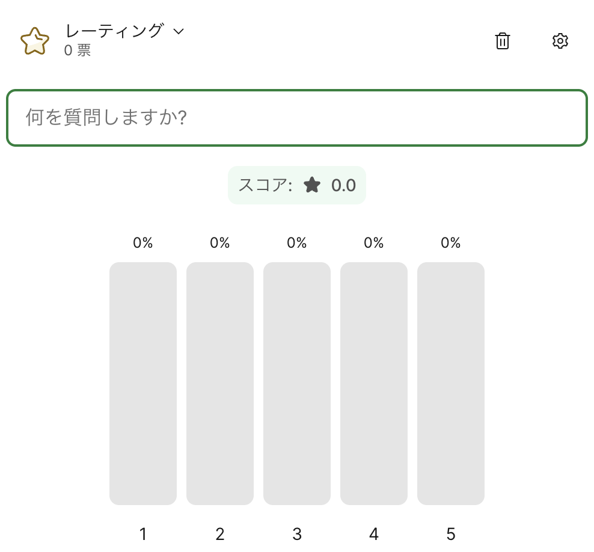
* クイズー正解が表示される問題を設定する
  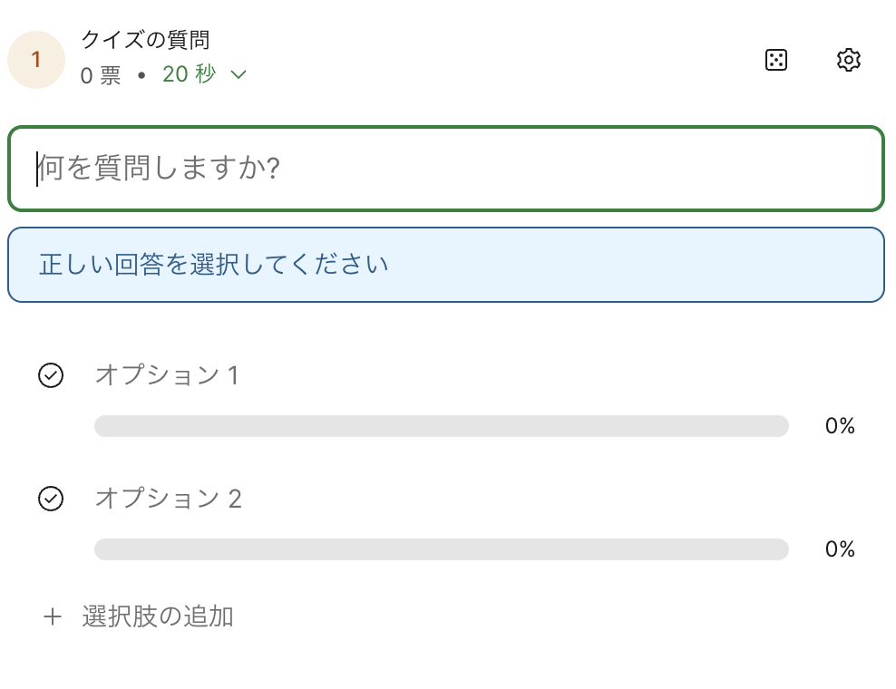
* アンケートー複数の質問を組み合わせたアンケートを作成する（上記の6種類とは異なり，複数の質問を1つのセットとしてまとめて回答してもらう）
  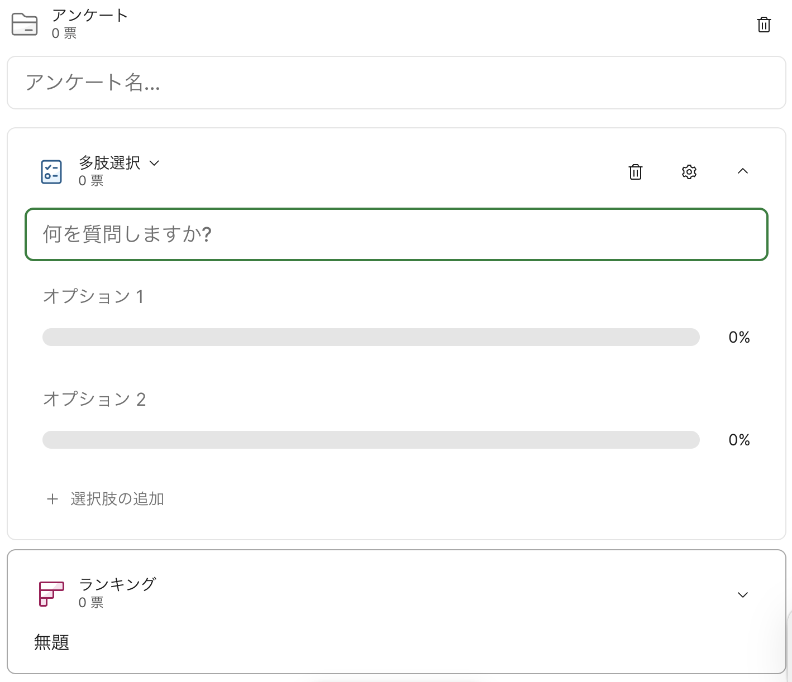

### 作成した投票を管理する

作成した投票は，画面左側と画面右側に表示されます．画面左側にはこれまで作成した全ての投票が表示され，画面右側には参加者に表示されている投票が表示されます．参加者への投票の表示を停止する場合は，画面左側の投票についている赤色のボタンをクリックして下さい． 

赤いボタンをクリックすると，画面右側に表示されていた投票が終了します．再度参加者への投票の表示を行いたい場合は，画面左側の投票についている緑色のボタン（元々赤色のボタンだったもの）をクリックして下さい． 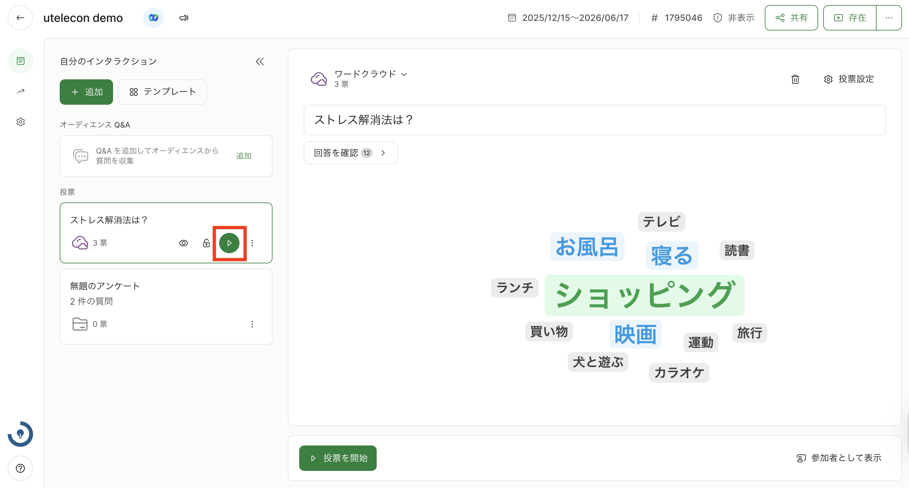
