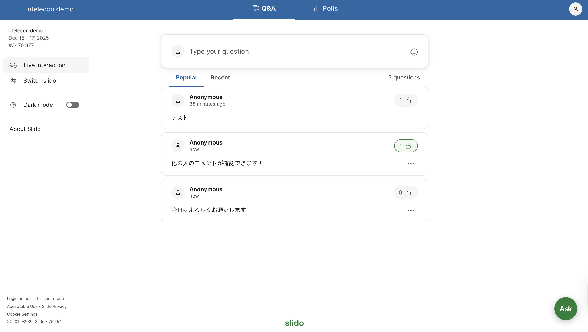

## Slidoとは

「Slido」は，Q&Aやライブ投票・アンケートなど，授業や会議・講演会などでの参加者との双方向コミュニケーションに役立つ機能を提供しているWebサービスです．

授業では，学生からの質問を受け付けたり (Q&A) ，リアルタイムに教員から学生に質問を投げかけたり（投票）するといった場合に活用することができます．Zoomのチャットなどと比較して，Slidoを使うと次のようなメリットがあります．

- 学生が質問を匿名で投稿することができ，質問しやすくなる
- 学生が他の人の投稿した質問に「いいね」を付けることができ，多くの人が気になっている質問が分かるようになる
- 質問ごとに文章での返信（回答）を付けることができ，多くの質問を混乱せずに扱うことができる（たとえばTAに文章で回答してもらう場合などに有効と思われます）

また，質問だけでなく感想やコメントを投稿してもらったり，学生同士で感想やコメントをやり取りできる掲示板のように使ったりする，といった応用も考えられます．

## 受講者の使い方

受講者としてSlidoを使う場合（すなわち，主催者からSlidoを使うように案内された場合）は，特段の準備は不要で，主催者からURLやQRコードをもらってアクセスするだけでSlidoの画面が開きます（主催者からURLやQRコードではなく「アクセスコード」が提供された場合は， [Slidoのトップページ](https://www.sli.do/jp)の上部にある入力欄にそれを入力するとSlidoの画面が開きます）．

Slidoの画面でどのようなことができるかについては，「**[Slidoで受講者ができること](how_to_use_audience)**」をご覧ください．

## 主催者の使い方

### 利用の流れ

Slidoでは，1つ1つの部屋にあたるものを「イベント」と呼んでおり，主催者としてSlidoを使いたい場合は，この「イベント」を作成して使うことになります．具体的な流れは次のようになります．

1. [東京大学のアカウントでサインイン](login)する
1. [イベントを作成し，共有するためのURLを確認する](create_event)
    - 必要があれば[設定を変更する](change_event_settings)
1. URLを受講者に共有（周知）する．授業で学生に伝える場合はZoomのチャットなどで連絡すれば十分でしょう．
1. 受講者からの質問を確認したり，投票を行ったりする．具体的な手順は「**[Slidoで主催者ができること](how_to_use_host)**」をご覧ください．
{:start="0"}

### 東京大学のアカウントとライセンス

Slidoは無料でも使うことができますが，Webexと連携しているため，東京大学のWebexアカウントでサインインすると有料機能を利用することができます．

* **モデレーション**：受講者（学生）から質問が投稿された後，すぐに他の受講者にも見えるようにするか，主催者（教員）が内容を確認してからでないと他の受講者には見えないようにするか，という設定ができるようになります（無料版では，必ずすぐに他の受講者に見えるようになります）．
* **返信**：投稿された質問に返信（回答）を付けることができる人の範囲を，主催者だけにするか主催者と受講者の双方にするか，設定できるようになります（無料版では返信は主催者しかできません）．
* **投票・調査**：投票を行う際に，投票の中に画像を埋め込んだり，複数の項目がある投票を行ったりすることができるようになります．
* **エクスポート**：質問のデータなどをエクスポート（ダウンロード）できるようになります．

授業でSlidoを利用する場合には，[東京大学のアカウントでサインイン](login)することをおすすめします．なお，東京大学のアカウントを利用する際は，「[情報システム本部が管理・運用する外部サービスの利用にあたっての注意事項](/docs/dics-terms)」も参照してください．

## 活用方法・実践例

* **[Slido の基本的な使い方と実践](https://dalt.c.u-tokyo.ac.jp/wp-content/uploads/2019/02/KOMEX-DALT-Newsletter-201806.pdf)**: 教養学部 附属教養教育高度化機構 アクティブラーニング部門のアクティブラーニングニュースレターの記事として Slido の基本的な使い方や授業における使い方が載っています．
* **[Slido の授業における使い方](https://dalt.c.u-tokyo.ac.jp/wp-content/uploads/2019/07/KOMEX-DALT-Newsletter-201907.pdf)**: 教養学部 附属教養教育高度化機構 アクティブラーニング部門のアクティブラーニングニュースレターの記事として 2つの授業における Slido の使い方が載っています．
* **[オンライン授業のグッドプラクティス／四本裕子先生 心理I](/good-practice/interview/yotsumoto)**: 教養学部の授業にて匿名での質問や相談を受け付ける実践です．Slidoを授業内だけではなく，学生同士の交流の場として活用していました．
* **[オンライン授業のグッドプラクティス／田中庸介先生 解剖学第3 (神経)](/good-practice/interview/tanaka)**: 医学部の授業にて匿名での質問や相談を受け付ける実践です．
* **[オンライン授業のグッドプラクティス／栗田佳代子先生 「学びの場」づくり](/good-practice/interview/kurita)**: 教育学部の授業にて匿名での質問や相談を受け付ける実践です．
