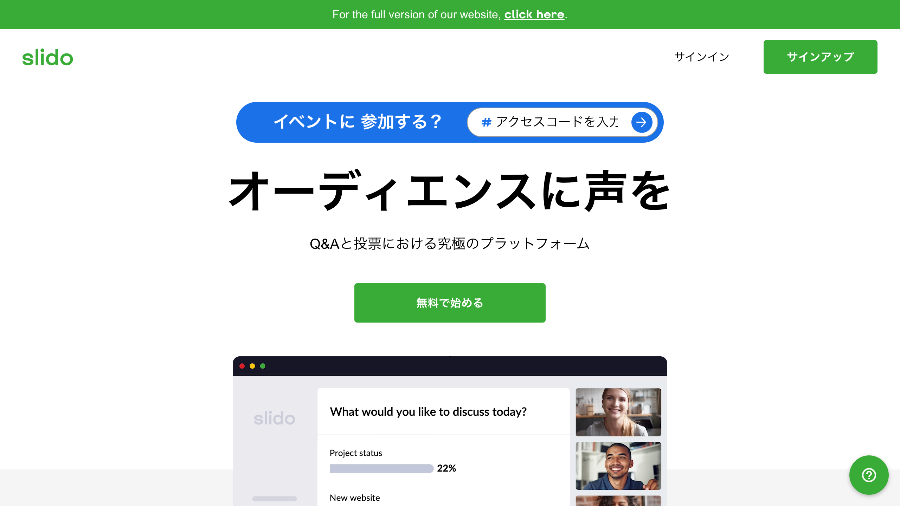
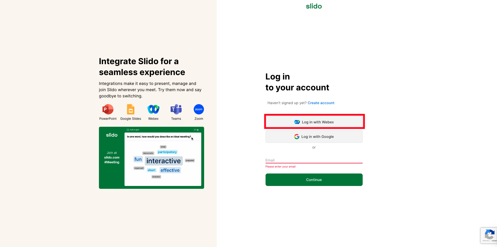
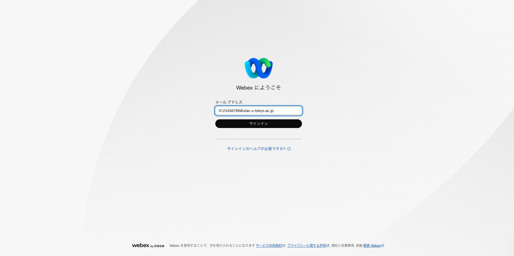
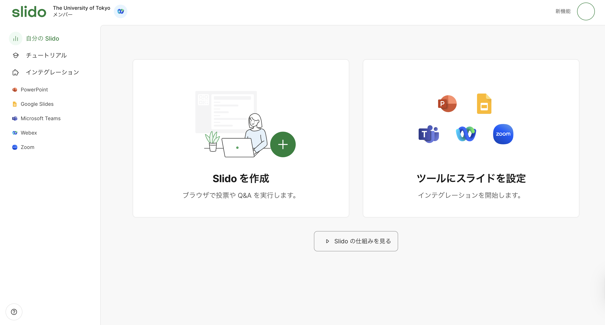
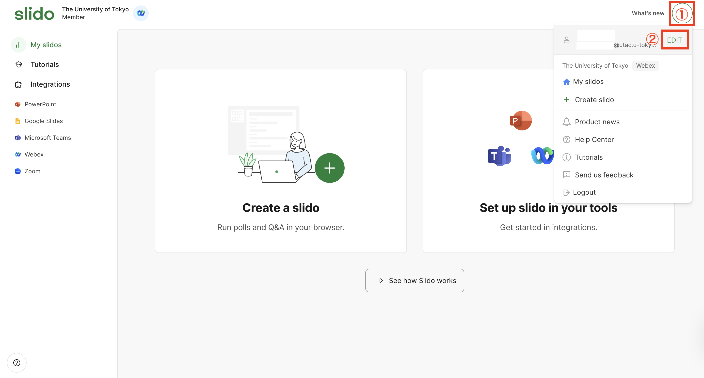

自身でイベントを主催する場合は，Slidoへのログインが必要です．イベントに参加するだけであれば，この手順は必要ありません．

Slidoには，個人のアカウントを利用してサインインすることもできますが，以下の手順に従ってUTokyo Accountでサインインすることで，有料機能を利用できるようになります（※UTokyo Accountをまだ使ったことがなければ，先に「[UTokyo Accountを使い始めるには](/utokyo_account/#procedures)」を参照してください．）

1. [公式サイト](https://www.sli.do/jp)にアクセスしてください．
2. 画面右上の「サインイン」をクリックしてから，「Log in with Webex」をクリックしてください．この画面の「Your email」の欄は利用しません．
3. Webexのサインイン画面が開くので，UTokyo Account（数字10桁の共通ID + `@utac.u-tokyo.ac.jp`）を入力してください．
4. 既にUTokyo Accountにサインイン済みの場合を除き，UTokyo Accountのサインイン画面が表示されるので，サインインしてください．
5. 画面の左上にThe University of Tokyoと書かれたSlidoのページが表示されればOKです．

### 管理画面を日本語にする
サインイン直後の画面が英語で表示されている場合は，以下の手順で日本語に変更することができます．
1. ①画面右上のプロフィールアイコンをクリックし，②「EDIT」ボタンをクリックします．
2. 「General」欄の設定項目から「Language」を選択します．「Japanese (Japan)」を選択し，「Save」をクリックすると，メニューなどが日本語で表示されるようになります．
