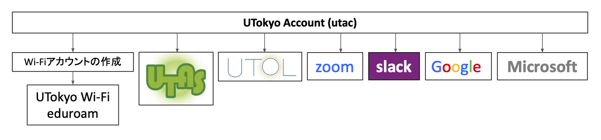

import UTokyoAccountChangePassword from '@components/ja/systems/utokyo_account/ChangePassword.mdx'
import UTokyoAccountMFA from '@components/ja/systems/utokyo_account/MFA.mdx'
import ZoomSigninBrowser from "@components/ja/systems/zoom/SigninBrowser.mdx";
import InformationSecurity from "@components/ja/InformationSecurity.mdx";
import UtolLogin from '@components/ja/systems/utol/Login.mdx'

<b class="box">
2025/3/12 15:00から，説明会「<a href="/events/2025-03-12/">東京大学における情報システムとコミュニケーションツール</a>」を開催します．本ページとあわせてご参照ください．
{/*2025/3/12 に，説明会「<a href="/events/2025-03-12/">東京大学における情報システムとコミュニケーションツール</a>」を開催しました．説明会の資料と動画をリンク先のページで提供していますので，本ページとあわせてご参照ください．*/}
</b>

## 基本的なご案内

このページでは，業務を実施するために必要なアカウントの初期設定と，について説明します．
最初に、アカウントの初期設定を以下の手順で済ませてください。

1.パスワードを初期パスワードから変更する

2.多要素認証を設定する

3.情報セキュリティ教育を受講し、テストに合格する

詳細については、後述の説明や utelecon の各ページをご参照ください。

教員の方は[東京大学における情報システムの準備について（教員向け）](/faculty_members/)をご参照ください.

### 困ったときは：サポート窓口

東京大学の情報システムの利用にあたり，トラブルや情報システムの利用方法に関する相談などは，**[サポート窓口](/support/)**にご相談ください．チャット・オンライン通話・メールフォームの3つの方法で相談を受け付けており，学生スタッフ「コモンサポーター」と教職員の共同体制により迅速な対応を行っています．

## 東京大学のシステムの全体像

東京大学では，Microsoft, Google等，様々な情報システムを提供しています．こうしたさまざまなシステムを利用するには，UTokyo Accountと呼ばれる全学的なアカウントを用いてサインインを行います．次の図はこのような東京大学の情報システムを表す概要図です．

なお東京大学では，セメスターの開始にあたり，教職員の方向けに，東京大学の各システムの概要についての説明会を実施しています．東京大学で提供している情報システムは多岐にわたり，把握するのが難しいですが，説明会ではそれぞれのシステムとその関係性について説明しておりますのでよりわかりやすくなっています．2025年度Sセメスターに向けた説明会につきましては，「[東京大学における情報システムとコミュニケーションツール](/events/2025-03-12/)」をご覧ください．

以下では，東京大学のシステム，およびその利用方法について個別に説明いたします．

## はじめに：「UTokyo Account」の初期設定など

「UTokyo Account」は，東京大学の情報システムを利用する際に必要となる全学的なアカウントです．この後で説明するZoomやUTOLなどの各システムは，このアカウントでログインして使うのが基本になります．

UTokyo Accountのユーザ名は，`0123456789@utac.u-tokyo.ac.jp`のように，10桁の数字（共通ID）の後に東京大学であることを表す記号`@utac.u-tokyo.ac.jp`を付けたもので表されます．

以下，UTokyo Accountの初期設定について説明します．システムを利用するために必要となる重要な作業ですので，よく読んで作業を行ってください．

### UTokyo Accountの初期パスワードを変更する

<UTokyoAccountChangePassword variant="faculty_members" />

### UTokyo Accountの「多要素認証」を有効化する
{:#setting-up-mfa}

<UTokyoAccountMFA />

{/*
東京大学では，情報システムのセキュリティ向上を目的として，UTokyo Accountには多要素認証を導入しています．また，UTokyo Accountを持つすべての方が#多要素認証の設定を必須#としております．「多要素認証 (Multi-Factor Authentication, MFA)」とは，アカウントへのサインイン時に，パスワードに加えて，SMSや専用のアプリなどで本人確認を行う認証方法です．多要素認証を利用すると，なんらかの事情でパスワードが他人に知られた場合でも，アカウントにサインインされる可能性を低くすることができ，セキュリティを向上することができます．

UTokyo Accountでは，利用者が各自で初期設定を行うことにより，多要素認証が有効化される仕組みとなっています．UTokyo Accountのセキュリティを確保することは，利用者個人の情報だけでなく，大学が保有する情報資産を守るために非常に重要ですので，多要素認証の利用は必須となっています．多要素認証の有効化が完了するまで一部のシステムは利用できません．「**[UTokyo Accountの多要素認証の初期設定手順](/utokyo_account/mfa/initial)**」のページを確認いただき，設定してください．
*/}

### 情報セキュリティ教育の受講
{:#information-security-education}

<InformationSecurity variant="faculty_members" />

### 職員向けの初期設定
ここまでの手順により、以下のページの「はじめに」の項目の部分が完了します。
これ以降の初期設定は以下のページを参照してください。

## その他の東京大学のシステム
東京大学では，各種情報システムを契約・運用していますので，以下ではその一部について説明します．
### UTokyo Portal

UTokyo Portalは教職員向けの学内ポータルサイトです．業務に必要な手続きや資料の確認を行えるほか，様々な「やりたいこと」に対応したマニュアルを便利帳としてトップページの下部に掲載しています．また各種通知につきましてもこのページに掲載されますので，ご確認ください．
**[UTokyo Portal](https://login.adm.u-tokyo.ac.jp/utokyoportal)**{:.box.center}

### UTokyo VPN

東京大学の一部の情報システム（人事情報MyWeb等）は，学内ネットワークからのみアクセスが可能です．UTokyo VPNは，このようなシステムにキャンパス外からアクセスするためのシステムです．
**[UTokyo VPN](/utokyo_vpn/)**{:.box.center}

### UTokyo Wi-Fi

UTokyo Wi-Fiは東京大学のキャンパス内で提供されている学内向けWi-Fiで，学内限定の情報システムやサービスへのアクセスが可能です．利用するためには事前に準備が必要です．
**[UTokyo Wi-Fi](/utokyo_wifi/)**{:.box.center}

### ECCSクラウドメール (Google Workspace)

Googleのシステムを東大のアカウントで利用できるようにしたもの (Google Workspace) です．東大のメールアドレス (`xxxx@g.ecc.u-tokyo.ac.jp`) が使えるGmail，オンラインストレージサービスのGoogleドライブ，文書作成サービスのGoogleドキュメント，表計算サービスのGoogleスプレッドシート，フォーム作成サービスのGoogleフォーム，動画配信サービスのYouTube，Web会議のGoogle Meet，など多くの機能が使用できます．また，東京大学のアカウントに限って公開する，通常のGoogleアカウントにはない共有設定（限定公開）も可能です．

**[ECCSクラウドメール (Google Workspace)](/google/)**{:.box.center}

### UTokyo Microsoft License

東京大学では，Microsoftのシステムを大学のアカウントで利用できるようになっており，WordやExcelなどのMicrosoft Officeアプリのダウンロードが可能です（学生および東京大学に雇用されている教職員のみ）．その他にも，ビジネスチャットツールのTeams，職員メールのOutlook (`@mail.u-tokyo.ac.jp`)，Web版のOffice，ファイル置き場のOneDrive，フォーム作成サービスのMicrosoft Formsなどのさまざまな機能を使うことができます．
**[UTokyo Microsoft License （Office アプリ，OneDrive）](/microsoft/)**{:.box.center}

### Zoom
Zoomは，東京大学で最も多く使われているWeb会議システムです．
東京大学ではZoomのライセンス契約を行っており，サインインして利用すると，参加者数の上限が300人・時間の上限が30時間のミーティングを開催できます．
**[Zoom](/zoom/)**{:.box.center}

### UTokyo Slack

ビジネスチャットツールと呼ばれるサービスの一種で，テキストメッセージをやり取りしてコミュニケーションを取るためのツールです．テキストメッセージを投稿できる「チャンネル」という場所を複数作って別々のやり取りを同時並行で行えるのが特徴です．なおUTokyo Slackでは，コミュニケーションを行う人が集まる単位である「ワークスペース」は，教職員からの申請により作成できます．
**[UTokyo Slack](/slack/)**{:.box.center}

