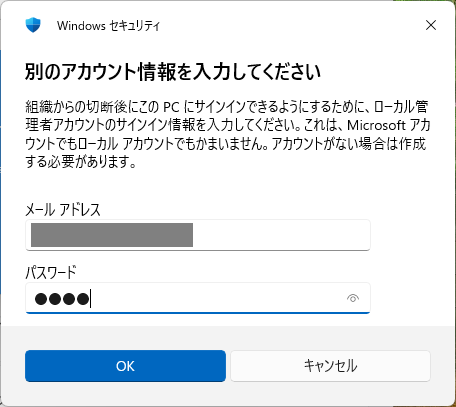

import ArrowOverlay from "@components/utils/ArrowOverlay.astro";
import workplace from "./workplace.png";

## はじめに
{:#about}

このページでは，UTokyo Account（Microsoft Entra ID）でサインインするように設定してしまったWindows PCから，UTokyo Accountの関連付けを解除する方法を説明します．

個人のWindows PCのセットアップ時にUTokyo Accountを使用してサインインした場合，そのPCはUTokyo Accountに関連付けられた状態（「Microsoft Entra 参加済み」の状態）になります．この状態のままだと，PCが大学によって管理された状態となり，**離籍などでUTokyo Accountが失効した際にPCにサインインできなくなります**．

個人のPCでこの状態になっている場合は，在籍中にこのページの手順に従って関連付けを解除してください．

### UTokyo Accountが関連付けられているかどうかの確認方法

1. Windowsの「設定」を開いてください（キーボードの<kbd>Windows</kbd>+<kbd>I</kbd>で開くことができます）．
1. 「**アカウント**」→「**組織または学校にアクセスする**」を選択してください．
    - 「ファイル名を指定して実行」（<kbd>Windows</kbd>+<kbd>R</kbd>）で`ms-settings:workplace`と入力して直接アクセスすることもできます．
1. この画面に自分のUTokyo Accountが表示されている場合は，UTokyo Accountが関連付けられている状態です．このページの手順に従って解除を行ってください．表示されていない場合は，解除の必要はありません．

## 事前に必要な準備
{:#preparation}

関連付けの解除を行う前に，以下の準備を行ってください．

### PCに別の管理者アカウントを用意する
{:#admin-account}

関連付けを解除すると，UTokyo Accountを使ってそのPCにサインインできなくなります．そのため，**事前に別のアカウントを用意し，PCの管理者権限を付与しておく必要があります**．

別のアカウントとしては，以下のいずれかを使用してください．

- **個人のMicrosoftアカウント**：すでにお持ちの場合は，そのアカウントをPCに追加し，管理者権限を付与してください．
- **ローカルアカウント**：PCにローカルアカウントを新規作成し，管理者権限を付与する方法もあります．

### BitLocker回復キーをバックアップする
{:#bitlocker}

PCでBitLocker（ドライブの暗号化機能）が有効になっている場合，回復キーがUTokyo Accountのデバイス情報に保存されていることがあります．**関連付けを解除すると，UTokyo Accountに保存されている回復キーは削除されてしまい，暗号化の回復が必要になった際にデータを復元できなくなります**．

以下の手順で，事前に回復キーをバックアップしてください．

1. [Microsoftのデバイス一覧ページ](https://myaccount.microsoft.com/device-list)にアクセスしてください．
1. 対象のデバイスを選択し，**BitLocker 回復キー**を確認してください．BitLocker 回復キーは6桁ずつに区切られた48桁の数字の列です．
    - 「BitLocker キーID」とは異なりますので注意してください．
1. 回復キーをメモやファイルなど，**PC以外の安全な場所に保存**してください．

### PCのデータをバックアップする
{:#backup}

関連付けの解除により，UTokyo Accountのユーザー領域に保存されているデータにアクセスできなくなる場合があります．アクセスできなくなると困るデータがある場合は，事前に外付けドライブやクラウドストレージなどにバックアップを取ってください．

## 関連付けを解除する手順
{:#disconnect}

事前準備が完了したら，以下の手順で関連付けを解除してください．

1. Windowsの「設定」を開いてください（キーボードの<kbd>Windows</kbd>+<kbd>I</kbd>で開くことができます）．
1. 「**アカウント**」→「**組織または学校にアクセスする**」を選択してください．
    - 「ファイル名を指定して実行」（<kbd>Windows</kbd>+<kbd>R</kbd>）で`ms-settings:workplace`と入力して直接アクセスすることもできます．
1. 自分のUTokyo Accountが表示されていることを確認し，「**切断**」を押してください．
    - UTokyo Accountが表示されていない場合は，関連付けされていないため，以降の手順は不要です．
    <ArrowOverlay image={workplace} x={650} y={380} angle={315}/>
1. 確認のメッセージ「このアカウントを削除しますか？メール、アプリ、ネットワーク、すべてのコンテンツなどの関連付けられているアクセスリソースが削除されます。このデバイスに保存されている一部のデータも、組織によって削除されることがあります。」が表示されます．内容を確認し，「**切断する**」を押してください．
1. 「組織から切断する」という画面が表示されます．「切断後は，組織のアカウントを使ってこのPCにサインインすることはできません．」という説明を確認し，「**実行**」を押してください．
1. 事前に用意した管理者アカウントの情報を入力する画面が表示されます．[事前に用意した](#admin-account)アカウントの情報を入力してください．
    - 「メール アドレス」と表示されますが，ローカルアカウントの場合はそのアカウント名を入力してください．
    
1. サインイン状態が削除され，サインアウトと再起動が自動的に実行されます．

再起動後は，事前に用意した管理者アカウントでPCにサインインしてください．

