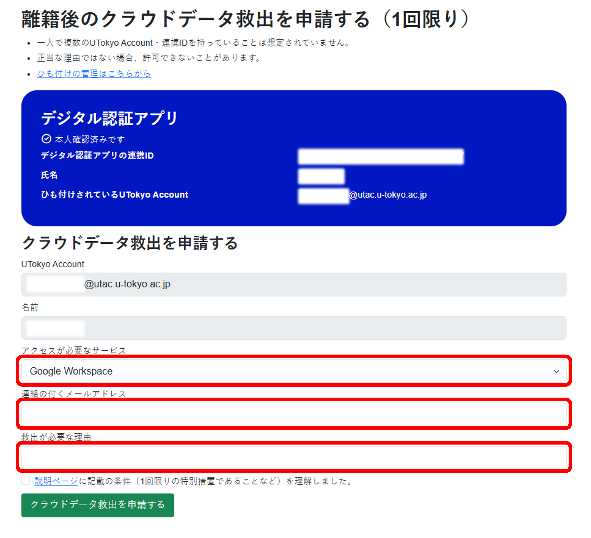

    このページで説明する「クラウドデータ救出」（UTokyo Account失効後に，在籍時のデータ・アカウントへのアクセスを一時的に提供する特例措置）は，**2025年10月1日以降**に申請可能となります．ただし，「[UTokyo Account本人確認サービス](/utokyo_account/ident-myna/)」の事前連携は，9月10日夕方頃から可能です．事前連携は必ず**離籍前に**済ませてください．

卒業・退職等により東京大学から離籍する際には，在籍期間の終了に伴ってUTokyo Accountが失効しサインインができなくなります．そのため，ZoomやECCSクラウドメール，Microsoft 365などの各種情報システムに保存されているデータを引き続き利用したい場合は「[離籍時のデータのバックアップについて](../backup/)」のページの手順に沿って，データのバックアップを取る必要があります．

しかし，なんらかの理由で離籍前にバックアップを作成できず，離籍後に正当な理由でどうしてもデータやアカウントへのアクセスが必要になった場合には，いくつかの条件のもとで特例的に，一部のデータやアカウントへのアクセスを提供できる場合があります．この措置を「クラウドデータ救出」と呼びます．クラウドデータ救出を利用することで，一時的に，ECCSクラウドメールのメール履歴や，Googleドライブ・OneDriveのデータをバックアップしたり，ECCSクラウドメールの転送設定を追加したりできます．

このページでは，クラウドデータ救出の措置を希望するにあたって必要な条件と，申請方法について説明します．

なお，この取り扱いは2025年10月1日より開始し，当面は試行として運用します．

## クラウドデータ救出を利用するための条件
{:#usage-conditions}
クラウドデータ救出を利用するには，いくつかの条件があります．次の条件を理解したうえで申請してください．

* **申請できる方**：過去に東京大学に在籍していた方で，卒業・退職等（離籍）により**UTokyo Accountが失効してから180日間以内**の方．
  * ただし，UTokyo Account失効後180日以内であっても，大学全体の保存容量の都合等により，一部または全部のデータを完全に削除し，提供できない状態にしてしまう場合があるので，ご注意ください．**あくまで[離籍前にバックアップを取る](../backup/)ことが原則**だとご認識ください．
* **アクセス提供対象**：UTokyo Accountで利用できるクラウドサービスのうち，次のもの．
  * **[ECCSクラウドメール](/google/)のアカウント**
    * 特別なパスワードを用いて，UTokyo Accountを経由せずにECCSクラウドメールのアカウントにログインできるようにします．
    * GmailやGoogleドライブなど，Googleのシステム全般のデータにアクセスできます．
    * Gmailの転送設定の追加など，Googleアカウントで行う各種の操作も可能です．
    * ただし，[メールホスティングサービス](https://mh.ecc.u-tokyo.ac.jp/)のメールアドレス（ECCSクラウドメールで利用できる，`g.ecc.u-tokyo.ac.jp`以外のドメイン名のメールアドレス）については，別途ドメイン管理者に相談してください．
  * **[OneDrive](/microsoft/onedrive/)に保存されたファイル**
    * UTokyo Microsoft LicenseにおけるMicrosoftアカウントそのものへのアクセスを提供するのではなく，あくまで個人のOneDriveに保存されたファイルのみをサルベージして提供します．
    * したがって，職員メールシステム，Teams，Teamsチームドライブのデータなどは対象外です．
    * また，Microsoft FormsやPowerPlatform（PowerAutomate，PowerAppsなど）などのデータは，OneDriveからダウンロードできるファイルとしての形は持たないため，対象外です．
* **本人確認について**：申請者がUTokyo Accountの所有者本人であることを確かめるため，在籍中に[UTokyo Account本人確認サービス](/utokyo_account/ident-myna/)を事前連携しており，申請時点でもマイナンバーカードを保有している必要があります．
* **その他の条件**：
  * クラウドデータ救出を利用できる回数は，ECCSクラウドメールとOneDriveそれぞれにつき**1回限り**です．両方の対象を同時に申請した場合は，その1回のみ利用可能です．
  * アクセスできる期間は，**1週間に限ります**．この間に必要なバックアップや転送設定等を済ませてください．
  * クラウドデータ救出の申請は必ず許可されるとは限りません．申請理由によってはお断りする可能性もありますので，ご了承ください．

## 手続きの流れ

クラウドデータ救出を希望する方は「[UTokyo Account本人確認サービス](/utokyo_account/ident-myna/)」を通じて申請してください．  
UTokyo Account本人確認サービスを利用できない場合は，「[UTokyo Account本人確認サービスを利用できない際の対応](#no-myna)」をご覧ください．

### 申請手順
1. 以下のリンクから「UTokyo Account本人確認サービス」にアクセスしてください．
**[UTokyo Account本人確認サービス](https://identification.adm.u-tokyo.ac.jp/verify/)**{:.box.center}
1. 「マイナンバーカードで本人確認」を押して，画面に表示される手順に従って本人確認を完了させてください．
1. 「離籍後のクラウドデータ救出を申請する（1回限り）」を押してください．
1. 「アクセスが必要なサービス」「連絡の付くメールアドレス」「救出が必要な理由」を記入してください．[救出を利用するための条件](#usage-conditions)を確認の上「説明ページに記載の条件（1回限りの特別措置であることなど）を理解しました。」にチェックを入れて，「クラウドデータ救出を申請する」を押してください．
    - アクセスが必要なサービス：Google WorkspaceとOneDriveのどちらのクラウドデータを救出したいか選択してください．両方のデータを救出したい場合は，お手数ですがそれぞれのサービスごとに申請を行ってください．
    - 連絡の付くメールアドレス：uteleconサポート窓口とのやり取りに使うメールアドレスを入力してください．
    - 救出が必要な理由：どうしても救出が必要な理由を具体的に入力してください．内容によっては許可できないことがあります．
{:.small.center.thin-border}
1. 申請後，uteleconサポート窓口から「連絡の付くメールアドレス」欄に記入されたメールアドレス宛に自動応答メールが送信されますのでご確認ください．もしメールが1時間経過後も届かない場合は、お手数ですが[サポート窓口](/support/)までお問い合わせください．
1. 後日，uteleconサポート窓口から記入されたメールアドレス宛に，クラウドデータ救出の許否について通知されます．許可された場合は，1週間以内に「[離籍時のデータのバックアップについて](../backup/)」の説明に沿って，データのバックアップ・転送設定などをしてください．

### UTokyo Account本人確認サービスを利用できない場合の対応
{:#no-myna}

クラウドデータ救出の際の本人確認には，原則として「UTokyo Account本人確認サービス」を用いますが，それが利用できない場合には，次の条件を両方満たせば例外的に申請を受け付けます．

* 離籍直前に，学生として東京大学に在籍していたこと．
* 離籍直前まで所属していた学部・研究科等の学務・教務担当窓口に相談の上，本人確認の協力が得られること．

クラウドデータ救出の利用を希望する方は，離籍直前まで所属していた学部・研究科等の学務・教務担当窓口に「UTokyo Accountで利用していたデータ等を取り出したいので，本人確認の上，uteleconサポート窓口に取り次いでほしい」旨と，以下の必要事項を伝えてください．

* UTokyo Account（10桁の数字）
* 離籍直前の学籍番号（学生証番号）
* 氏名
* 離籍直前の学部・研究科等
* 措置が必要な理由（どうしても**措置が必要な**理由を具体的にお伝えください．例えば「在学時の研究データの一部のバックアップに失敗しており，それが投稿論文の作成にあたって必要な根拠資料であるため」など．たんに「バックアップを忘れていたため」など，バックアップできなかった理由だけでは許可できないことがあります）
* アクセス提供対象サービス（ECCSクラウドメール，OneDrive，または両方）
* 本人連絡先（メールアドレス）

なお，以後のやり取りはuteleconサポート窓口のメールフォームを通じて行うため，[メールフォームのページ](/support/email-form/)に記載の注意事項にあらかじめ目を通しておいてください．

※部局の担当の方へ：本人確認は，公的な写真付き本人確認書類を確認するなど，部局で判断いただき適切な方法により実施してください．対面で行うことを想定していますが，やむを得ない場合，ビデオ映像をやり取りできるWeb会議（Zoom等）で対応することも考えられます．申請者の本人確認が取れたら，[uteleconサポート窓口の**メールフォーム**](/support/email-form/)から，必要事項を添えてご連絡ください．詳しくは内部連絡でお伝えします．
