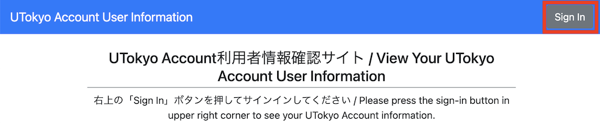
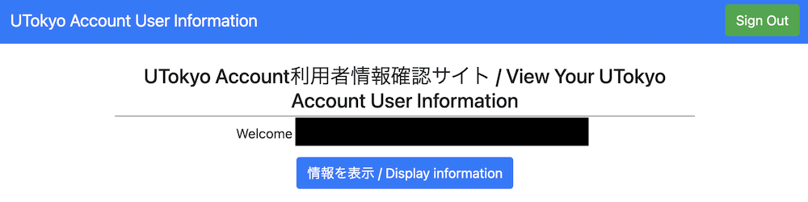

import If from "@components/utils/If.astro"

{/**
  * @typedef {object} Props
  * @property {"link" | "unlink" | "notSpecified"} variant
  */}

連携状況は，UTokyo Account本人確認サービスまたはUTokyo Account利用者情報確認サイト上で確認することができます．

### UTokyo Account本人確認サービス上での確認

1. [UTokyo Account本人確認サービス](https://identification.adm.u-tokyo.ac.jp/verify/)にアクセスしてください．
1. 本人確認を求められた場合は，デジタル認証アプリで本人確認を行ってください．
1. <If cond={props.variant === "link"}>
   「デジタル認証アプリ」欄に，名前とひも付けされているUTokyo Accountが正しく表示されているか確認してください．
   </If>
   <If cond={props.variant === "unlink"}>
   「デジタル認証アプリ」欄に，「ひも付けされているUTokyo Account」の情報が表示されていなければ，連携解除が完了しています．
   </If>
   <If cond={props.variant === "notSpecified"}>
   「デジタル認証アプリ」欄の「ひも付けされているUTokyo Account」の情報が記載されているかを確認してください．
   </If>

### UTokyo Account利用者情報確認サイト上での確認

1. [UTokyo Account利用者情報確認サイト](https://login.adm.u-tokyo.ac.jp/my/)にアクセスしてください．
1. 右上の「Sign In」ボタンを押してください．
   {:.border}
1. 既にUTokyo Accountにサインイン済みの場合を除き，UTokyo Accountのサインイン画面が表示されるので，サインインしてください．
   {:.border}
1. 「情報を表示 / Display information」ボタンを押してください．
1. <If cond={props.variant === "link"}>
   「UTokyo Account本人確認サービスを利用しています」と表示されていれば，事前連携が完了しています．
   {:.border}
   </If>
   <If cond={props.variant === "unlink"}>
   「UTokyo Account本人確認サービスを利用していません」と表示されていれば，連携解除が完了しています．
   {:.border}
   </If>
   <If cond={props.variant === "notSpecified"}>
   「UTokyo Account本人確認サービスを利用しています」または「UTokyo Account本人確認サービスを利用していません」と表示されている行を確認してください．
   <figure class="gallery">{:.border}{:.border}</figure>
   </If>
