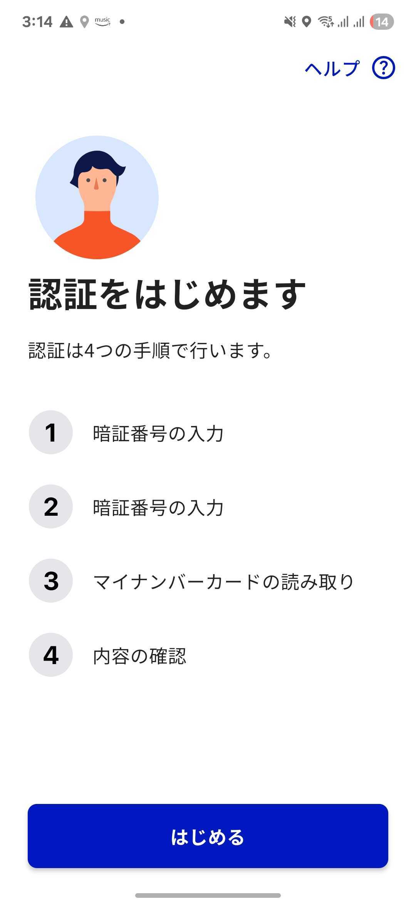
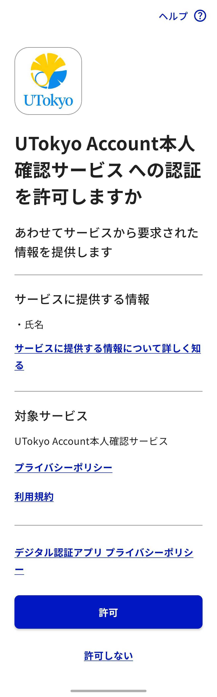
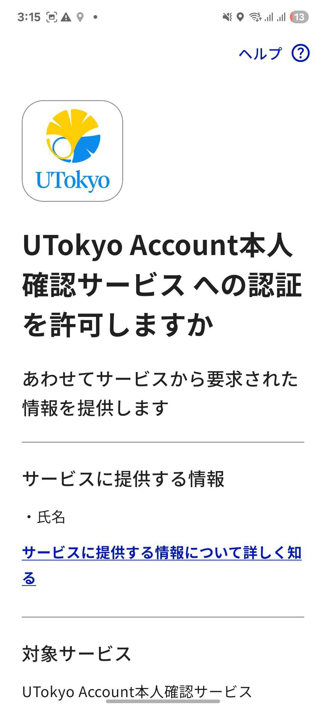

## はじめに
このページでは、Utokyo Account本人確認サービスの利用を開始する際の手順について説明します。

全体の流れは以下のようになります。

- 手順1:[デジタル認証アプリをセットアップする](#setup)
- 手順2:[アプリとマイナンバーカードで本人認証する](#auth)
- 手順3:[UTokyo Accountでログインして紐付けを行う](#login)
- 手順4:[紐付け状況を確認する](#statuscheck)

本人確認サービスを操作する端末により手順2での作業が異なります。
PCとスマートフォン(iPhoneを含む)を併用する方法と、スマートフォンのみで完結する方法があります。
手順が簡潔であるため、スマートフォンのみで完結する方法を推奨します。

## 必要なもの

- 本人のマイナンバーカード
    - iPhone, Androidともにスマホ用電子証明書の利用はデジタル認証アプリ側が対応していません。物理カードが必要です。
- マイナンバーカードの利用者証明用電子証明書の暗証番号
- マイナンバーカードの券面事項入力補助用の暗証番号
- デジタル認証アプリが利用可能なスマートフォン
    - 動作環境
        - Android 11　以降
        - iOS 16.0　以降
        - [公的個人認証サービスポータルサイト](https://www.jpki.go.jp/prepare/reader_writer.html)のリンク先ページにある、「マイナンバーカードに対応したスマートフォン一覧」というファイルに記載がある機種ならば利用可能です。
- (PCから手続きを行う場合)PC

        
暗証番号を忘れた、ロックされてしまった場合は、市町村窓口にて初期化・再設定が必要です。詳しくは[マイナンバーカード総合サイト](https://www.kojinbango-card.go.jp/faq_pin3/)を確認してください。

## 手順1
{:#setup}
デジタル認証アプリのセットアップを行います。

1. デジタル認証アプリをインストールしてください。
    - [iPhone用リンク](https://apps.apple.com/jp/app/id6454900894)
    - [Android用リンク](https://play.google.com/store/apps/details?id=jp.go.digital.auth_and_sign)
1. [デジタル庁が公開している利用登録の方法](https://services.digital.go.jp/auth-and-sign/start-guide/)に従い、アプリの利用登録を済ませてください。

## 手順2
{:#auth}

マイナンバーカードとデジタル認証アプリを用いた本人認証を行います。
[スマートフォンのみで行う場合](#auth-smartphone)と、[PCとスマートフォンを併用して行う場合](#auth-pc)で手順が少し異なります。
それぞれ対応する手順を参照し、作業を進めてください。

### スマートフォンのみで行う場合
{:#auth-smartphone}

1. [Utokyo Account本人確認サービス](https://identification.adm.u-tokyo.ac.jp/verify/)にスマートフォンでアクセスしてください。
1. 「マイナンバーカードで本人確認」を押してください。押すとデジタル認証アプリの画面に遷移します。認証手順の目次が表示されていれば正常です。
    
    
    {/* ここから共通 */}
    

    
デジタル認証アプリが開かず別の画面が表示された場合

    
    アプリがインストールされていない場合はアプリのインストールを促す画面が表示されます。
    ブラウザのの表示倍率の設定によってはPCからのアクセスと判定され、QRコードが表示される画面になることもあります。
    いずれの場合でも、手順1に戻り、デジタル認証アプリのインストールと利用登録を行ってください。
    

    

    
デジタル認証アプリが開いたが別の画面が表示された場合

    アプリはインストールされているが、利用登録がまだの状態であったため、利用登録手続きが開始された可能性があります。手順1に戻り、アプリの利用登録を行ってください。
    

    {/* ここまで共通 */}

    {/* ここから共通 */}
1.  デジタル認証アプリから生体認証やパスコードを求められるので、案内に従い入力してください。
1. 「はじめる」を押して認証手順をすすめてください。
    
1. 利用者証明用電子証明書の暗証番号を入力してください。
    
1. 券面事項入力補助用の暗証番号を入力してください。利用者証明用電子証明書の暗証番号と同じ物を使用している場合は「直前と同じ番号を入力」を押すことで省略できます。
    
1. アプリの案内に従い、「読み取り開始」を押し、マイナンバーカードをスマートフォンで読み取ってください。「カードを読み取っています」と表示されている間はカードを離さないでください。読み取りが完了するとデータがサーバーに送信されます。
    
    
    
1. Utokyo Account本人確認サービスへの認証の許可を求める画面が表示されます。プライバシーポリシーや利用規約を確認の上、許可を押してください。
    

    

    
デジタル認証アプリを途中で閉じた場合

    
    
    「認証と情報提供を中止しますか」というポップアップが出現し、中止を選択した場合、Utokyo Account本人確認サービス側が対応していないためBad Requestと表示されるページに移動します。Utokyo Account本人確認サービスのページにアクセスし直し、手順2の最初からやり直してください。
    このポップアップのキャンセルを押した場合は続けて手順を進めてください。
    

    {/* ここまで共通 */}
1. アプリからUtokyo Account本人確認サービスのページへ戻ります。アプリの「利用中のサービスへ戻る」を押すか10秒経過するかのいずれかでUtokyo Account本人確認サービスへ戻ります。
    
1. [手順3](#login)に進んでください。

### PCとスマートフォンを併用して行う場合
{:#auth-pc}

1. [Utokyo Account本人確認サービス](https://identification.adm.u-tokyo.ac.jp/verify/)にPCでアクセスしてください。
1. 「マイナンバーカードで本人確認」を押してください。QRコードが表示されます。
1. 大きなQRコードを、手順1でセットアップを済ませたスマートフォンで読み込んでください。QRコードが無効になった場合は、下にでる「二次元コードを更新」を押してQRコードを更新してください。以降PCのページは閉じないでください。
    
    

    
PCのページを閉じてしまった場合

    手順2の最初からやり直してください。
    

    {/* ここから共通 */}
    

    
デジタル認証アプリが開かず別の画面が表示された場合

    
    アプリがインストールされていない場合はアプリのインストールを促す画面が表示されます。
    ブラウザのの表示倍率の設定によってはPCからのアクセスと判定され、QRコードが表示される画面になることもあります。
    いずれの場合でも、手順1に戻り、デジタル認証アプリのインストールと利用登録を行ってください。
    

    

    
デジタル認証アプリが開いたが別の画面が表示された場合

    アプリはインストールされているが、利用登録がまだの状態であったため、利用登録手続きが開始された可能性があります。手順1に戻り、アプリの利用登録を行ってください。
    

    {/* ここまで共通 */}

1. スマートフォンに表示される6桁の数字をPCに入力してください。有効期限が切れた場合は6桁の数字を更新してください。

    {/* ここから共通 */}
1.  デジタル認証アプリから生体認証やパスコードを求められるので、案内に従い入力してください。
1. 「はじめる」を押して認証手順をすすめてください。
    
1. 利用者証明用電子証明書の暗証番号を入力してください。
    
1. 券面事項入力補助用の暗証番号を入力してください。利用者証明用電子証明書の暗証番号と同じ物を使用している場合は「直前と同じ番号を入力」を押すことで省略できます。
    
1. アプリの案内に従い、「読み取り開始」を押し、マイナンバーカードをスマートフォンで読み取ってください。「カードを読み取っています」と表示されている間はカードを離さないでください。読み取りが完了するとデータがサーバーに送信されます。
    
    
    
1. Utokyo Account本人確認サービスへの認証の許可を求める画面が表示されます。プライバシーポリシーや利用規約を確認の上、許可を押してください。
    

    

    
デジタル認証アプリを途中で閉じた場合

    
    
    「認証と情報提供を中止しますか」というポップアップが出現し、中止を選択した場合、Utokyo Account本人確認サービス側が対応していないためBad Requestと表示されるページに移動します。Utokyo Account本人確認サービスのページにアクセスし直し、手順2の最初からやり直してください。
    このポップアップのキャンセルを押した場合は続けて手順を進めてください。
    

    {/* ここまで共通 */}

1. スマートフォンでの作業は終了です。PCの画面に戻ってください。
1. [手順3](#login)に進んでください。

## 手順3
{:#login}

1. 「UTokyo Accountでサインイン」を押してください。既にUTokyo Accountにサインイン済みの場合を除き，UTokyo Accountのサインイン画面が表示されるので，サインインしてください．
    
1. 「紐付けを行う」を押して紐付けを行ってください。
    
1. 紐付けを解除というボタンが出てくれば紐付けが出来ています。
    

## 手順4
{:#statuscheck}

### Utokyo account本人確認サービス上での確認
1. Utokyo account本人確認サービス上で、名前と紐付けされているUTokyo Accountが正しく表示されているか確認してください。
### Utokyo account利用者情報確認サイト上での確認
1. [UTokyo Account利用者情報確認サイト](https://login.adm.u-tokyo.ac.jp/my/)にアクセスし、サインインを行ってください。
1. 「情報を表示」を押してください。

    {/* /myとの連携はまだ取れてなさそう？ */}
