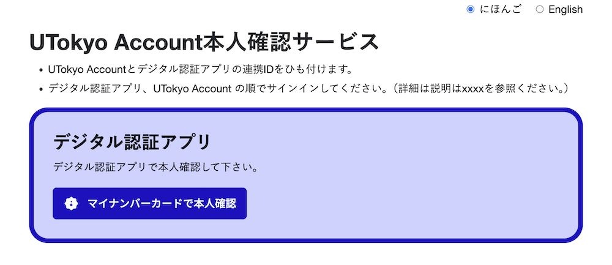
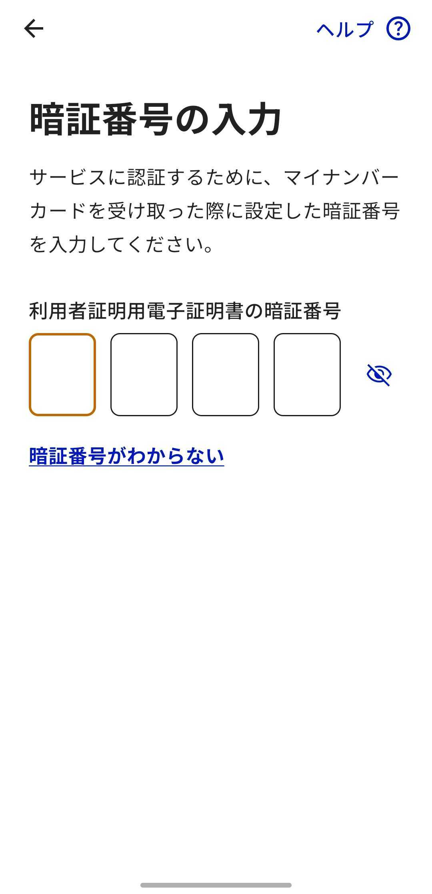
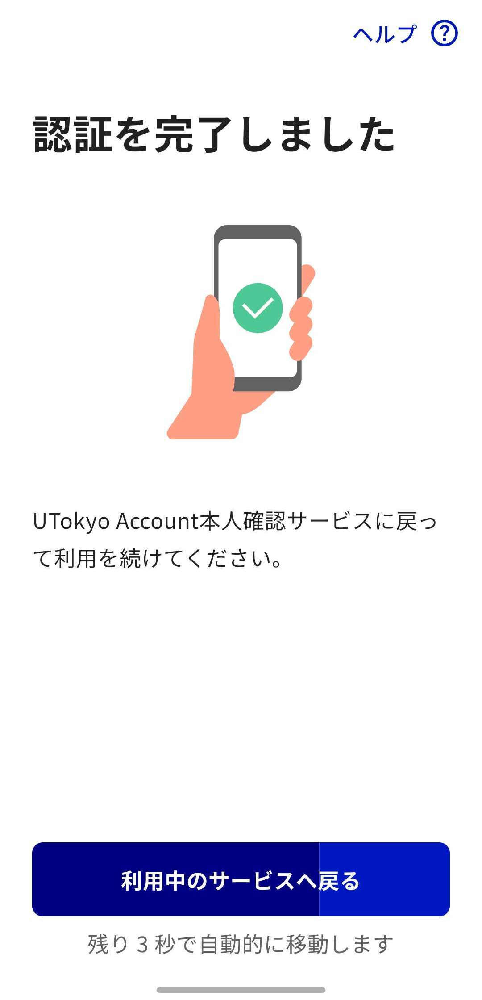
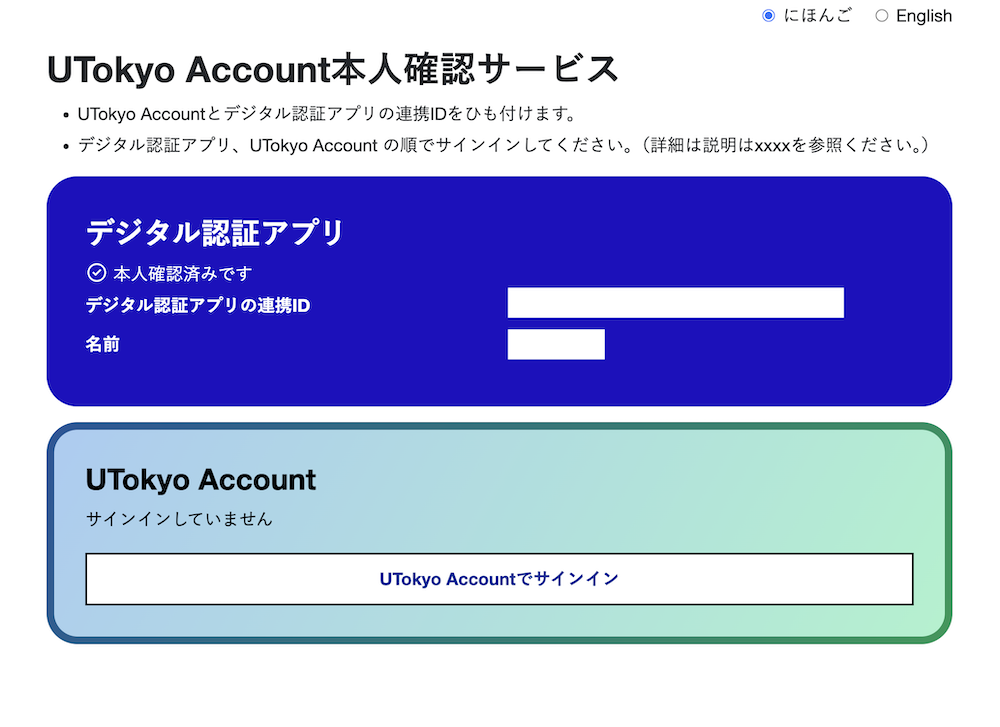

import CheckStatus from "../_CheckStatus.mdx"

## はじめに
このページでは，UTokyo Account本人確認サービスを利用するために，あらかじめ済ませておく必要がある，「事前連携」の手続きについて説明します．

全体の流れは以下のようになります．

- 手順1:[デジタル認証アプリをセットアップする](#app-setup)
- 手順2:[アプリとマイナンバーカードで本人認証する](#auth)
- 手順3:[UTokyo Accountでサインインしてひも付けを行う](#signin)
- 手順4:[連携状況を確認する](#statuscheck)

UTokyo Account本人確認サービスにアクセスする際に，PCを用いる(PCとスマートフォンと併用して作業を行う)か，スマートフォンを用いる(スマートフォンのみで作業を行う)かにより，手順2での作業が異なります．手順が簡潔であるため，スマートフォンのみで完結する方法を推奨します．

## 必要なもの

- 本人のマイナンバーカード（物理カードそのもの[^1]が必要です）
- マイナンバーカードを受け取る際に登録した数字4桁の暗証番号（[利用者証明用電子証明書](https://faq.myna.go.jp/faq/show/3494)，[券面事項入力補助用](https://faq.myna.go.jp/faq/show/2385)）[^2]
- デジタル認証アプリが利用可能なスマートフォン（iOS 16.0以降，またはAndroid 11以降）[^3]
- PCから手続きを行う場合はPC（スマートフォンだけで手続きを済ませることも可能です）

[^1]: 2025年9月現在，いわゆる[スマートフォンのマイナンバーカード](https://www.digital.go.jp/policies/mynumber/smartphone-certification)（Androidのスマホ用電子証明書やiPhoneのマイナンバーカード）は利用できません．
[^2]: 暗証番号を忘れた，ロックされてしまった場合は，住民登録のある市区町村の窓口で初期化・再設定が必要です．詳しくは[マイナンバーカード総合サイト](https://www.kojinbango-card.go.jp/faq_pin3/)を確認してください．
[^3]: [公的個人認証サービスポータルサイト](https://www.jpki.go.jp/prepare/reader_writer.html)のリンク先ページにある，「マイナンバーカードに対応したスマートフォン一覧」というファイルに記載がある機種ならば利用可能です．

## 手順1: デジタル認証アプリをセットアップする
{:#app-setup}
まず，デジタル認証アプリのセットアップを行います．

1. 以下のリンクから，デジタル認証アプリをインストールしてください．
    - [iPhone用リンク](https://apps.apple.com/jp/app/id6454900894)
    - [Android用リンク](https://play.google.com/store/apps/details?id=jp.go.digital.auth_and_sign)
1. デジタル庁公式HPに記載されている[デジタル認証アプリの利用登録の方法](https://services.digital.go.jp/auth-and-sign/start-guide/)に従って，デジタル認証アプリの利用登録を済ませてください．

## 手順2: アプリとマイナンバーカードで本人認証する
{:#auth}

続いて，マイナンバーカードとデジタル認証アプリを用いた本人認証を行います．UTokyo Account本人確認サービスに[スマートフォンのみで認証する場合](#auth-smartphone)と，[PCとスマートフォンを併用して認証する場合](#auth-pc)で手順が少し異なります．なお，スマートフォンのみで行う方が簡便です．それぞれ対応する手順を参照し，作業を進めてください．

### スマートフォンのみで認証する場合
{:#auth-smartphone}

1. [UTokyo Account本人確認サービス](https://identification.adm.u-tokyo.ac.jp/verify/)にスマートフォンでアクセスしてください．
1. 「マイナンバーカードで本人確認」ボタンを押してください．デジタル認証アプリの画面に遷移します．
    {:.border}{:.medium}

    {/* ここから共通 */}
    

    
デジタル認証アプリが開かず別の画面が表示された場合

    デジタル認証アプリがインストールされていない場合は，以下のようにアプリのインストールを促す画面が表示されます．またブラウザの表示倍率の設定によっては，PCからのアクセスと判定され，画面にQRコードが表示されることもあります．いずれの場合も，[手順1](#app-setup)に従って，デジタル認証アプリのインストールと利用登録を行ってください．
    {:.border}{:.small}
    

    

    
デジタル認証アプリが開いたが別の画面が表示された場合

    デジタル認証アプリはインストールされているが，利用登録が行われていない状態であるため，利用登録手続きが開始された可能性があります．[手順1](#app-setup)に示す手順により，デジタル認証アプリの利用登録を行ってください．
    

    {/* ここまで共通 */}

    {/* ここから共通 */}
1. デジタル認証アプリ上の案内に従って，生体情報・パスコード等による認証を行ってください．
1. 「はじめる」ボタンを押して認証手順をすすめてください．
    {:.border}
1. マイナンバーカードの利用者証明用電子証明書の暗証番号を入力してください．
    {:.border}
1. 券面事項入力補助用の暗証番号を入力してください．利用者証明用電子証明書の暗証番号と同じ物を使用している場合は「直前と同じ番号を入力」ボタンを押すことで省略できます．
    {:.border}
1. アプリの案内に従い，「読み取り開始」ボタンを押し，マイナンバーカードをスマートフォンで読み取ってください．
    - 「カードを読み取っています…」と表示されている間は，マイナンバーカードをスマートフォンから離さないでください．
    - 読み取りが完了すると，データが自動的にサーバーに送信されます．
    
    <figure class="gallery">{:.border} {:.border} {:.border}</figure>
1. UTokyo Account本人確認サービスへの認証の許可を求める画面が表示されます．プライバシーポリシーや利用規約を確認の上，「許可」ボタンを押してください．
    {:.border}

    

    
「認証と情報提供を中止しますか」という選択ボタンが出た場合

    
    AndroidとiOSで少し形式が異なりますが「認証と情報提供を中止しますか」という選択ボタンが出現します．「中止」を選択した場合，UTokyo Account本人確認サービス側が対応していないためBad Requestと表示されるページに移動します．UTokyo Account本人確認サービスのページにアクセスし直し，[手順2](#auth-smartphone)の最初からやり直してください．このポップアップのキャンセルを押した場合は元の画面に戻るので，続きの手順を進めてください．
    
    <figure class="gallery">{:.border}{:.small} {:.border}{:.small}</figure>

    {:.border}{:.small}

    

    {/* ここまで共通 */}
1. デジタル認証アプリの「利用中のサービスへ戻る」を押すか，画面遷移後10秒経過するのを待ってください．UTokyo Account本人確認サービスへ戻ります．
    {:.border}

初期設定はまだ完了していません．[手順3](#signin)に進んでください．

### PCとスマートフォンを併用して認証する場合
{:#auth-pc}

1. [UTokyo Account本人確認サービス](https://identification.adm.u-tokyo.ac.jp/verify/)にPCでアクセスしてください．
1. 「マイナンバーカードで本人確認」ボタンを押してください．
    {:.border}{:.medium}

1. 画面上に表示された大きなQRコードを，手順1でセットアップを済ませたスマートフォンで読み込んでください．QRコードが無効になった場合は，下にでる「二次元コードを更新」を押してQRコードを更新してください．以降**PCのページは閉じないでください**．

    <figure class="gallery"> {:.border}{:.medium} {:.border}{:.medium}</figure>
    
    

    
PCのページを閉じてしまった場合

    [手順2](#auth-pc)の最初からやり直してください．
    

    {/* ここから共通 */}
    

    
デジタル認証アプリが開かず別の画面が表示された場合

    デジタル認証アプリがインストールされていない場合は，以下のようにアプリのインストールを促す画面が表示されます．またブラウザの表示倍率の設定によっては，PCからのアクセスと判定され，画面にQRコードが表示されることもあります．いずれの場合も，[手順1](#app-setup)に従って，デジタル認証アプリのインストールと利用登録を行ってください．
    {:.border}{:.small}
    

    

    
デジタル認証アプリが開いたが別の画面が表示された場合

    デジタル認証アプリはインストールされているが，利用登録が行われていない状態であるため，利用登録手続きが開始された可能性があります．[手順1](#app-setup)に示す手順により，デジタル認証アプリの利用登録を行ってください．
    

    {/* ここまで共通 */}

1. スマートフォンに表示される6桁の数字をPCに入力してください．有効期限が切れた場合は6桁の数字を更新してください．

    {/* ここから共通 */}
1.  デジタル認証アプリ上の案内に従って，生体情報・パスコード等による認証を行ってください．
1. 「次へ」ボタンを押して認証手順をすすめてください．
    {:.border}
1. マイナンバーカードの利用者証明用電子証明書の暗証番号を入力してください．
    {:.border}
1. 券面事項入力補助用の暗証番号を入力してください．利用者証明用電子証明書の暗証番号と同じ物を使用している場合は「直前と同じ番号を入力」ボタンを押すことで省略できます．
    {:.border}
1. アプリの案内に従い，「読み取り開始」ボタンを押し，マイナンバーカードをスマートフォンで読み取ってください．
    - 「カードを読み取っています…」と表示されている間は，マイナンバーカードをスマートフォンから離さないでください．
    - 読み取りが完了すると，データが自動的にサーバーに送信されます．
    
    <figure class="gallery">{:.border} {:.border} {:.border}</figure>
1. UTokyo Account本人確認サービスへの認証の許可を求める画面が表示されます．プライバシーポリシーや利用規約を確認の上，「許可」ボタンを押してください．
    {:.border}

    

    
「認証と情報提供を中止しますか」という選択ボタンが出た場合

    
    AndroidとiOSで少し形式が異なりますが「認証と情報提供を中止しますか」という選択ボタンが出現します．「中止」を選択した場合，UTokyo Account本人確認サービス側が対応していないためBad Requestと表示されるページに移動します．UTokyo Account本人確認サービスのページにアクセスし直し，[手順2](#auth-smartphone)の最初からやり直してください．このポップアップのキャンセルを押した場合は元の画面に戻るので，続きの手順を進めてください．
    
    <figure class="gallery">{:.border}{:.small} {:.border}{:.small}</figure>

    {:.border}{:.small}

    

    {/* ここまで共通 */}

1. スマートフォンでの作業は終了です．PCの画面に戻ってください．

初期設定はまだ完了していません．[手順3](#signin)に進んでください．

## 手順3: UTokyo Accountでサインインしてひも付けを行う
{:#signin}

1. 「UTokyo Accountでサインイン」ボタンを押してください．
    {:.border}{:.medium}
1. 既にUTokyo Accountにサインイン済みの場合を除き，UTokyo Accountのサインイン画面が表示されるので，サインインしてください．
1. 「ひも付けを行う」ボタンを押して，デジタル認証アプリの連携IDとUTokyo Accountをひも付けしてください．
    {:.border}{:.medium}
1. 「上記のひも付けを解除する」ボタンが出てくれば，連携が出来ています．
    {:.border}{:.medium}

## 手順4: 連携状況を確認する
{:#statuscheck}

<CheckStatus variant="link"/>
