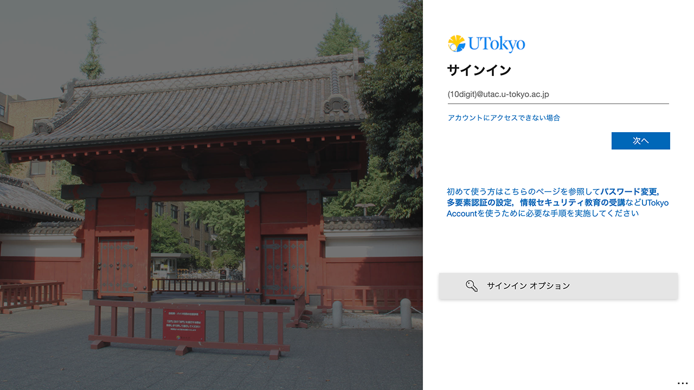
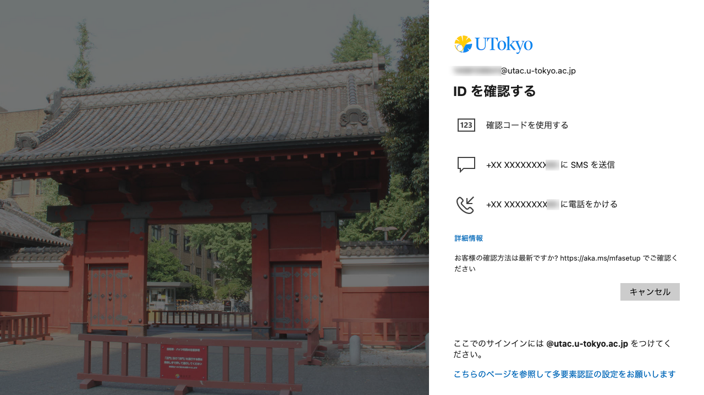

import ChangePassword from "@components/ja/systems/utokyo_account/ChangePassword.mdx";
import MFA from "@components/ja/systems/utokyo_account/MFA.mdx";
import InformationSecurity from '@components/ja/InformationSecurity.mdx'

## UTokyo Accountとは
{:#about}

- **UTokyo Account**は，東京大学の情報システムを利用する際に必要となる全学的なアカウントです．東京大学の構成員（学生および教職員）が各種情報システムを利用する際は，このアカウントでサインインして利用することになります．
  - 現在アカウントを持っていない方でも，大学への組織的な受け入れがされ管理されている構成員であれば，UTokyo Accountの発行を受けることが可能です．希望する場合は，所属する学部・研究科等の窓口（学生は学務・教務担当，教職員は人事担当）に相談してください．
- UTokyo Accountのユーザ名は10桁の数字で表され，**共通ID**とも呼ばれます．情報システム内では，`0123456789@utac.u-tokyo.ac.jp`のように，10桁の共通IDの後に東京大学であることを表す記号`@utac.u-tokyo.ac.jp`を付けたものが用いられることもあります．
  - 「10桁の共通ID＋`@utac.u-tokyo.ac.jp`」は通常利用できるメールアドレスではありません．
  - 「10桁の共通ID＋`@utac.u-tokyo.ac.jp`」に送られたシステムからの通知メールなどが[ECCSクラウドメール](/google/)に転送されることがありますが，メールの送信には利用できません． 
- UTokyo Accountで利用できる情報システムについては，**[UTokyo Account Service Directory](https://login.adm.u-tokyo.ac.jp/utokyoaccount/)**や[「東京大学のシステム」のページ](/systems)をご覧ください．
  - 利用できるシステムは利用者の在籍形態・所属等によって異なっており，すべてのシステムをすべての方が利用できるわけではありません．
- UTokyo Accountの管理・運用は，[UTokyo Account規則](https://www.u-tokyo.ac.jp/gen01/reiki_int/reiki_pdf/r060321094.pdf)や[UTokyo Accountの管理及び運用に関する細則](UTokyoAccountsaisoku.pdf)に沿って行われています．

## UTokyo Accountを使い始めるには
{:#procedures}

### 初期パスワードを変更する

<ChangePassword variant="individual" />

### 多要素認証を有効化する

<MFA variant="individual" />

### 情報セキュリティ教育を受講する
{:#information-security-education}

<InformationSecurity variant="individual" />

### 関連する初期設定について
以上の作業を終えたら，あわせて以下のページもご覧ください．

- 学生の方：「**[大学生活に必要な情報システムの準備について（新入生向け）](/oc/)**」
- 教員の方：以下の2ページをご確認ください．
    - 「**[東京大学における情報システムの準備について（教員向け）](/faculty_members/)**」
    - [UTokyo Portal「**UTokyo Accountの初期設定**」<small>（※閲覧にはUTokyo Accountでサインインする必要があります）</small>](https://univtokyo.sharepoint.com/sites/utokyoportal/wiki/d/UTokyo_Account_Initial_Settings.aspx)
- 職員の方：[UTokyo Portal「**UTokyo Accountの初期設定**」<small>（※閲覧にはUTokyo Accountでサインインする必要があります）</small>](https://univtokyo.sharepoint.com/sites/utokyoportal/wiki/d/UTokyo_Account_Initial_Settings.aspx)

## UTokyo Accountで情報システムにサインインする
{:#signin}

ここでは，UTokyo Accountを用いて情報システムにサインインする方法を説明します．

東京大学の情報システムを利用する際，画像のようにサインインを要求する画面が表示された場合には，UTokyo Accountによるサインインが必要です．以下の手順に従ってサインインを行ってください．

{:.small.center}

1. 入力欄に「10桁の共通ID＋`@utac.u-tokyo.ac.jp`」を入力し，「次へ」を押してください．
1. 以下の1枚目のような画面が表示されたら，パスワードを入力し，「サインイン」を押してください．
1. 以下の2枚目のように「IDを確認する」という画面が表示されたら，画面の指示に従って多要素認証の本人確認を行ってください．
1. サインインが行われ，利用しているシステムのページに移動します．

<figure class="gallery">{:.small.center}{:.small.center}</figure>

なお，UTokyo Accountでサインインする情報システムの多くは互いに連携しており，最初にひとつの情報システムでユーザ名とパスワードを入力してサインインすると，それ以降に別の情報システムを利用する際にはユーザ名とパスワードの入力が不要になります．これを**シングルサインオン** (Single Sign-On, SSO) といいます．

## パスワードについて
{:#password}

### パスワードの有効期間
{:#password-expiration}

多要素認証を利用している場合は，パスワードに有効期限はありません．一方，多要素認証を利用していない場合，パスワードは変更してから397日（1年+1ヶ月）間有効です．現在のパスワードの有効期限は，[利用者メニュー](https://utacm.adm.u-tokyo.ac.jp/webmtn/LoginServlet)から確認することができます．

### パスワードを変更する
{:#change-password}

[利用者メニュー](https://utacm.adm.u-tokyo.ac.jp/webmtn/LoginServlet)内の「パスワードの変更」から，パスワードを変更することができます．なお，パスワードの有効期限が切れた場合でもパスワードの変更は可能で，パスワードの再設定や再発行をする必要はありません．

### パスワードを忘れた場合
{:#forget-password}

UTokyo Accountのパスワードを忘れた場合には，次のような手順を踏むことでアカウントに再びサインインすることができます．

#### メールでパスワードを再設定する
{:#reset-password}

事前に以下のいずれかの場所でメールアドレスを登録していた場合には，そのメールアドレスを利用してパスワードを再設定することができます．

- 「[セキュリティ情報](https://mysignins.microsoft.com/security-info?domain_hint=univtokyo.onmicrosoft.com)」のページ  
  ※このメールアドレスは，[多要素認証の初期設定の手順1](mfa/initial/#first)の際に登録されるようになっているものです．このページで直接登録する場合は，以下の手順で行ってください．
    1. 「[セキュリティ情報](https://mysignins.microsoft.com/security-info?domain_hint=univtokyo.onmicrosoft.com)」のページにアクセスしてください．
    1. 「サインイン方法の追加」ボタンを押してください．
    1. 「どの方法を使用しますか?」欄で「電子メール」を選び，「追加」を押してください．
    1. 以降は表示される画面に従って登録を進めてください．
- （学生の場合 <small>※学生でも教職員でもあるアカウントの場合を含む</small>）[UTAS](https://utas.adm.u-tokyo.ac.jp/campusweb/campusportal.do)の「学生情報」メニューにある「現住所等変更入力」の「E-MAIL 1」欄
    - 学部1年生の新入生の場合，[ウェブ登録システム](https://utas-ew.adm.u-tokyo.ac.jp/)に登録していたメールアドレスが自動で設定されています．
    - 「E-MAIL 2」のアドレスは再設定用のメール送信先としては使えません．
- （教職員のみ <small>※学生でも教職員でもあるアカウントの場合を除く</small>）[人事情報MyWeb](https://univtokyo.sharepoint.com/sites/utokyoportal/wiki/d/Personal_information_and_ID_card.aspx)の「パーソナルメニュー」にある「本人属性変更：登録画面」の「学内メールアドレス」欄
    - この欄のメールアドレスについては， `u-tokyo.ac.jp` で終わるものである必要があります．

再設定の手順は以下の通りです．

1. **[パスワード再設定用のページ](https://passwordreset.microsoftonline.com/?whr=univtokyo.onmicrosoft.com)**にアクセスしてください．
1. 以下のような「アカウントを回復する」という画面が表示されるので，「メールまたはユーザ名」の欄に「10桁の共通ID＋`@utac.u-tokyo.ac.jp`」を，その下の欄に画像の文字を入力してから「次へ」を押してください．
    
    

    	
「パスワードのリセットを登録していないため、自分でパスワードをリセットすることはできません」と表示され，再設定ができない場合

	システムにメールアドレスが登録されていないため，通知メールを送信することができず，したがってパスワードの再設定ができません．<a href="#reissue-password">窓口でパスワードを再発行</a>してください．
	パスワードを再発行することができたら，メールアドレスをUTAS（学生）や人事情報MyWeb（教職員）に登録してください．
    

1. 事前に登録されているメールアドレスの一部分が表示されているので，確認してください．このメールアドレスに，パスワードを再設定するために必要な確認コードが書かれた通知メールが届きます．
1. 通知メールが届いたら，メールの指示に従って再設定の手続きを行ってください．メールが届かない場合には，迷惑メールフォルダなどに紛れ込んでいないかどうか，違うメールアドレスを見ていないかを確認してください．
    - UTokyo Accountのパスワードは，12文字以上64文字以下であること，アルファベット大文字・アルファベット小文字・数字・記号をすべて含むこと，「` `」（空白）・「`"`」（ダブルクォーテーション）・「`.`」（ドット）・「`\`」（バックスラッシュ，円マーク）を含まないこと，の要件をすべて満たす必要があります．

#### 窓口でパスワードを再発行する
{:#reissue-password}

メールアドレスを未登録の場合や，上記の手順がうまくいかない場合には以下の窓口でパスワードを再発行してください．

- 所属する学部・研究科等の学務・教務担当窓口（学生のみ）
    - 学生証を持参してください．
    - 学部1年生の新入生の方で，まだ学生証を受け取っていない場合は，合格通知書を持参してください．
- 所属する部局の人事担当（教職員のみ）
- [ECCS窓口](https://www.ecc.u-tokyo.ac.jp/map.html)
    - 学生は学生証，教職員は職員証を持参してください．
    - 窓口は，情報教育棟（駒場キャンパス），情報基盤センター（本郷地区浅野キャンパス），福武ホール（本郷キャンパス）に設置されています．

手続きを行うと，初期パスワードが記載された「パスワード通知書」が発行されます．「[UTokyo Accountを使い始めるには](#procedures)」の「作業：初期パスワードを変更する」を参考に，初期パスワードを新しいものに変更してください（初期パスワードのままでは，各種情報システムを利用することができません）．

## 多要素認証 (MFA)
{:#mfa}

UTokyo Accountでは**多要素認証** (Multi-Factor Authentication, MFA) を導入しています．多要素認証を設定すると，アカウントにサインインする際に，パスワードに加えて，SMSや専用のアプリ等での本人確認が要求されるようになります．詳細は[UTokyo Accountにおける多要素認証の利用について](mfa/)を参照してください．
