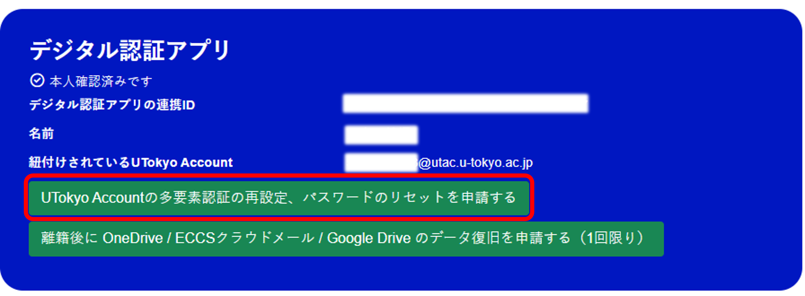

import ChangePassword from "@components/ja/systems/utokyo_account/ChangePassword.mdx";
import MFA from "@components/ja/systems/utokyo_account/MFA.mdx";
import InformationSecurity from '@components/ja/InformationSecurity.mdx'

## UTokyo Accountとは
{:#about}

- **UTokyo Account**は，東京大学の情報システムを利用する際に必要となる全学的なアカウントです．東京大学の構成員（学生および教職員）が各種情報システムを利用する際は，このアカウントでサインインして利用することになります．
  - 現在アカウントを持っていない方でも，大学への組織的な受け入れがされ管理されている構成員であれば，UTokyo Accountの発行を受けることが可能です．希望する場合は，所属する学部・研究科等の窓口（学生は学務・教務担当，教職員は人事担当）に相談してください．
- UTokyo Accountは`0123456789@utac.u-tokyo.ac.jp`のように，数字10桁の共通IDの後に東京大学であることを表す記号@utac.u-tokyo.ac.jpを付けたもので表されます．
  - UTokyo Accountは通常利用できるメールアドレスではありません．
  - UTokyo Accountに送られたシステムからの通知メールなどが[ECCSクラウドメール](/google/)に転送されることがありますが，メールの送信には利用できません． 
- UTokyo Accountで利用できる情報システムについては，**[UTokyo Account Service Directory](https://login.adm.u-tokyo.ac.jp/utokyoaccount/)**や[「東京大学のシステム」のページ](/systems/)をご覧ください．
  - 利用できるシステムは利用者の在籍形態・所属等によって異なっており，すべてのシステムをすべての方が利用できるわけではありません．
- UTokyo Accountの管理・運用は，[UTokyo Account規則](https://www.u-tokyo.ac.jp/gen01/reiki_int/reiki_pdf/r060321094.pdf)や[UTokyo Accountの管理及び運用に関する細則](UTokyoAccountsaisoku.pdf)に沿って行われています．

## UTokyo Accountを使い始めるには
{:#procedures}

### 初期パスワードを変更する
{:#change-initial-password}

<ChangePassword variant="individual" />

### 多要素認証を有効化する

<MFA />

### 情報セキュリティ教育を受講する
{:#information-security-education}

<InformationSecurity variant="individual" />

### 関連する初期設定について
以上の作業を終えたら，あわせて以下のページもご覧ください．

- 学生の方：「**[大学生活に必要な情報システムの準備について（新入生向け）](/oc/)**」
- 教員の方：以下の2ページをご確認ください．
    - 「**[東京大学における情報システムの準備について（教員向け）](/faculty_members/)**」
    - [UTokyo Portal「**UTokyo Accountの初期設定**」<small>（※閲覧にはUTokyo Accountでサインインする必要があります）</small>](https://univtokyo.sharepoint.com/sites/utokyoportal/wiki/d/UTokyo_Account_Initial_Settings.aspx)
- 職員の方：[UTokyo Portal「**UTokyo Accountの初期設定**」<small>（※閲覧にはUTokyo Accountでサインインする必要があります）</small>](https://univtokyo.sharepoint.com/sites/utokyoportal/wiki/d/UTokyo_Account_Initial_Settings.aspx)

## UTokyo Accountで情報システムにサインインする
{:#signin}

ここでは，UTokyo Accountを用いて情報システムにサインインする方法を説明します．

東京大学の情報システムを利用する際，次の画像のようにサインインを要求する画面が表示された場合には，UTokyo Accountによるサインインが必要です．以下の手順に従ってサインインを行ってください．

{:.small.center.thin-border}

1. 入力欄にUTokyo Account（数字10桁の共通ID + `@utac.u-tokyo.ac.jp`）を入力し，「次へ」を押してください．
1. 左下の画面が表示されたら，パスワードを入力し，「サインイン」を押してください．
1. 右下のような「IDを確認する」または「サインイン要求を承認」という画面が表示されたら，画面の指示に従って多要素認証の本人確認を行ってください．
1. サインインが行われ，利用しているシステムのページに移動します．

<figure class="gallery">{:.small.center.thin-border}{:.small.center.thin-border}</figure>

また，サインインの際，次のような画面が表示されることもあります．この場合は同様に「10桁の共通ID＋`@utac.u-tokyo.ac.jp`」と書かれた項目を選択してください．

{:.small.center.thin-border}

なお，UTokyo Accountでサインインする情報システムの多くは互いに連携しており，最初にひとつの情報システムでユーザ名とパスワードを入力してサインインすると，それ以降に別の情報システムを利用する際にはユーザ名とパスワードの入力が不要になります．これを**シングルサインオン** (Single Sign-On, SSO) といいます．

## パスワードについて
{:#password}

### パスワードの有効期間
{:#password-expiration}

多要素認証を利用している場合は，パスワードに有効期限はありません．一方，多要素認証を利用していない場合，パスワードは変更してから397日（1年+1ヶ月）間有効です．現在のパスワードの有効期限は，[利用者メニュー](https://utacm.adm.u-tokyo.ac.jp/UserMenu/LoginServlet)から確認することができます．

### パスワードを変更する
{:#change-password}

[セキュリティ情報](https://mysignins.microsoft.com/security-info?domain_hint=univtokyo.onmicrosoft.com)内の「パスワード」から，パスワードを変更することができます．

### パスワードを忘れた場合
{:#forget-password}

UTokyo Accountのパスワードを忘れた場合には，次のような手順を踏むことでアカウントに再びサインインすることができます．

#### メールでパスワードを再設定する
{:#reset-password}

事前に以下のいずれかの場所でメールアドレスを登録していた場合には，そのメールアドレスを利用してパスワードを再設定することができます．

- 「[セキュリティ情報](https://mysignins.microsoft.com/security-info?domain_hint=univtokyo.onmicrosoft.com)」のページ
  ※このメールアドレスは，[多要素認証の初期設定の手順1](mfa/initial/#first)の際に登録されるようになっているものです．このページで直接登録する場合は，以下の手順で行ってください．
    1. 「[セキュリティ情報](https://mysignins.microsoft.com/security-info?domain_hint=univtokyo.onmicrosoft.com)」のページにアクセスしてください．
    1. 「サインイン方法の追加」ボタンを押してください．
    1. 「どの方法を使用しますか?」欄で「電子メール」を選び，「追加」を押してください．
    1. 以降は表示される画面に従って登録を進めてください．
- （学生の場合 <small>※学生でも教職員でもあるアカウントの場合を含む</small>）[UTAS](https://utas.adm.u-tokyo.ac.jp/campusweb/campusportal.do)の「学生情報」メニューにある「現住所等変更入力」の「E-MAIL 1」欄
    - 学部1年生の新入生の場合，[ウェブ登録システム](https://utas-ew.adm.u-tokyo.ac.jp/)に登録していたメールアドレスが自動で設定されています．
    - 「E-MAIL 2」のアドレスは再設定用のメール送信先としては使えません．
- （教職員のみ <small>※学生でも教職員でもあるアカウントの場合を除く</small>）[人事情報MyWeb](https://univtokyo.sharepoint.com/sites/utokyoportal/wiki/d/Personal_information_and_ID_card.aspx)の「パーソナルメニュー」にある「本人属性変更：登録画面」の「学内メールアドレス」欄
    - この欄のメールアドレスについては， `u-tokyo.ac.jp` で終わるものである必要があります．

再設定の手順は以下の通りです．

1. **[パスワード再設定用のページ](https://passwordreset.microsoftonline.com/?whr=univtokyo.onmicrosoft.com)**にアクセスしてください．
1. 以下のような「アカウントを回復する」という画面が表示されるので，「メールまたはユーザ名」の欄に「10桁の共通ID＋`@utac.u-tokyo.ac.jp`」を，その下の欄に画像の文字を入力してから「次へ」を押してください．
    
    

    	
「パスワードのリセットを登録していないため、自分でパスワードをリセットすることはできません」と表示され，再設定ができない場合

	システムにメールアドレスが登録されていないため，通知メールを送信することができず，したがってパスワードの再設定ができません．<a href="#reissue-password-ident-myna">UTokyo Account 本人確認サービスを利用してパスワードを再発行</a>するか，<a href="#reissue-password">窓口でパスワードを再発行</a>してください．
	パスワードを再発行することができたら，メールアドレスをUTAS（学生）や人事情報MyWeb（教職員）に登録してください．
    

1. 事前に登録されているメールアドレスの一部分が表示されているので，確認してください．このメールアドレスに，パスワードを再設定するために必要な確認コードが書かれた通知メールが届きます．
1. 通知メールが届いたら，メールの指示に従って再設定の手続きを行ってください．メールが届かない場合には，迷惑メールフォルダなどに紛れ込んでいないかどうか，違うメールアドレスを見ていないかを確認してください．
    - UTokyo Accountのパスワードは，12文字以上64文字以下であること，アルファベット大文字・アルファベット小文字・数字・記号をすべて含むこと，「` `」（空白）・「`"`」（ダブルクォーテーション）・「`.`」（ドット）・「`\`」（バックスラッシュ，円マーク）を含まないこと，の要件をすべて満たす必要があります．

#### UTokyo Account本人確認サービスを利用してパスワードを再発行する
{:#reissue-password-ident-myna}
[UTokyo Account本人確認サービス](./ident-myna/)を事前連携しておくことで，マイナンバーカードを利用してオンラインで本人確認を行い，ご自身でパスワードを再発行できます．このサービスを利用すると，窓口に来訪することなく手続きが可能です．詳しくは「[UTokyo Account 本人確認サービス」](./ident-myna/)」をご確認ください．

##### 本サービスを利用できる条件
本サービスを利用するには，以下の条件をすべて満たしている必要があります．
- UTokyo Account 本人確認サービスの事前連携が完了していること．
	- パスワードを忘れてサインインできなくなる**前**に事前連携が完了している必要がありますので，ご注意ください．
- 多要素認証で設定している本人確認方法が利用できること．
	- 利用できない場合は，先に[多要素認証の本人確認方法を再登録](mfa/reregister/)してください．
- 以下のものがお手元にそろっていること．
	- ご自身のマイナンバーカード（有効な利用者証明用電子証明書が搭載されたもの）
	- マイナンバーカードの読み取りに対応したスマートフォン（デジタル認証アプリがインストール済みであること）
	- マイナンバーカード作成時に設定した以下の暗証番号
		- 利用者証明用電子証明書の暗証番号（4桁）
		- 券面事項入力補助用の暗証番号（4桁）

##### 再発行の手順
以下の手順はPCでもスマートフォンでも行えますが，スマートフォンを使用するとデジタル認証アプリとの連携がスムーズです．
1. 以下の「UTokyo Account本人確認サービス」にアクセスしてください．
**[UTokyo Account本人確認サービス](https://identification.adm.u-tokyo.ac.jp/verify/)**{:.box.center}
1. 「マイナンバーカードで本人確認」を押して，画面に表示される手順に従って本人確認を完了させてください．
{:.small.center.thin-border}
1. 「UTokyo Accountの多要素認証の再設定、パスワードのリセットを申請する」を押してください．
{:.small.center.thin-border}
1. 「発行したいものを選んでください」の欄で「パスワード（パスワードを忘れた）」を選択して，「パスワードを発行する」を押してください．
{:.small.center.thin-border}
1. 「パスワードが発行されました」と表示されます．表示された仮パスワードをコピーし，UTokyo Accountでの認証が必要なページ（例：[セキュリティ情報](https://mysignins.microsoft.com/security-info)）にアクセスしてください．
{:.small.center.thin-border}
1. サインイン画面が表示されたら，UTokyo Account（10桁の共通ID＋`@utac.u-tokyo.ac.jp`）と仮パスワードを入力してください．
	

	
サインイン画面が表示されない場合

	最初に多要素認証の再設定を行った場合など，すでにサインインしている場合はサインイン画面が表示されません．その場合は以下の手順で行ってください．

	1. 「セキュリティ情報」のページを開いてください．
	**[セキュリティ情報](https://mysignins.microsoft.com/security-info/)**{:.box.center}
	1. 左側のメニューから「パスワードの変更」を選択してください．
	1. 「現在のパスワード」の欄に先ほどコピーした仮パスワードを，「新しいパスワード」の欄に新しく設定するパスワードを入力して，「送信」を押してください．
	1. パスワードの再発行・設定はこれで完了です．

	

1. 多要素認証の本人確認が行われます．本人確認方法により手順が異なりますので，画面の指示に従って操作してください．
1. サインインが完了すると，パスワードの更新を求められます．「現在のパスワード」の欄に先ほどコピーした仮パスワードを，「新しいパスワード」の欄に新しく設定するパスワードを入力して，サインインを押してください．
{:.small.center.thin-border}

#### 窓口でパスワードを再発行する
{:#reissue-password}

メールアドレスを未登録の場合や，上記の手順がうまくいかない場合には以下の窓口でパスワードを再発行してください．

- 学生の方は，所属する学部・研究科等の学務・教務担当
    - 学生証を持参してください．
    - 学部1年生の新入生の方で，まだ学生証を受け取っていない場合は，合格通知書を持参してください．
- 教職員の方は，所属する部局の人事担当

※以前はECCS窓口でも受け付けていましたが，お願いを守っていただけない方が多かったため，2025年5月より受付を終了しました．

手続きを行うと，初期パスワードが記載された「パスワード通知書」が発行されます．「[UTokyo Accountを使い始めるには](#procedures)」の「作業：初期パスワードを変更する」を参考に，初期パスワードを新しいものに変更してください（初期パスワードのままでは，各種情報システムを利用することができません）．

## 多要素認証 (MFA)
{:#mfa}

UTokyo Accountでは**多要素認証** (Multi-Factor Authentication, MFA) を導入しています．多要素認証を設定すると，アカウントにサインインする際に，パスワードに加えて，SMSや専用のアプリ等での本人確認が要求されるようになります．詳細は[UTokyo Accountにおける多要素認証の利用について](mfa/)を参照してください．

## UTokyo Account本人確認サービスについて
{:#ident-myna}
UTokyo Account 本人確認サービス（以下「本人確認サービス」）は，UTokyo Accountにサインインできない場合に，UTokyo Accountと事前連携しておいたマイナンバーカードを用いて，オンラインで本人確認を行う仕組みです．

具体的には，次の場面で利用できます．

- UTokyo Accountでのサインインに失敗し，リセットしたいとき（パスワードを忘れたときや，多要素認証の再設定が必要なとき）
- 離籍（卒業・退職等）の前にバックアップしそびれていたクラウドデータを，離籍後にどうしても取り出す必要があるとき（クラウドデータ救出を利用するとき）
- 卒業・修了後，卒業生サービスへ加入するとき

詳しくは,[UTokyo Account本人確認サービスの説明ページ](./ident-myna/)を参照してください.
