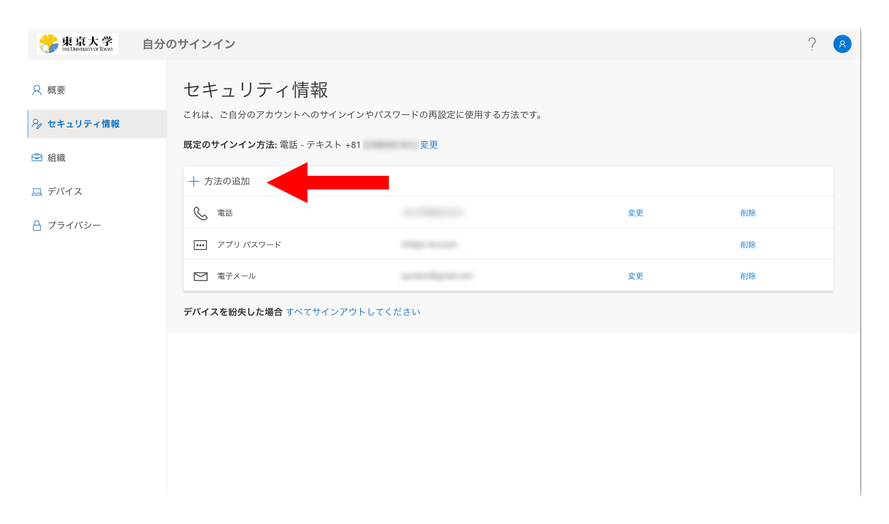
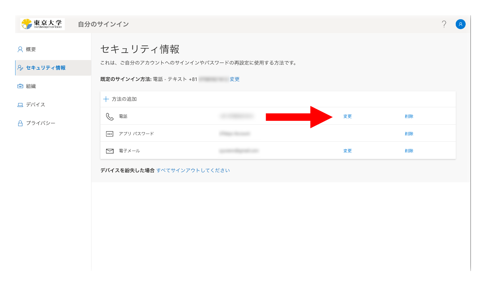

[多要素認証に関する説明ページのトップに戻る](.)

以下では，多要素認証の本人確認方法（スマホアプリや電話番号）を変更する手順について説明します．

**機種変更などで登録されている本人確認方法を使えなくなる場合，あらかじめ代わりの本人確認方法を追加で登録しておくようにしてください．**スマホを処分すると認証アプリによる本人確認はできなくなりますし，電話番号が変わると電話番号による本人確認はできなくなります．登録の変更をする際にもサインイン時の本人確認は必要となるので，**本人確認できずにUTokyo Accountにサインインできないという事態にならないよう，必ず事前に変更を行うことが重要です．**

**[多要素認証の設定ページ](https://mysignins.microsoft.com/security-info?domain_hint=utac.u-tokyo.ac.jp)**にアクセスすると，登録されている本人確認方法を変更することができます．

## 本人確認方法を追加する
{:#add}

[多要素認証の設定ページ](https://mysignins.microsoft.com/security-info?domain_hint=utac.u-tokyo.ac.jp)にアクセスすると，[「UTokyo Account多要素認証の初期設定手順」の中の「手順2：追加の本人確認方法を登録する」](initial#alternative)と同じ要領で本人確認方法を追加することができます．

## 既定（デフォルト）の本人確認方法を変更する
{:#default}

本人確認方法を複数登録している場合は，そのうちいずれか（通常，最初に設定したもの）が「既定」（デフォルト）の本人確認方法として扱われ，サインイン時の本人確認ではその方法が自動的に選ばれます．この「既定」の本人確認方法は，次の手順で変更することができます．

1. [多要素認証の設定ページ](https://mysignins.microsoft.com/security-info?domain_hint=utac.u-tokyo.ac.jp)の上の方にある「既定のサインイン方法:」という欄を探してください．
2. その欄の右の方にある「変更」を押してください．
3. 「どの方法を使用してサインインしますか?」の欄で，既定（デフォルト）にしたい本人確認方法を選び，「確認」を押してください．

## 登録済みの本人確認方法を変更する
{:#edit}

本人確認方法のうち，「電話」「代替の電話」「会社電話」の3種類の電話番号については，次の手順で変更することができます．

1. [多要素認証の設定ページ](https://mysignins.microsoft.com/security-info?domain_hint=utac.u-tokyo.ac.jp)に表示されている本人確認方法の一覧から変更したいものを探し，その右の方にある「変更」を押してください．
2. 新しい電話番号を入力する画面が表示されるので，入力してください．
3. 電話番号の確認（SMSまたは音声通話）が行われます．追加（新規に登録）する場合と同様の要領で作業してください．

なお，Microsoft AuthenticatorやGoogle認証システムなどの認証アプリには「変更」画面がありません．認証アプリの登録を変更したい場合は，代わりに新しい本人確認方法を登録してから古い本人確認方法の項目を削除するという操作を行ってください．

## 本人確認方法を削除する
{:#delete}

次の手順で，不要になった本人確認方法を削除することができます．

1. [多要素認証の設定ページ](https://mysignins.microsoft.com/security-info?domain_hint=utac.u-tokyo.ac.jp)に表示されている本人確認方法の一覧から削除したいものを探し，その右の方にある「削除」を押してください．
2. 「ご使用のアカウントでこの方法を削除しますか?」と表示されるので，「OK」を押してください．

なお，本人確認方法として利用できる項目（認証アプリと電話）をすべて削除してしまうと，次にサインインするときに本人確認方法の登録を求められますので，注意してください（「メールアドレス」と「アプリ パスワード」の項目は多要素認証の本人確認方法としては利用できません）．
