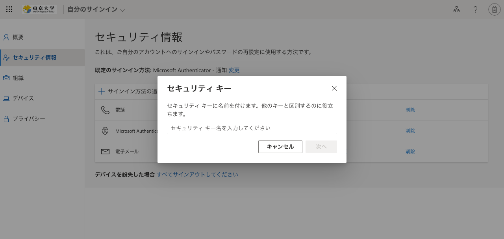

2024年3月12日（予定）から，UTokyo Accountの多要素認証で<a href="/notice/2024/02-utac-auth-improvement">さらに便利にFIDOセキュリティキーを利用できるようになります</a>．

## はじめに

このページでは，UTokyo Accountの多要素認証にFIDOセキュリティキーを利用する方法について，注意事項や登録方法，利用方法について説明しています．FIDO（Fast IDentity Online）とは，オンラインサービスでのサインインのセキュリティ向上のために普及が進められている新しい技術の一つであり，パスワードやPINのような秘密情報をサーバーと共有せずにサインインを行うため情報漏洩のリスクが低く，ブラウザ以外にアプリなどを必要とせずスムーズに操作できる点で利便性が高いサインイン方法です．

なお，FIDOはセキュリティキーと呼ばれる専用の機器を用いる方法とパソコンやスマホに保存された情報を用いるパスキーという方法の2種類に大別されますが，UTokyo Accountの多要素認証では，現時点ではFIDOにパスキーは利用できず，YubiKeyなどのセキュリティキーのみが利用可能ですので，セキュリティキーを自身で購入してご利用ください．その際，利用可能なセキュリティキーは「FIDO 2」規格に対応したセキュリティキーとなりますので，注意してください．

## 一部のOS・ブラウザでは使えません
{:#unsupported-os-browser}

FIDOは，AndroidのGoogle ChromeやLinuxのFirefoxなど一部のOSとブラウザの組み合わせでは利用できません．2024年3月時点で利用できるOSとブラウザの組み合わせは，以下の通りです．

- Windows - Google Chrome
- Windows - Microsoft Edge
- Windows - Firefox
- macOS - Google Chrome
- macOS - Microsoft Edge
- macOS - Firefox
- macOS - Safari
- ChromeOS - Google Chrome
- Linux - Google Chrome
- iOS - Google Chrome
- iOS - Microsoft Edge
- iOS - Firefox
- iOS - Safari

利用できるOSとブラウザの組み合わせについての詳細は，Microsoft社の「[サポートされているブラウザ](https://learn.microsoft.com/ja-jp/azure/active-directory/authentication/fido2-compatibility#supported-browsers)」のページを参照してください．

## FIDOセキュリティキーの登録手順

FIDOセキュリティキーは，2個目以降の本人確認方法として登録することを前提としています．多要素認証を初めて利用する方は，[「UTokyo Account多要素認証の初期設定手順」の中の「手順1：1個目の本人確認方法を登録する」](/utokyo_account/mfa/initial/#first)の手順に従って1個目の本人確認方法を登録してから，追加の本人確認方法としてFIDOセキュリティキーを登録してください．

1. [多要素認証の設定ページ](https://mysignins.microsoft.com/security-info)にアクセスし，サインインしてください．
2. 「サインイン方法の追加」を押してください．

3. 「方法を選択します」を押して，現れる選択肢から「セキュリティキー」を押し，「追加」を押してください．

4. セキュリティキーの接続方法として，「USBデバイス」または「NFCデバイス」を選択するよう求められるので，該当する方のボタンを押してください．

5. 「キーの用意をしてください」という画面が表示されるので，「次へ」を押してください．

6. 画面の指示に従って，セキュリティキーの設定を完了してください．具体的には，セキュリティキーの接続や，PINあるいは生体認証の設定，セキュリティキーのタップなどが求められます．
7. セキュリティキーの設定が完了したら，セキュリティキーに名前を付けてください．

※FIDOセキュリティキーは「既定のサインイン方法」には設定できないため，別の本人確認方法を「既定のサインイン方法」に設定した上で，サインイン時に別の本人確認方法としてセキュリティキーを選択する必要があります．

## FIDOセキュリティキーでのサインイン方法

1. UTokyo Accountでサインイン時（パスワード入力後）にデフォルトの本人確認方法で多要素認証の本人確認を行う画面が表示されますが，その画面で「問題がありますか? 別の方法でサインインする」あるいは「Microsoft Authenticator アプリを現在使用できません」というリンクを押してください．

2. 別の本人確認方法を選択する画面が表示されるので，「セキュリティ キーを使用する」を押してください．

3. 画面の指示に従って，PINの入力あるいは生体認証，セキュリティキーのタップなどを行った後，サインインが完了します．

※サインインがうまくいかない場合は，FIDOが使えないOS・ブラウザの組み合わせである可能性があります．詳細は，「[一部のOS・ブラウザでは使えません](#unsupported-os-browser)」の節を参照してください．
