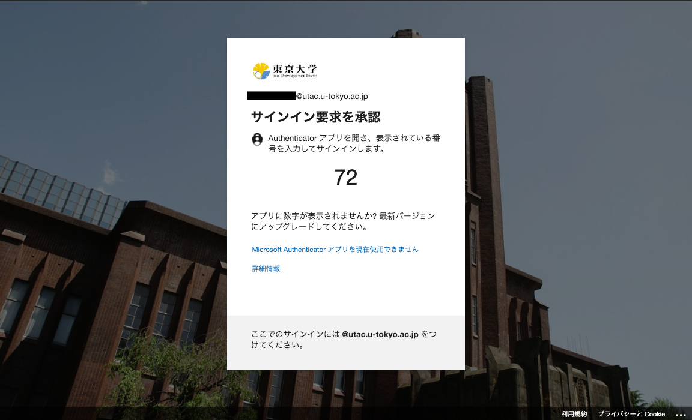
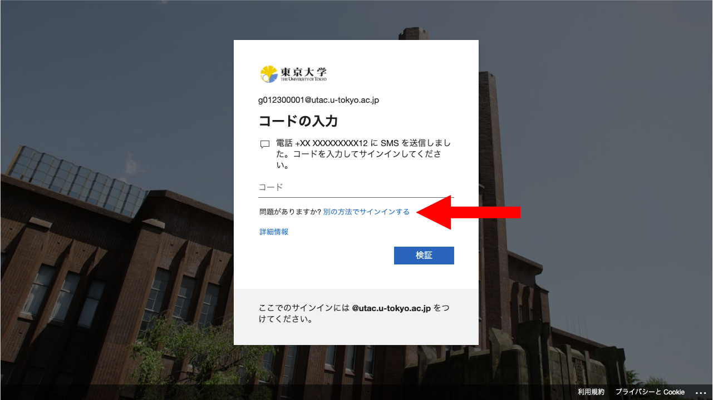
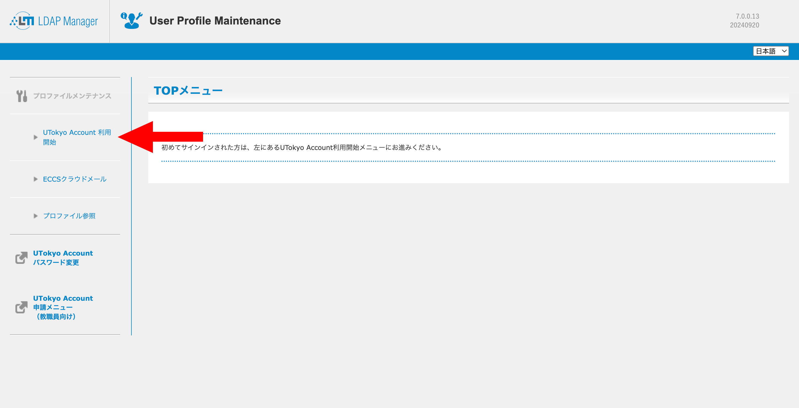
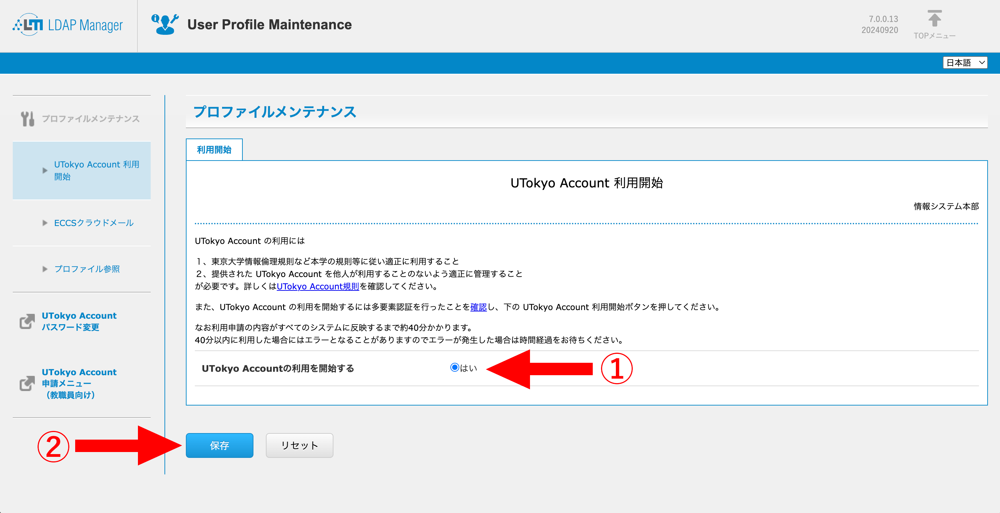

import Tabs from "@components/ja/mfa/Tabs.astro";
import TabSelector from "@components/ja/mfa/TabSelectorGrid.astro";

## はじめに
{:#introduction}

多要素認証 (Multi-Factor Authentication, MFA) とは，アカウントへのサインイン時に，パスワードに加えて，SMSや専用のアプリなどで本人確認を行う認証方法です．多要素認証を利用すると，なんらかの事情でパスワードが他人に知られた場合でも，アカウントにサインインされる可能性を低くすることができ，セキュリティを向上することができます．

このページでは，多要素認証の利用を有効化するための初期設定手順について説明します．全体の流れは以下のようになります．

- 手順1：[1個目の本人確認方法を登録する](#first)
- 手順2：[追加の本人確認方法を登録する](#alternative)
- 手順3：[サインインできるか確認する](#try)
- 手順4：[多要素認証の利用を申請する](#apply)

登録する本人確認方法により，手順1，2での作業が異なります．
最初に，以下の表から，手順1，2のそれぞれで使用する本人確認方法を選んでください．このページの以下では，選択した本人確認方法に対応する設定手順が表示されます．  

なお，手順1で登録する「1個目の本人確認方法」がデフォルト（自動で選ばれる方法）になるので，最もよく使う本人確認方法を「1個目の本人確認方法」として登録するのが良いでしょう．
また，2台以上のスマホを持っている場合に2台目以降のスマホにインストールした同じ認証アプリを登録する，携帯電話と固定電話の両方を登録するなど，手順1，2で同じ本人確認方法を使用することも可能です．

<TabSelector group="intent" />

これから，手順1から順に，**手順4までのすべての作業を行ってください**．なお，手順を終えると，その後**UTokyo Accountにサインインする際，毎回，設定したSMSや専用のアプリなどで本人確認することが求められます**．本人確認方法（スマホのアプリや電話番号）が利用できない状態ではUTokyo Accountにサインインすることができなくなりますので，十分ご注意ください．

### 初期設定手順の動画

このページで説明している初期設定手順を動画でも説明しています．

<iframe width="560" height="315" src="https://www.youtube.com/embed/km-v8v_LvwM" title="YouTube video player" frameborder="0" allow="accelerometer; autoplay; clipboard-write; encrypted-media; gyroscope; picture-in-picture; web-share" allowfullscreen></iframe>

## 手順1：1個目の本人確認方法を登録する
{:#first.mfa-initial-step-heading}

まず，多要素認証で使う本人確認方法（SMSや専用の認証アプリ）を設定します．ここではまず1個目の本人確認方法を設定し，この後の手順2で2個目以降を設定します．

選択した本人確認方法によって，手順1での作業が異なります．（表示する本人確認方法の設定手順は，以下のパネルで選択・切り替えができます．）

<Tabs step="first" />

初期設定はまだ完了していません．引き続き手順2～4を行ってください．

## 手順2：追加の本人確認方法を登録する
{:#alternative.mfa-initial-step-heading}

続いて，**[多要素認証の設定ページ](https://mysignins.microsoft.com/security-info?domain_hint=univtokyo.onmicrosoft.com)**から，追加の（2個目以降の）本人確認方法を登録します．

本人確認方法を1個しか登録していなくても多要素認証を利用することはできますが，故障や機種変更などで登録されている本人確認方法が使えなくなった場合，UTokyo Accountにサインインできなくなってしまいます．このような事態を防ぐため，必ず**複数の本人確認方法を登録してください**．

選択した本人確認方法によって，手順2での作業が異なります．（表示する本人確認方法の設定手順は，以下のパネルで選択・切り替えができます．）

<Tabs step="alt" />

なお，「方法の追加」を押した後に表示される「どの方法を使用しますか?」欄で，上記の他に「電子メール」と「アプリ パスワード」を選ぶことができますが，これらは多要素認証の本人確認方法とは異なる用途のためのもので，サインイン時の本人確認に使うことはできません．

初期設定はまだ完了していません．引き続き手順3・4を行ってください．

## 手順3：サインインできるか確認する
{:#try.mfa-initial-step-heading}

次に，ここまでに登録した本人確認方法を利用してUTokyo Accountにサインインすることができるか確認します．

1. [UTokyo Accountのサインアウトページ](https://univtokyo.sharepoint.com/sites/utokyoaccount/_layouts/15/SignOut.aspx)にアクセスしてください．
1. 「サインアウトしました」という画面が表示されるまでしばらく待ってください．
1. [多要素認証の設定ページ](https://mysignins.microsoft.com/security-info?domain_hint=univtokyo.onmicrosoft.com)へアクセスしてください．
1. サインイン画面が表示されたら，UTokyo Accountのユーザ名（10桁の数字）とパスワードを入力してください．
1. 続いて多要素認証の本人確認が行われます．本人確認方法により手順が異なりますので，画面の指示に従って操作してください．
    - **Microsoft Authenticatorの場合**：スマホに通知が送られ，サインイン画面に表示されている2桁の数字を入力するように求められるので，そのようにしてください．
        

            
※「Microsoft Autheticator アプリを現在使用できません」の表示について

            
            画面に「Microsoft Authenticator アプリを現在使用できません」との表示が現れますが，これは，もしあなたがMicrosoft Authenticatorを使用できない状態にある場合にはここを押してくださいという旨のヘルプメッセージであり，システムがMicrosoft Authenticatorを使用できない状態にある旨のエラーメッセージではありません．
        

    - **その他の認証アプリの場合**：アプリに表示されるコード（6桁の数字）を入力するように求められるので，そのようにしてください．
    - **電話番号でSMSを使う場合**：SMSにコード（6桁の数字）が送られ，それを入力するように求められるので，そのようにしてください．
    - **電話番号で音声通話を使う場合**：電話が着信し，音声ガイダンスで「#」ボタンを押すように言われるので，そのようにしてください（スマホで通話中に「#」ボタンを表示するには，画面に表示されている「キーパッド」ボタンを押します）．
    

        
表示されているもの以外の本人確認方法を使いたい場合

        サインイン時の本人確認方法は，登録されている方法のいずれか（通常，最初に登録したもの）がデフォルトとして自動的に選ばれます．他の本人確認方法を使いたい場合は，画面上の「別の確認オプションを使用する」あるいは「Microsoft Authenticator アプリを現在使用できません」というリンクを押してください．
        
        また，デフォルトの方法を変更したい場合は，下の「[既定（デフォルト）の本人確認方法を変更する](../change/#default)」の説明に従って作業してください．
    

1. 「セキュリティ情報」と書かれた多要素認証の設定ページが表示されればOKです．

初期設定はまだ完了していません．引き続き手順4を行ってください．  
※この手順3がうまくいかなかった場合は，次の手順4へ進まず，[サポート窓口](/support/)に問い合わせてください．

## 手順4：多要素認証の利用を申請する
{:#apply.mfa-initial-step-heading}

最後に，多要素認証の利用申請を行います．この申請を行うと，以降，UTokyo Accountにサインインする際に毎回，上の手順3と同様の手順による本人確認が求められるようになります．

なお，事務業務端末（職員向け）のリモートアクセス (Citrix Workspace) が接続中の場合，多要素認証の利用申請を行うと接続が強制的に切断されるため，あらかじめ接続を終了（サインアウト）してから以下の手順を行ってください．

1. [UTokyo Account利用者メニュー](https://utacm.adm.u-tokyo.ac.jp/webmtn/LoginServlet)にアクセスしてください．
2. UTokyo Accountのユーザ名（10桁の数字）とパスワードを入力してログインしてください．
3. 左のメニューにある「多要素認証利用申請」を押してください．
    
4. 表示される多要素認証に関する説明をよく読んでから，下の方にある「多要素認証を利用する」を「はい」にして，「保存」を押してください．
    

以上で多要素認証の初期設定手順は完了です．**設定がシステム全体に反映されるまで最大約40分かかります**ので，多要素認証の利用が必須なシステム
（2024年5月末現在：UTokyo Slack, UTokyo VPN, UTokyo Wi-Fi）
を利用したい場合は，それまでしばらくお待ちください．
なお，UTokyo VPNを利用したい場合は，[UTokyo VPNのページ](/utokyo_vpn/)に記載されている作業も必要ですので，約40分の経過後，引き続き作業を行うようお願いします．

## おわりに
{:#note}

手順を終えると，その後**UTokyo Accountにサインインする際，毎回，設定したSMSや専用のアプリなどで本人確認することが求められます**．登録した本人確認方法（スマホのアプリや電話番号）が利用できない状態ではUTokyo Accountにサインインすることができなくなりますので，十分ご注意ください．

特に，機種変更の際は，古いスマホが利用できるうちに，「[UTokyo Account多要素認証の本人確認方法の登録変更手順](../change/)」に従って新しいスマホを追加登録してください．スマホを処分すると認証アプリによる本人確認はできなくなりますし，電話番号が変わると電話番号による本人確認はできなくなります．登録の変更をする際にもサインイン時の本人確認は必要となるので，本人確認できずにUTokyo Accountにサインインできないという事態にならないよう，必ず事前に変更を行うことが重要です．

また，多要素認証の有効化は，自身の操作では元に戻すことができません．多要素認証の利用をやめてパスワードだけでサインインできる状態に戻したい場合，「多要素認証の利用終了」という手続きが必要ですので，「[UTokyo Account多要素認証の本人確認方法再登録および利用終了について](../reregister_and_terminate)」を参照してください．
