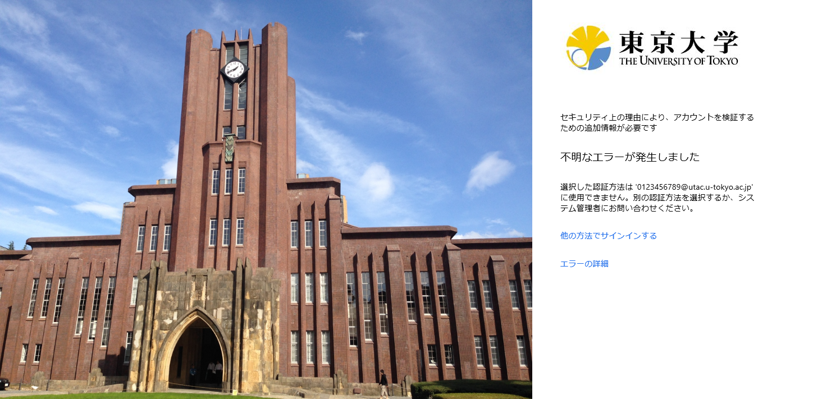

## ハードウェアトークンの貸出について（教職員向け）
{:#hardware-token}

UTokyo Accountの多要素認証における本人確認方法としては，スマホの認証アプリまたは電話番号（SMS・音声通話）が基本となりますが，どちらも利用できない場合のため，「ハードウェアトークン」という専用の機器を貸し出しています（教職員向け）．詳細は[UTokyo Portalの案内ページ（教職員専用）](https://univtokyo.sharepoint.com/sites/utokyoportal/wiki/d/UTokyo_Account_Token.aspx)を参照してください．

## 海外での利用について
{:#overseas}

出張等により海外でUTokyo Accountにサインインする必要がある場合，利用している本人確認方法に応じて，利用できるかどうかが異なります．

- Microsoft Authenticator
    - Microsoft Authenticatorアプリをインストールしたスマートフォンがインターネットに接続されていれば，基本的に通常通り利用できます．インターネット接続はモバイルデータ通信でもWi-Fiでもかまいません．
    - ただし，Androidでは，通知の送信にGoogle社のシステムが利用されているため，Google社のシステムとの通信が制限されている国・地域では，通知を承認する通常の方法でのサインインができない可能性があります．この場合でも，スマートフォン本体を所持していれば，通信を必要としない方法である[6桁のコードを使ってサインインする方法](#msauth-totp)は利用可能です．
    - インターネットに接続できない場合でも，スマートフォン本体を所持していれば，通信を必要としない方法である[6桁のコードを使ってサインインする方法](#msauth-totp)は利用可能です．
- その他の認証アプリ
    - アプリに表示されるコード（6桁の数字）を用いてサインインを行うため，コードが表示できればサインインが可能です．
    - お使いのアプリの仕様にもよりますが，ほとんどの場合，アプリをインストールしたスマートフォンを所持していれば，インターネットに接続できなくても問題なく利用できるはずです．例えば，[多要素認証の初期設定手順のページ](/utokyo_account/mfa/initial/)で紹介しているGoogle Authenticatorは，これに当てはまるようです．
- 電話番号
    - 登録されている電話番号でSMSまたは音声通話を受信できる必要があるため，渡航先での国際ローミングに対応している場合に限り利用できます．国際ローミングでは通常，SMSや音声通話の着信に料金がかかるため，ご注意ください．
    - お使いの電話番号の契約が渡航先での国際ローミングに対応していない場合は，あらかじめ[他の本人確認方法を追加](change/#add)してから出国するようご注意ください．
- FIDOセキュリティキー
    - FIDOセキュリティキーを所持していれば，サインインが可能です．

出国前にあらかじめ，[多要素認証の設定ページ](https://mysignins.microsoft.com/security-info?domain_hint=univtokyo.onmicrosoft.com)にアクセスして登録されている本人確認方法を確認し，必要に応じて[登録を変更する作業](change/)を行ってください．

## Microsoft Authenticatorで6桁のコードを使ってサインインする方法
{:#msauth-totp}

多要素認証によるサインインの際に，本人確認方法としてMicrosoft Authenticator
を使う場合，アプリに送られる通知を承認する方法（標準的な方法）のほかに，
アプリに表示されるコード（6桁の数字）を入力する方法があります．
この方法には，スマホがネットワークに接続されていなくても使うことができ，
通信障害に強いという利点があります．

1. UTokyo Accountのユーザ名（10桁の数字）とパスワードを入力した後に表示される多要素認証の本人確認の画面で，「別の確認オプションを使用する」（あるいは「Microsoft Authenticator アプリを現在使用できません」）というリンクを押してください．
1. 続いて表示される画面で「モバイル アプリまたはハードウェア トークンから確認コードを使用する」（あるいは「確認コードを使用する」）という項目を押してください．
1. 続いて表示される画面に，「確認コードを入力してください」（あるいは「モバイル デバイスの Microsoft Authenticator アプリに表示されているコードを入力してください」）と書かれた入力欄が表示されます．以下の手順でMicrosoft Authenticatorアプリからコード（6桁の数字）を取得し，入力欄にそのコードを入力してください．
   1. Microsoft Authenticatorアプリを開いてください．
   1. 表示される一覧から「The University of Tokyo」と書かれた項目を押してください．
   1. 次の画面の，「ワンタイム パスワード コード」と書かれた下に，コード（6桁の数字）が表示されます．
   1. アプリ画面の左側に表示されるカウントダウンが0になる前に，このコードをサインイン画面の入力欄に入力し，「サインイン」（あるいは「検証」）を押してください．
       ※カウントダウンが0になると，表示されているコードが別の新しいものに変わります．その場合は，新しく表示されたコードを使って操作をやり直してください．
1. これでUTokyo Accountにサインインできます．

## サインイン時の本人確認の挙動について
{:#irregular}

通常，多要素認証を利用している場合のサインインは，まずパスワードを入力し，次いで多要素認証の本人確認を行う，という手順になります．

しかし，これと異なる次のような挙動が起きることがあります．

- 多要素認証の本人確認を続けて2回求められる
- パスワードの入力が求められない（スキップする）のに，多要素認証の本人確認だけが求められる
- パスワードを入力したのにその後に多要素認証の本人確認が求められない

これらの挙動は，UTokyo Accountに関するシステム間の連携処理の都合により発生するものですので，お手数ですが，画面の指示に従って操作し，サインインするようお願いいたします．

## 「アカウントを検証するための追加情報が必要です」エラーについて
{:#unknown-error}

多要素認証の設定の状態によって，UTokyo Accountにサインインする際に「セキュリティの上の理由により、アカウントを検証するための追加情報が必要です」という上の画像のような内容のエラーが表示される場合があります．これは，[多要素認証の初期設定手順](initial/)において，本人確認方法の登録（手順1・手順2）を行う前に多要素認証の利用申請（手順4）を行った際に起きることがあるものです．「[手順1：1個目の本人確認方法を登録する](initial/#first)」および「[手順2：追加の本人確認方法を登録する](initial/#alternative)」の手順で本人確認方法の登録をしてください．
