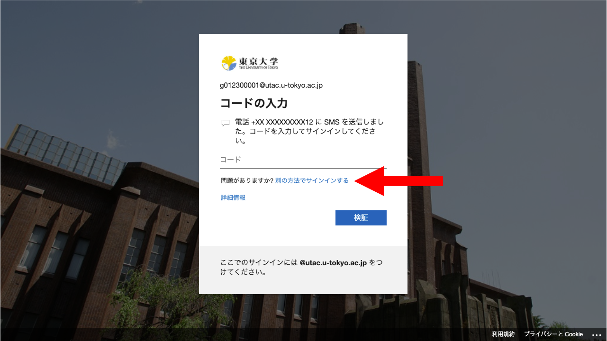

このページでは，[UTokyo Accountの多要素認証](./)について，「**本人確認方法の再登録**」の手続きの説明をしています．

これは，故障や機種変更などで本人確認方法が使えずに多要素認証によるサインインができなくなった場合のための手続きです．本人確認方法の登録をやり直し，多要素認証を引き続き使えるようにします．下で説明している通り，先に他に利用できる本人確認方法がないか確認した上で，すべての本人確認方法が使えなかった場合に手続きを行ってください．

なお，セキュリティの観点から，UTokyo Account では多要素認証を利用することを必須としております．やむを得ない事情がある場合には，[サポート窓口](/support/email-form/)にご相談ください．

※以前は「本人確認方法の再登録」手続きは「リセット」手続きと呼んでいましたが，2022年9月に手続きの名称を改めました．

## 手続きの流れ

### 本人確認方法の再登録
{:#reregister}

#### 他の本人確認方法を使えないか確認する

故障や機種変更などで本人確認方法が使えなくなった場合，登録済みの他の本人確認方法が使える状態であれば，それを使ってサインインすることができますので，まずはそれを試してください．

サインイン時（パスワード入力後）に表示される本人確認を行う画面で，「問題がありますか? 別の方法でサインインする」または「別の確認オプションを使用する」，あるいは「Microsoft Authenticator アプリを現在使用できません」というリンクを探して押してください．

デフォルト（自動的に選ばれるもの）以外のものも含め，設定済みの本人確認方法が一覧で表示されます．

- この中に使える状態の本人確認方法があれば，それを選んでその方法で本人確認を行うことでUTokyo Accountにサインインすることができますので，本人確認方法の再登録手続きは不要です．
- 表示された本人確認方法がすべて使えない状態であれば，本人確認方法の再登録手続きを行う必要があります．下の説明に進んでください．

#### 手続きを行う

登録済みの本人確認方法がすべて使えない状態となってしまった場合は，以下の流れで本人確認方法の再登録手続きを行ってください．

1. 下の「[申請方法](#application-method)」の説明を参照し，申請を行ってください．
1. 申請後しばらくすると，本人確認方法の再登録開始処理が行われ，その旨がメールで通知されます．
1. 通知メールを受け取ったら，「[UTokyo Account多要素認証の初期設定手順](initial/)」ページの初期設定手順にある「[手順1：1個目の本人確認方法を登録する](initial/#first)」および「[手順2：追加の本人確認方法を登録する](initial/#alternative)」の手順で本人確認方法を登録し直してください．
1. 登録した本人確認方法を使ってUTokyo Accountにサインインできるようになります．

なおこの際，本人確認方法が使えない状態が再び生じた場合にサインインできない事態にならないよう，**複数の本人確認方法を登録しておくことを強く推奨**します．

## 申請方法
{:#application-method}

本人確認方法の再登録手続きを申請する方法は，以下の3つがあります．それぞれの説明を参照し，自身が利用可能な方法で申請してください．

### 専用のMicrosoftフォームで申請する（UTokyo Accountにサインイン可能な場合）
{:#ms-form}

UTokyo Accountにサインイン可能な場合は，専用のMicrosoftフォームで申請することができます．

※担当者が内容を確認の上で対応するため，夜間・土日祝日の場合は翌営業日以降の対応となることをご了承ください．

<b class="box center">
<a href="https://forms.office.com/r/NS4sh40RjR">本人確認方法の再登録申請フォーム</a>
</b>

このフォームは，本人確認のために多要素認証によるサインインが必要です．多要素認証によるサインインができない状態の場合，このフォームにアクセスすることはできないので，下で説明している他の申請方法を利用してください．

    
このフォームで申請が可能な場合の詳細

    次のような場合にこのフォームを利用した申請が可能であると想定しています．
    <ul>
        <li>
            多要素認証の初期設定を行っている途中でトラブルが生じ，本人確認方法の再登録が必要になった場合
            <ul>
                <li>初期設定の手順4（利用申請）を行うまではサインインの際に多要素認証を求められることがないため，初期設定の途中であればMicrosoftフォームにサインインしてアクセスすることが可能な場合があります．</li>
            </ul>
        </li>
    </ul>

### 学部・研究科等の窓口で申請する
{:#office}

所属の学部・研究科等の窓口（学生は学務・教務担当，教職員は人事担当）で申請を行うことができます．

- 「本人確認方法の再登録」を申し出てください．
- 本人確認書類（基本的には学生証または職員証）を持参してください．
- [学部・研究科等の窓口担当者の方はこちらをご覧ください（教職員限定ページ）](https://univtokyo.sharepoint.com/sites/utokyoportal/wiki/d/MFA_Reset_Request.aspx)．

### 専用の申請サイトで申請する
{:#dedicated-site}

専用の申請サイトから申請を行うこともできます．この申請サイトでは，本人確認のため，ICカード学生証またはICカード職員証の写真をアップロードする必要があります．ICカード学生証・ICカード職員証以外は受け付けられませんので，お持ちでない場合は，上で説明している学部・研究科等の窓口での申請を利用してください．

※担当者が内容を確認の上で対応するため，夜間・土日祝日の場合は翌営業日以降の対応となることをご了承ください．

<b class="box center">
<a href="https://identification.adm.u-tokyo.ac.jp/ident/">本人確認方法の再登録申請サイト</a>
</b>

上のリンクにアクセスし，UTokyo Accountでサインインしてください．サインインの際に多要素認証は不要となっております．
