## はじめに

UTokyo Accountの多要素認証において，本人確認方法として認証アプリを使う場合，「Google Authenticator」などのスマホアプリの他に，セキュリティキーと呼ばれる専用の機器と連携させて利用するパソコンのアプリがあります．その製品の一例が，「YubiKey」セキュリティキーの一部のモデルと「Yubico Authenticator」アプリの組み合わせです．

このページでは，UTokyo Accountの多要素認証で，YubiKeyセキュリティキーとYubico Authenticatorアプリを利用する本人確認方法について，登録やサインインの方法を説明します．

YubiKeyには，FIDOと呼ばれる高度な仕組みで多要素認証を行う機能もありますが，それについては「[UTokyo Account多要素認証におけるFIDOセキュリティキーの利用方法](/utokyo_account/mfa/fido-security_key)」を参照してください．なお，YubiKeyをFIDOセキュリティキーとして登録している場合であっても，その上で認証アプリとしても別途登録しておくということが可能です（[FIDOに対応していない一部のシステム](/utokyo_account/mfa/fido-security_key#unsupported-system)でもサインインできるようになるため便利です）．

## Yubico Authenticatorの登録手順

YubiKeyセキュリティキーとYubico Authenticatorアプリの組み合わせをUTokyo Accountの多要素認証の本人確認方法として登録するためには，以下の4つの手順を行ってください．

### 「Yubico Authenticator」アプリのインストール

まず，お使いのパソコンやスマホにYubico Authenticatorアプリをダウンロードし，YubiKeyを登録する必要があります．

1. [Yubico Authenticatorアプリのダウンロードページ](https://www.yubico.com/products/yubico-authenticator/)から，お使いの機器にアプリをインストールしてください．
2. Yubico Authenticatorアプリの指示に従って，YubiKeyを接続してください．

### QRコードの表示

Yubico AuthenticatorアプリをUTokyo Accountの多要素認証の本人確認方法として登録するために，QRコードを表示させる必要があります．QRコードを表示させる方法は，場合によって異なるため，それぞれ説明します．

#### 1個目の本人確認方法としてYubico Authenticatorアプリを登録する場合

多要素認証の本人確認方法を1個も登録しておらず，Yubico Authenticatorアプリを1個目の本人確認方法として登録する場合，手順は以下の通りです．

1. [多要素認証の設定ページ](https://account.activedirectory.windowsazure.com/proofup.aspx?proofup=1&whr=utac.u-tokyo.ac.jp)にアクセスしてください．
2. （サインイン済みでなければ）サインイン画面が表示されるので，UTokyo Accountのユーザ名（10桁の数字）とパスワードを入力してください．
3. 「詳細情報が必要」という画面が表示されるので，「次へ」を押してください．

4.  「別の認証アプリを使用します」を押してください．
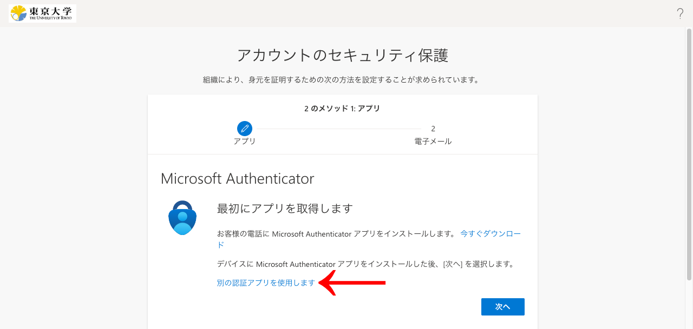
5. 画面の指示に従って進めて，QRコードを表示させてください．
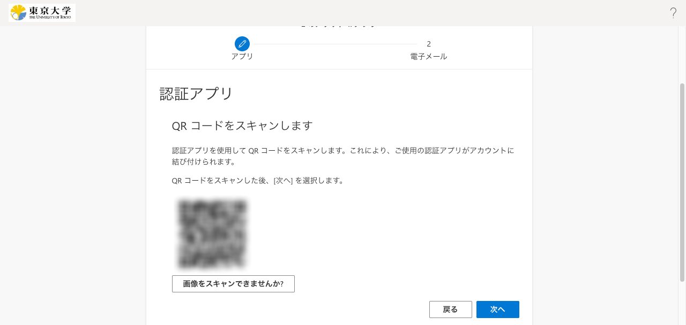

#### 既に1個目の本人確認方法を登録している場合

既に他の本人確認方法を1個目の本人確認方法として登録済みであり，Yubico Authenticatorアプリを追加の本人確認方法として登録する場合，手順は以下の通りです．

1. [多要素認証の設定ページ](https://mysignins.microsoft.com/security-info?domain_hint=utac.u-tokyo.ac.jp)にサインインし，「サインイン方法の追加」を押してください．
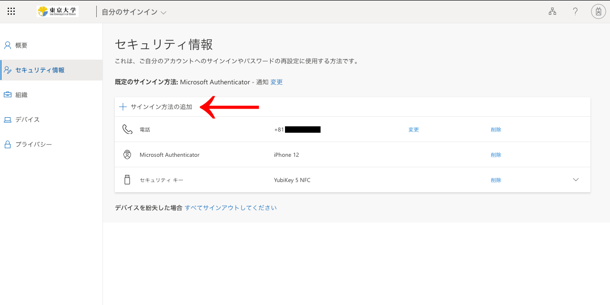
2. 「認証アプリ」を選択し，「追加」を押してください．
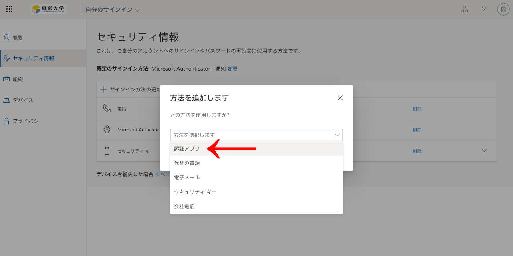
3. 「別の認証アプリを使用します」を押してください．
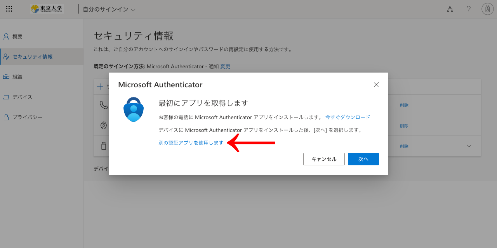
4. 画面の指示に従って進めて，QRコードを表示させてください．
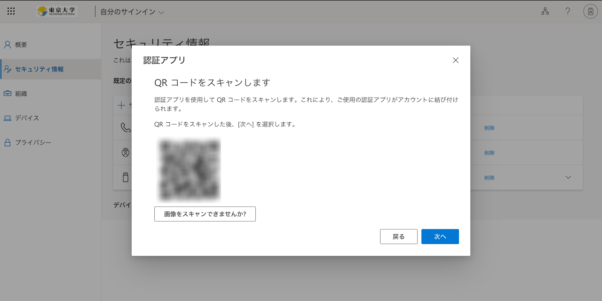

### Yubico Authenticatorアプリへのアカウントの追加

1. Yubico Authenticatorアプリにアカウントを追加するため，画面右上の「Configure Yubikey」を押して，表示された画面で「Add account」を押してください．
    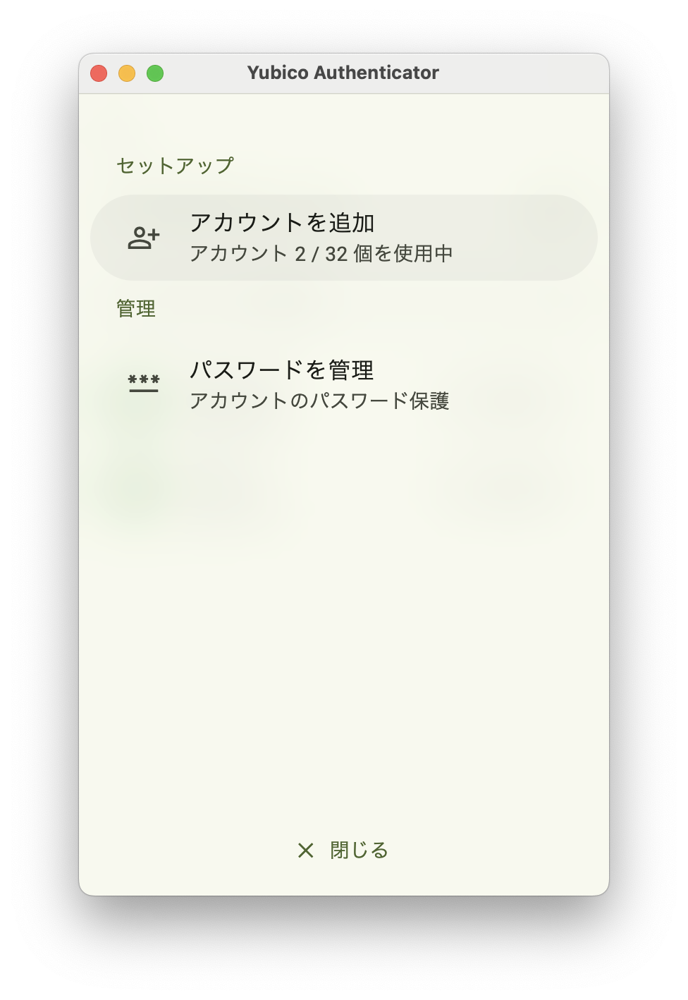
2. 「Scan QR code」を押して，画面の指示に従ってQRコードを読み取り，「Save」を押してください． 
※パソコンの場合，QRコードをパソコンのカメラでスキャンするのではなく，同じ画面上に表示されているQRコードが読み取られます．そのため，初めて使用する場合は，画面収録などの許可が要求されることがあります．
    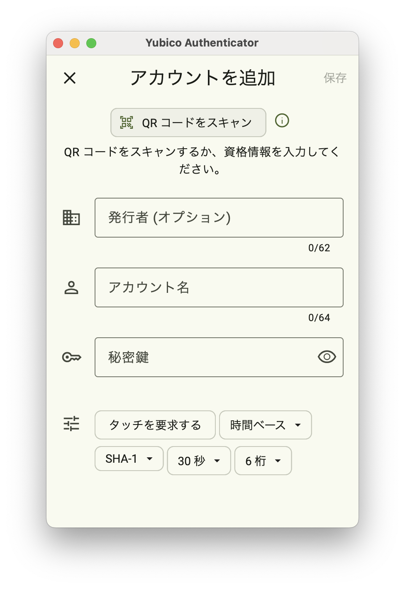
3. Yubico Authenticatorアプリにアカウントが追加されていればOKです．
    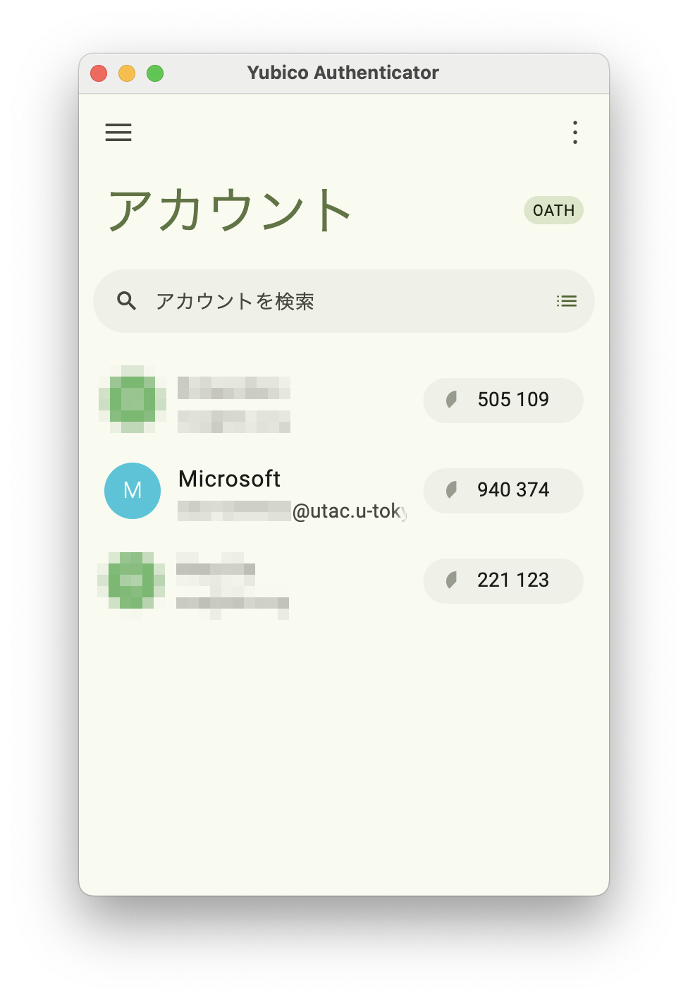

### コード入力のテスト

1. Yubico Authenticatorアプリにアカウントが追加されたら，QRコードが表示されているブラウザ画面で「次へ」を押してください．
2. 「コードの入力」という入力欄が表示されるので，Yubico Authenticatorアプリを開いて6桁の数字を確認し，それを入力欄に入力すると，登録が完了します．
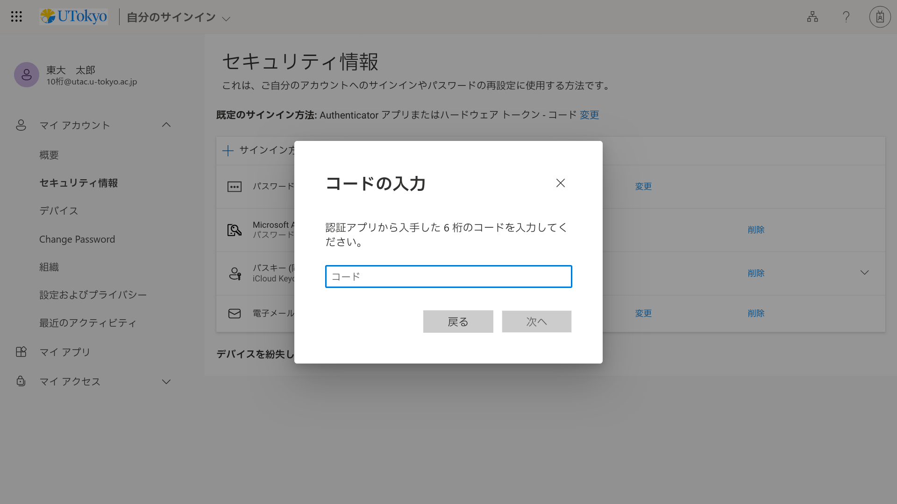

※メールアドレスの登録について
1個目の本人確認方法としてYubico Authenticatorアプリを登録する場合は，コードの入力テストの後にメールアドレスの入力を求められます．なるべくECCSクラウドメール以外のメールアドレスを入力してください．続いてそのメールアドレスに送られてくる「コード」（6桁の数字）を入力するよう求められるので，そのようにしてください．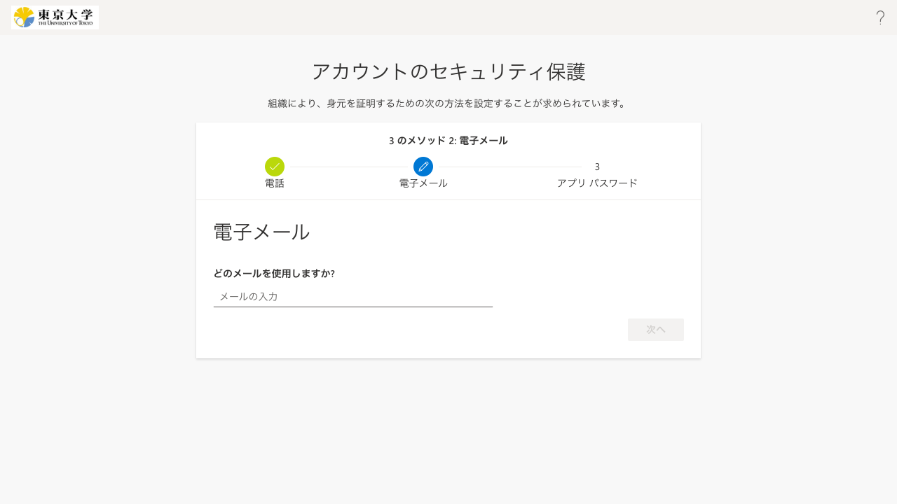

本人確認方法の登録を終えた後，**必ず「[UTokyo Account多要素認証の初期設定手順](initial)」の手順4までの全ての作業を行い，多要素認証を有効化してください．**

## Yubico Authenticatorでのサインイン手順

1. UTokyo Accountでサインイン時（パスワード入力後）に，デフォルトの本人確認方法で多要素認証の本人確認を行う画面が表示されますが，その画面で「問題がありますか? 別の方法でサインインする」あるいは「Microsoft Authenticator アプリを現在使用できません」というリンクを押してください． 
※デフォルトの本人確認方法を「アプリベースの認証またはハードウェアトークン - コード」に設定している場合は初めから3.の画面が表示されるため，1.と2.の手順を省略して3.の手順を行ってください．
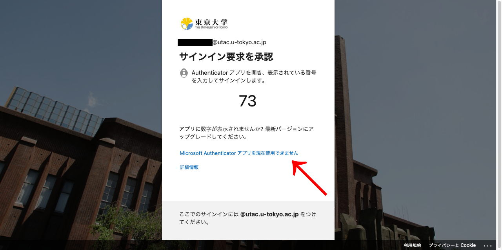
2. 「確認コードを使用する」を押してください．
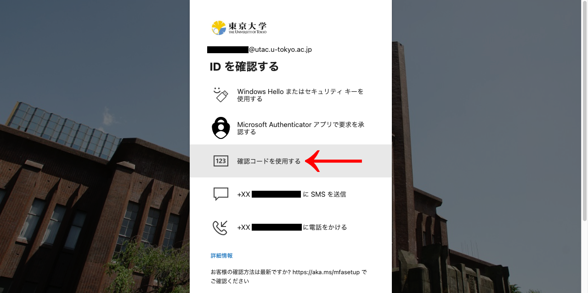
3. 「コードの入力」という入力欄が表示されるので，YubiKeyを接続した状態でYubico Authenticatorアプリを開いて6桁の数字を確認し，それを入力欄に入力してください．
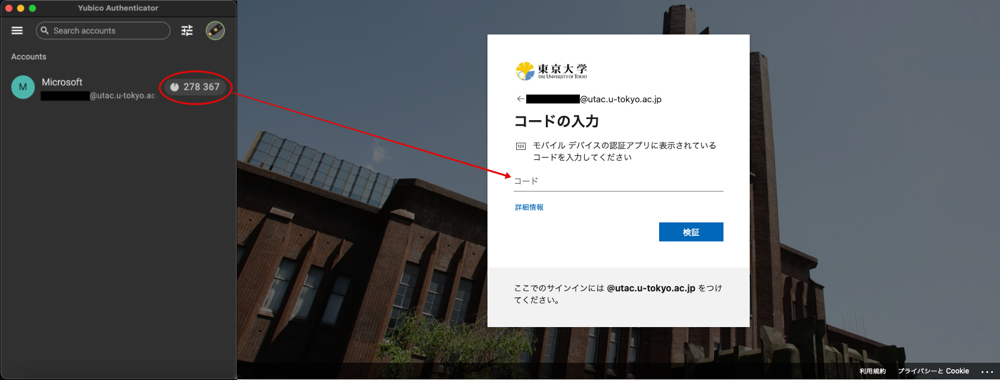
