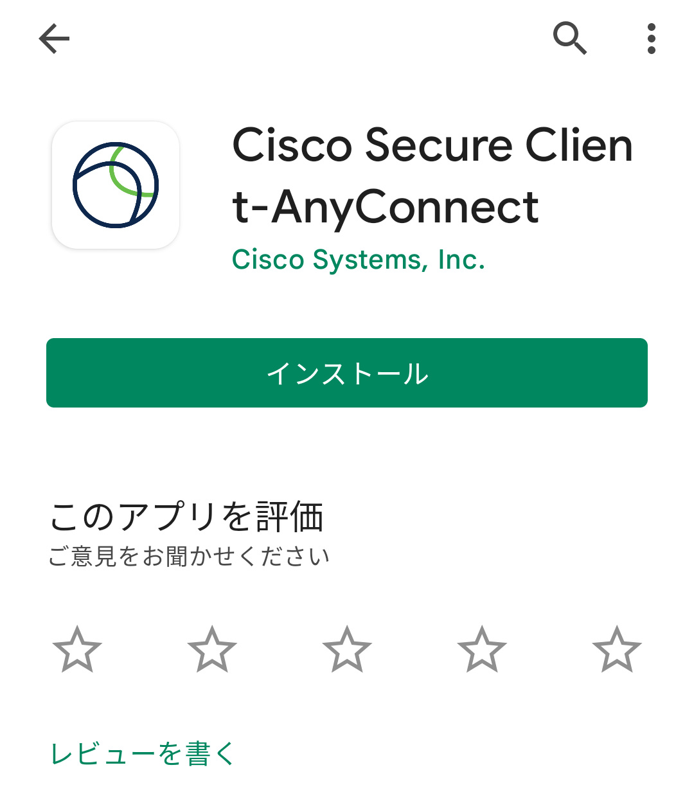
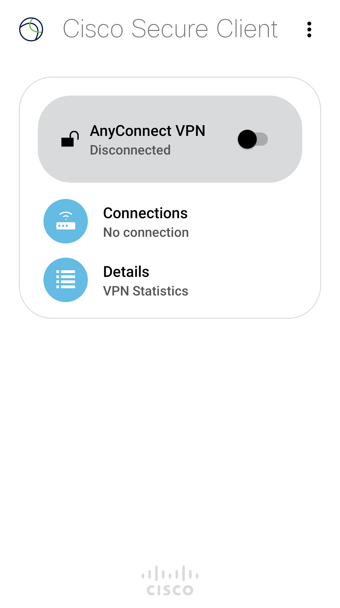
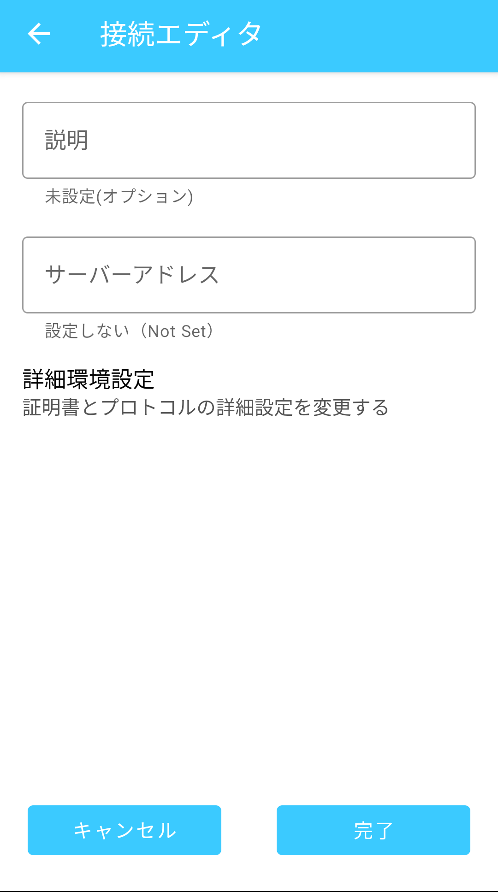
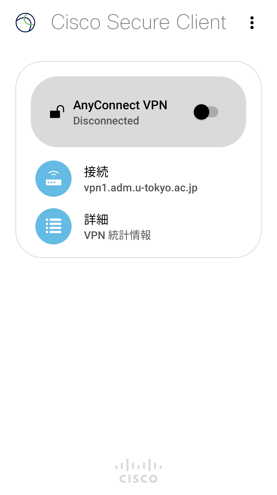
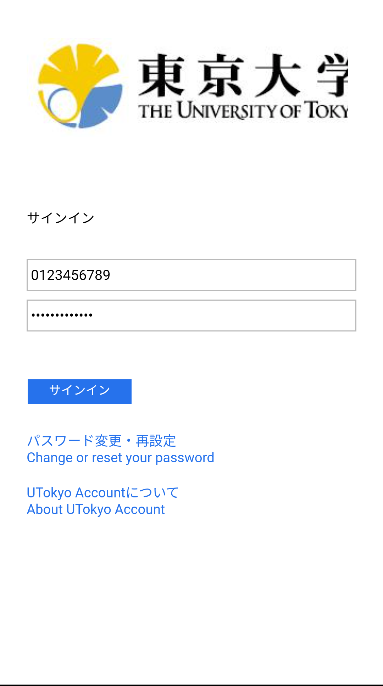

import SubpageBeginning from './_subpage_beginning.md';
import HelpMfa from './_help_mfa.html';
import HelpMultipleUsers from './_help_multiple_users.html';
import HelpSecurityEducation from './_help_security_education.html';

このページでは，UTokyo VPNをAndroidで利用する方法を説明します．

<SubpageBeginning />

## 準備編: UTokyo VPNの初期設定
{:#setup}

まずはUTokyo VPNに接続するために必要なアプリをインストールし，初期設定を行います．手順は通常のAndroidアプリと同様です．

**手順A:** [Google Play](https://play.google.com/store/apps/details?id=com.cisco.anyconnect.vpn.android.avf)にアクセスし，Cisco Systems社のSecure Clientというアプリをインストールします．このアプリは以前，AnyConnectという名前だったため，以下の画像ではこの2つの名前が併記されています．

{:.medium.center.border}

**手順B:** インストールを終えてSecure Clientアプリを開くと，以下の1枚目のような画面が出るので内容を確認のうえ「OK」をタップしてください．2枚目のような画面が出たらインストールは完了です．

<figure class="gallery">
  
  
</figure>

**手順C:** 上の画面で「Connections」（日本語で表示されている場合は「接続」）をタップし，続いて右下のプラス「＋」ボタンをタップします．以下のような「接続エディタ」が表示されるので，「サーバーアドレス」をタップして **vpn1.adm.u-tokyo.ac.jp** と入力します．

{:.medium.center.border}

**手順D:** 以下のようになっていることを確認したうえで画面下の「完了」をタップします．

{:.medium.center.border}

## 利用編: UTokyo VPNへの接続
{:#connect}

以下の手順はVPNを利用するたびに必要です．特に機器を起動した直後に自動的にVPNに接続されるわけではありませんので，ご注意ください．

**手順E:** 下図1枚目のように「接続」に「vpn1.adm.u-tokyo.ac.jp」と記載されていることを確認してください．次に，「AnyConnect VPN」の横のトグルボタンをONにして，下図2枚目のようにUTokyo Accountの認証画面が表示されたらご自身のUTokyo Accountでサインインしてください．前回のアクセスから時間をおかずに起動した場合は，この画面が表示されないで直ちにVPN接続が開始されることもあります．

<figure class="gallery">
  
  
</figure>

このとき，以下のように許可を求める画面が出ることがあります．その場合は内容を確認のうえで「OK」を押してください．

{:.medium.center.border}

<HelpMfa />
<HelpSecurityEducation />

**手順F:** 認証に成功すれば，VPNへの接続は完了です．ZoomやWebexなどVPNを経由する必要のない一部の通信や電子ジャーナルサイトなどを除く全ての通信は，このVPNを経由して，東京大学キャンパスネットワークに接続している状態で行われます．

**手順G:** 以下のようにSecure Clientアプリの下に「接続中」と表示されていれば，お使いの機器はUTokyo VPNに接続している状態です．

{:.medium.center.border}

VPNを切断する際は，この画面のトグルボタンをタップして「切断されました」になったことを確認してください．

---

[UTokyo VPN全体のページに戻る](.)
