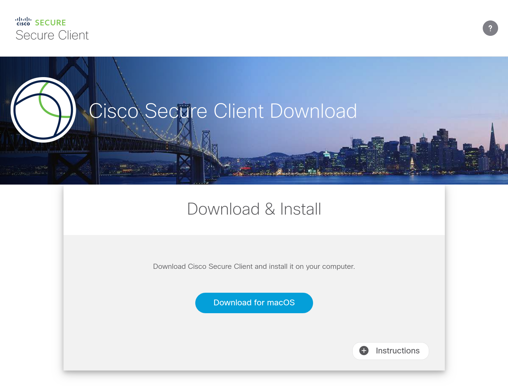
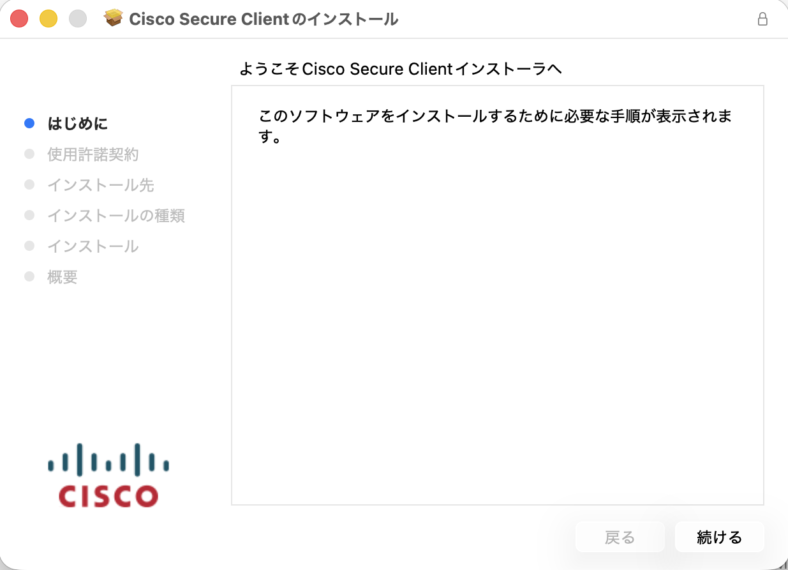
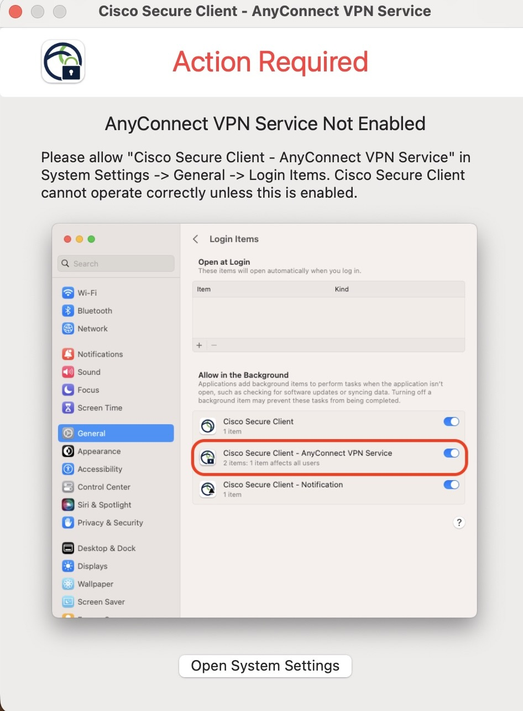
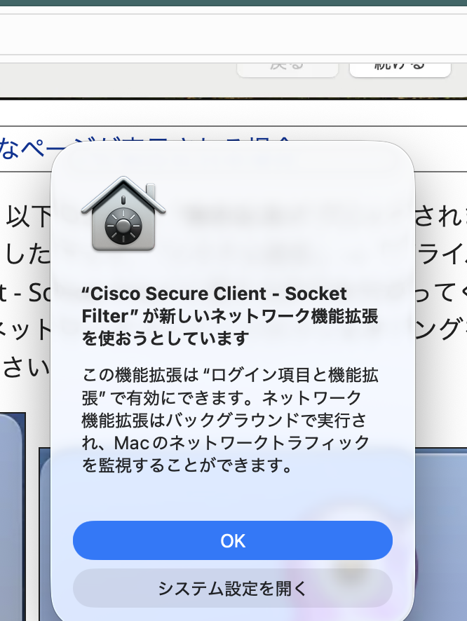
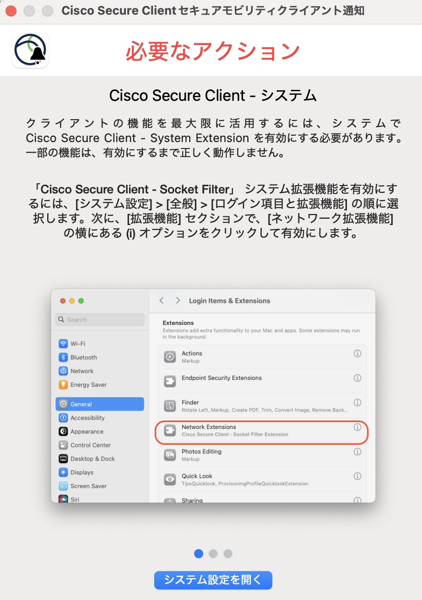
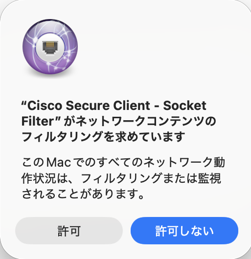
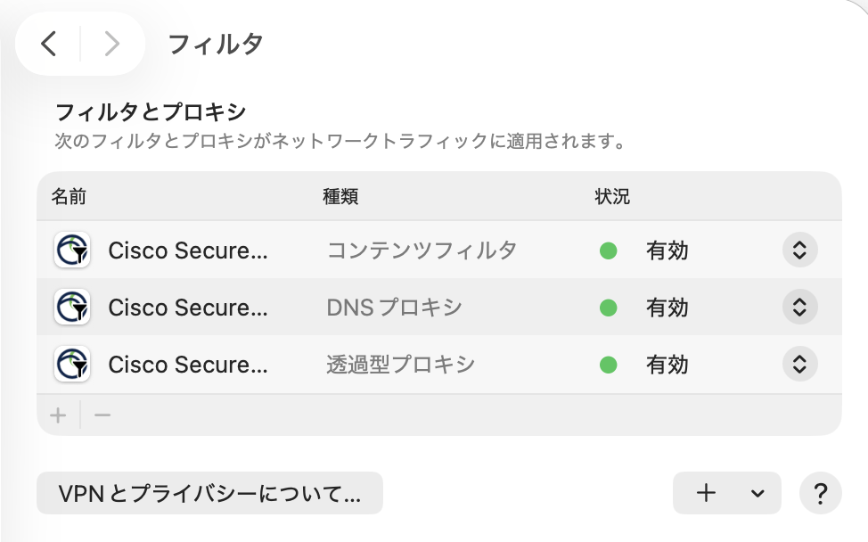
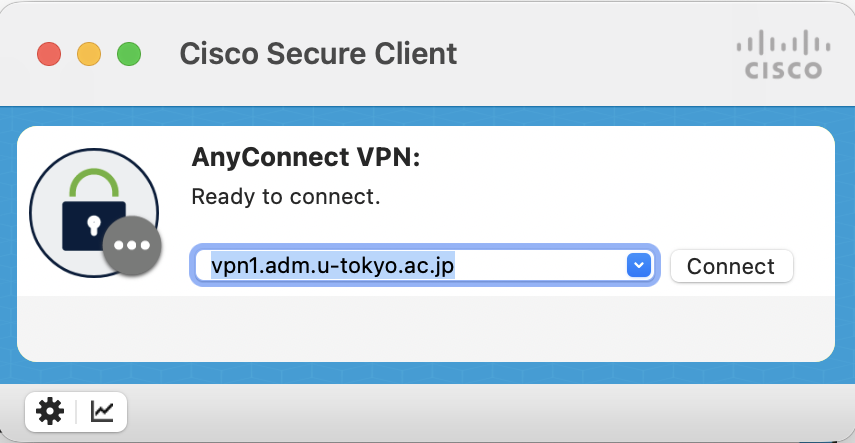

import SubpageBeginning from './_subpage_beginning.md';
import HelpMfa from './_help_mfa.html';
import HelpWhite from './_help_white.html';
import HelpSecurityEducation from './_help_security_education.html';
import HelpMultipleUsers from './_help_multiple_users.html';
import HelpCiscoSecureClient from './_help_cisco_secure_client.md';

このページでは，UTokyo VPNをmacOSのコンピュータで利用する方法を説明します．

<SubpageBeginning />

## 準備編: UTokyo VPNの初期設定
{:#setup}

まずはUTokyo VPNに接続するために必要なアプリケーション（Cisco Secure Client）をインストールします．

**手順A:**
[https://vpn1.adm.u-tokyo.ac.jp/](https://vpn1.adm.u-tokyo.ac.jp/) にアクセスします．既にUTokyo Accountにサインイン済みの場合を除き，UTokyo Accountのサインイン画面が表示されるので，サインインしてください．

<HelpMfa />
<HelpSecurityEducation />

**手順B:** サインインに成功すると，以下のようなダウンロードページが表示されるので，「Download for macOS」をクリックしてください．Cisco Secure Clientのインストーラがダウンロードされます．

その後は他のmacOS用アプリケーションと同様にインストールします．

{:.medium.center.border}
{:.medium.center.border}

<HelpWhite />

**手順C:**Cisco Secure Clientのインストールの途中で，以下のような「Action Required AnyConnect VPN Service Not Enabled」というポップアップが表示されます．ポップアップの指示に従って，「システム設定」→「一般」→「ログイン項目と機能拡張」にすすみ，「アプリのバックグラウンドでのアクティビティ」の"Cisco Secure Client - AnyConnect VPN Service"を有効にしてください．また，以下のような「"Cisco Secure Client - Socket Filter"が新しいネットワーク機能拡張を使おうとしています」というポップアップが表示されたら，OKをクリックしてください．

{:.medium.center.border}
{:.medium.center.border}

**手順D**
以下のような「Cisco Secure Clientセキュアモビリティクライアント通知」というポップアップが表示されたら，表示される手順にしたがって，「システム設定」→「一般」→「ログイン項目と機能拡張」にすすみ，「機能拡張」の「カテゴリ別」を選択し「ネットワーク機能拡張」の右にあるiボタンをクリックして"Cisco Secure Client - Socket Filter"を有効にしてください．この際，以下のような「"Cisco Secure Client - Socket Filter"がネットワークコンテンツのフィルタリングを求めています」というポップアップが表示されたら，許可をクリックしてください．

{:.medium.center.border}
{:.medium.center.border}

**手順E:** インストールが完了すると，アプリケーションフォルダに「Cisco」というフォルダが作成され，その中にVPNのクライアントアプリケーションであるCisco Secure Clientがインストールされています．

{:.medium.center.border}

これで準備は完了です．

macOS 11 Big Sur以降のmacOSにCisco Secure Clientをインストールすると，「システム環境設定」→「ネットワーク」→「フィルタ」（または，「VPNとフィルタ」）に以下のような Cisco Secure Client - Socket Filter という3つの拡張機能が追加されます．これらの拡張機能はUTokyo VPN接続時に通信を振り分けるために必要な機能として常駐しており，通信内容の記録やホスト外への情報送付も行いません．またこれらはUTokyo VPNに接続しているか否かに関わらず常時接続状態になります．

{:.medium.center.border}

## 利用編: UTokyo VPNへの接続
{:#connect}

以下の手順はVPNを利用するたびに必要です．特にPCを起動した直後に自動的にVPNに接続されるわけではありませんので，ご注意ください．

**手順F:** 準備編でインストールしたCisco Secure Clientを起動すると，以下のような画面が出てきます．VPN接続先として **vpn1.adm.u-tokyo.ac.jp** と入力し，「Connect」ボタンをクリックします．

{:.medium.center.border}

**手順G:** 「Connect」ボタンを押してください．既にUTokyo Accountにサインイン済みの場合を除き，UTokyo Accountのサインイン画面が表示されるので，サインインしてください．

<HelpMfa />
<HelpSecurityEducation />
<HelpCiscoSecureClient />

**手順H:** サインインに成功すれば，VPNへの接続は完了です．ZoomやWebexなどVPNを経由する必要のない一部の通信や電子ジャーナルサイトなどを除く全ての通信は，このVPNを経由して，東京大学キャンパスネットワークに接続している状態で行われます．

**手順I:** 再度Cisco Secure Clientをクリックし，現在の状態を確認します．表示された画面で，以下のように「Connected to vpn1.adm.u-tokyo.ac.jp.」と表示されていれば，お使いの機器はUTokyo VPNに接続している状態です．

VPNを切断する際は，この画面の「Disconnect」ボタンをクリックしてください．

{:.medium.center.border}
