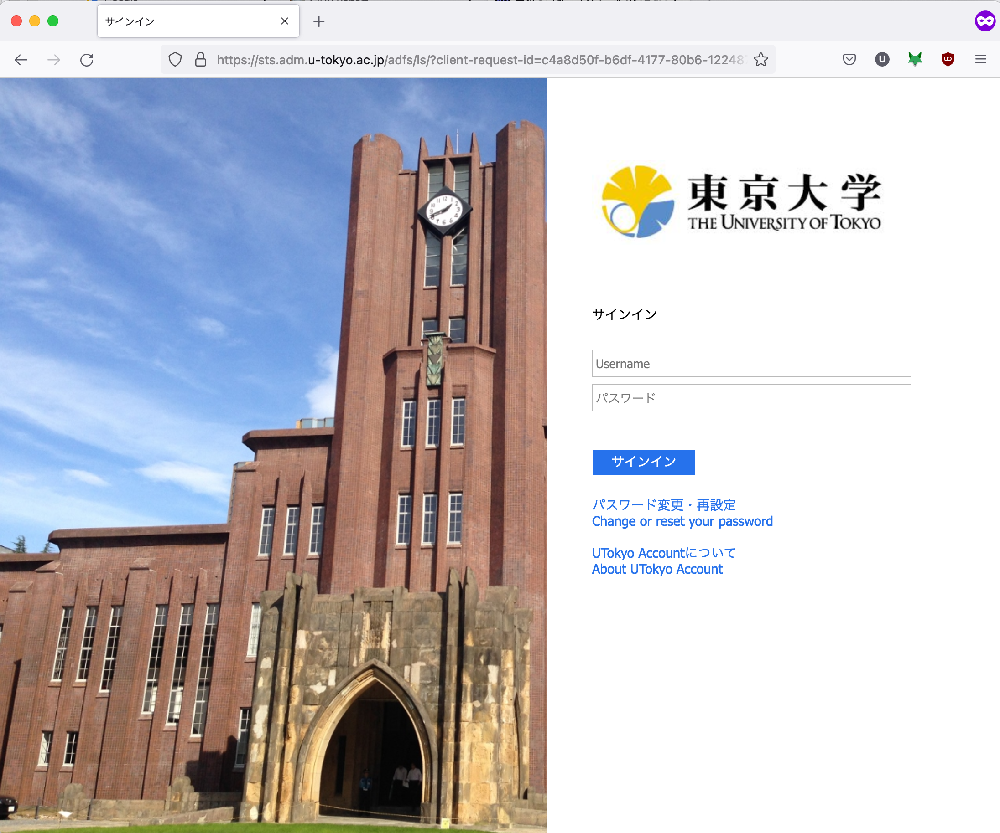
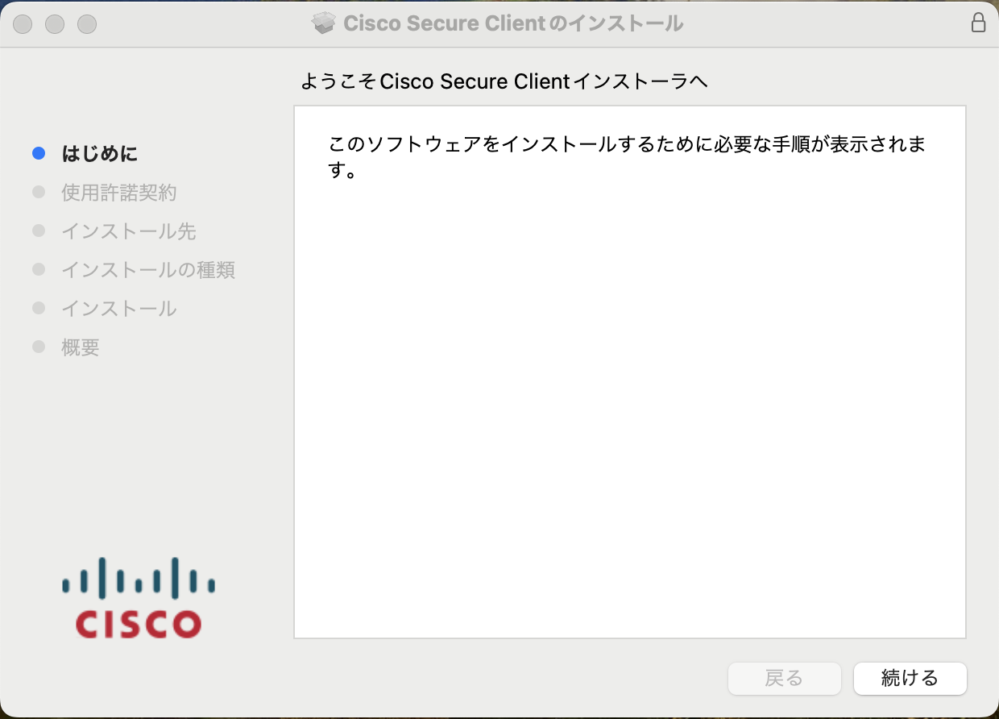
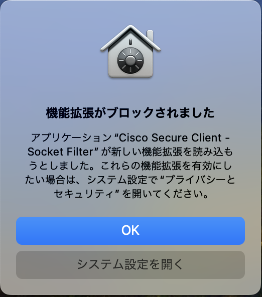
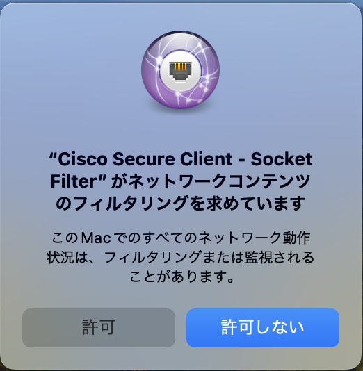
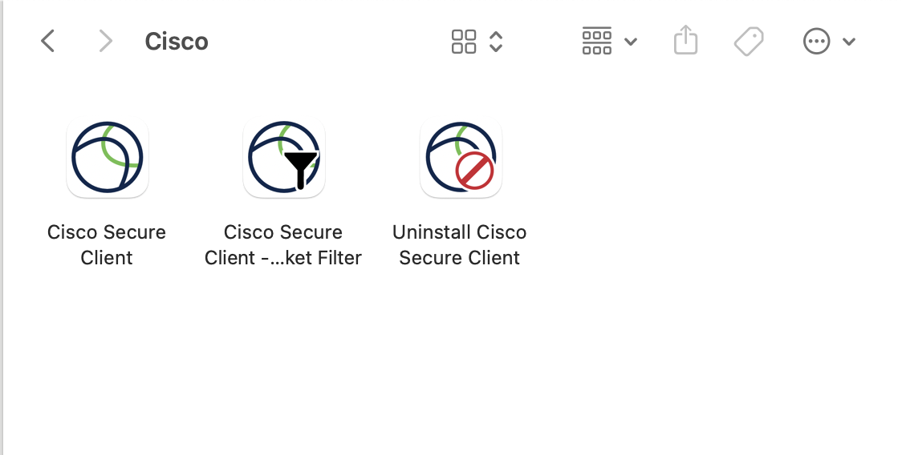
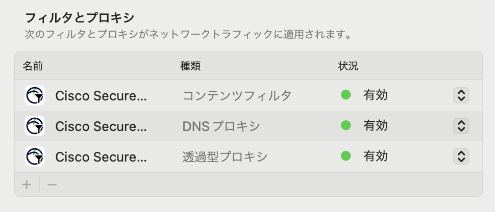
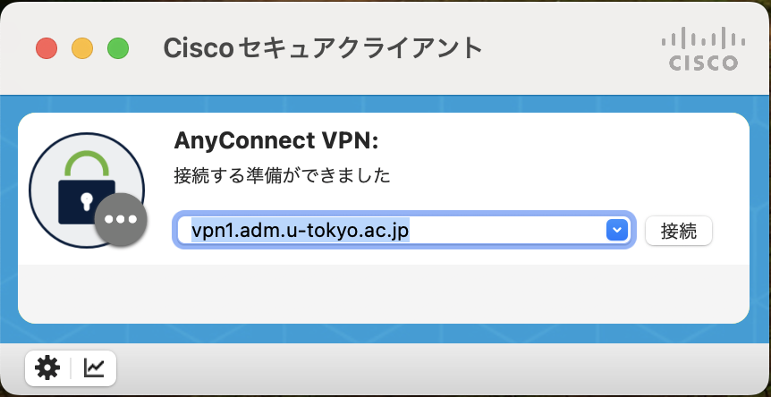
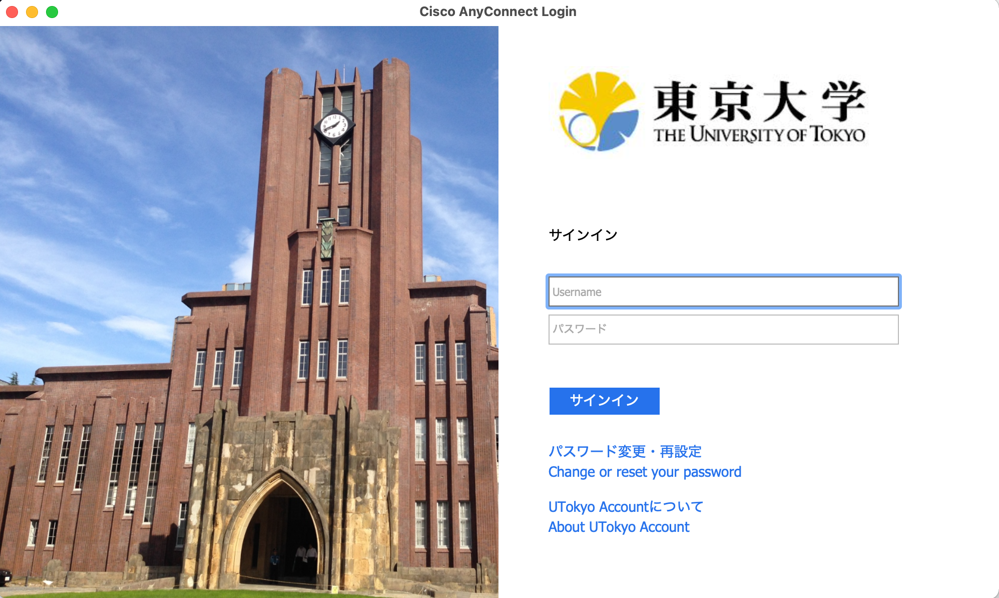
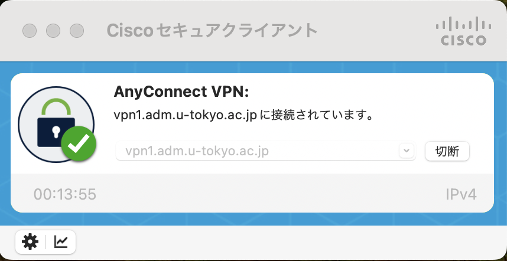

import SubpageBeginning from './_subpage_beginning.md';
import HelpMfa from './_help_mfa.html';
import HelpWhite from './_help_white.html';
import HelpSecurityEducation from './_help_security_education.html';
import HelpMultipleUsers from './_help_multiple_users.html';

このページでは，UTokyo VPNをmacOSのコンピュータで利用する方法を説明します．

<SubpageBeginning />

## 準備編: UTokyo VPNの初期設定
{:#setup}

まずはUTokyo VPNに接続するために必要なアプリケーションをインストールします．

**手順A:**
[https://vpn1.adm.u-tokyo.ac.jp/](https://vpn1.adm.u-tokyo.ac.jp/) にアクセスします．以下のようにUTokyo Accountの認証ページが表示されたら，ご自身のUTokyo Accountでサインインしてください．

{:.medium.center.border}

<HelpMfa />
<HelpSecurityEducation />

**手順B:** サインインに成功すると，以下のようなAnyConnectのクライアントアプリケーションをダウンロードするためのページが表示されるので，Download for macOSをクリックして，クライアントアプリケーションをダウンロードしてください．

その後は他のmacOS用アプリケーションと同様にインストールします．

{:.medium.center.border}
{:.medium.center.border}

<HelpWhite />

**手順C:** AnyConnectのインストールの途中で，以下のような「機能拡張がブロックされました」という画面が出る場合があります．その際は表示される手順にしたがって，「システム設定」→「プライバシーとセキュリティ」のペインに表示されている"Cisco Secure Client - Socket Filter"に関する許可を行なってください． また以下のような「"Cisco Secure Client - Socket Filter"がネットワークコンテンツのフィルタリングを求めています」という画面が表示されますので，これも許可してください．

<figure class="gallery">
  
  
</figure>

**手順D:** インストールが完了すると，アプリケーションフォルダに「Cisco」というフォルダが作成され，その中にAnyConnectのクライアントアプリケーションであるCisco Secure Clientがインストールされています．

{:.medium.center.border}

これで準備は完了です．

macOS 11 Big Sur以降のmacOSにAnyConnectのクライアントアプリケーションをインストールすると，「システム環境設定」→「ネットワーク」に以下のような Cisco Secure Client - Socket Filter という3つの拡張機能が追加されます．これらの拡張機能はUTokyo VPN接続時に通信を振り分けるために必要な機能として常駐しており，通信内容の記録やホスト外への情報送付も行いません．
またこれらはUTokyo VPNに接続しているか否かに関わらず常時接続状態になります．

{:.medium.center.border}

## 利用編: UTokyo VPNへの接続
{:#connect}

以下の手順はVPNを利用するたびに必要です．特にPCを起動した直後に自動的にVPNに接続されるわけではありませんので，ご注意ください．

**手順E:** 準備編でインストールしたCisco Secure Clientを起動すると，以下のような画面が出てきます．VPN接続先として **vpn1.adm.u-tokyo.ac.jp** と入力し，「接続」ボタンをクリックします．

{:.medium.center.border}

**手順F:** 「接続」ボタンを押し，以下のようなUTokyo Accountの認証画面が表示されたらご自身のUTokyo Accountでサインインしてください．前回のアクセスから時間をおかずに起動した場合は，この画面が表示されないで直ちにVPN接続が開始されることもあります．

{:.medium.center.border}

<HelpMfa />
<HelpSecurityEducation />

**手順G:** 認証に成功すれば，VPNへの接続は完了です．ZoomやWebexなどVPNを経由する必要のない一部の通信や電子ジャーナルサイトなどを除く全ての通信は，このVPNを経由して，東京大学キャンパスネットワークに接続している状態で行われます．

**手順H:** 再度Cisco Secure Clientをクリックし，現在の状態を確認します．表示された画面で，以下のように「vpn1.adm.u-tokyo.ac.jpに接続されています。」と表示されていれば，お使いの機器はUTokyo VPNに接続している状態です．

VPNを切断する際は，この画面の「切断」ボタンをクリックしてください．

{:.medium.center.border}

---

[UTokyo VPN全体のページに戻る](.)
