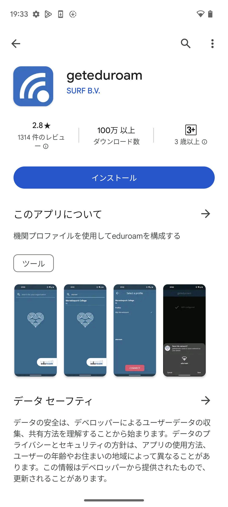
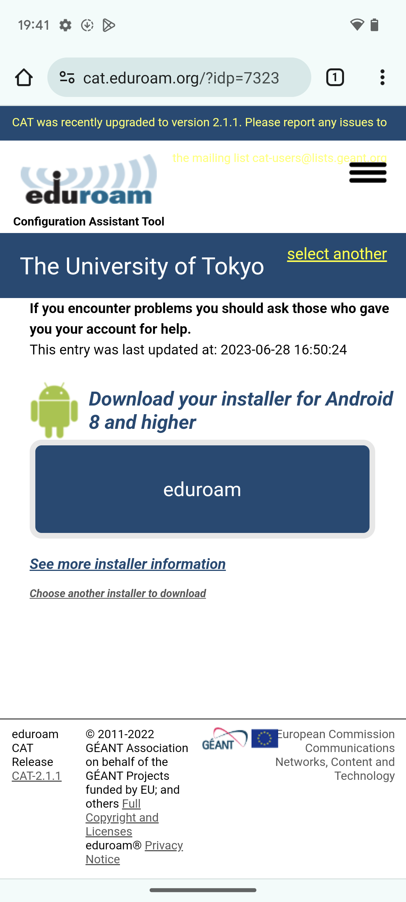
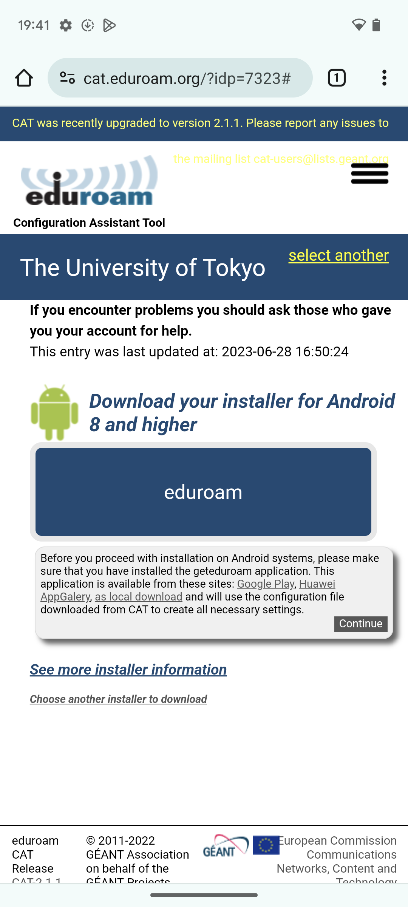
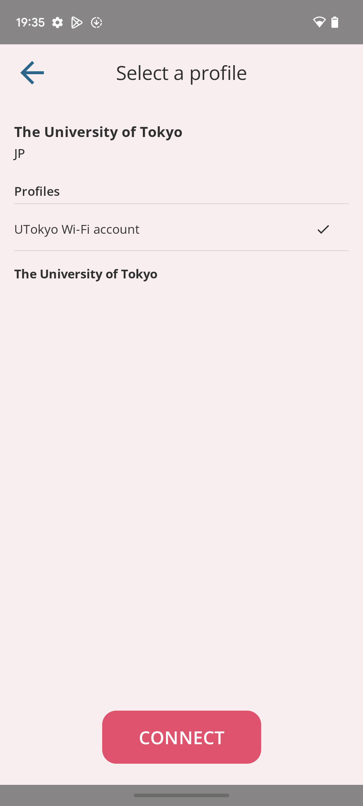

UTokyo Wi-Fiを利用するには，通常，[必要な設定情報を手作業で入力する](/utokyo_wifi/android/#procedure)必要がありますが，この記事では，Android端末でこの操作を半自動化する設定支援ツール「geteduroam」をご紹介します．

geteduroamを用いてWi-Fiを利用するには，専用の設定ファイルを用います．東京大学では，geteduroamでUTokyo Wi-Fiを利用するための設定ファイルを公開しており，これを適用することでスムーズにUTokyo Wi-Fiを利用できます．

なお，UTokyo Wi-Fiの利用に関する全般的な説明は， [UTokyo Wi-Fi全般の説明ページ](/utokyo_wifi/)に記載されていますので，あらかじめそちらも確認してください．

## 事前の準備

実際に接続して利用する前に，いくつか準備が必要です．これらの準備は，UTokyo Wi-Fiを利用する現地（大学の教室など）でなくても行うことができ，またアプリのダウンロード等が必要なため，別途通信環境がある場所で行ってください．

### UTokyo Wi-Fiアカウントの発行を申請する

初めて接続する場合や，アカウントの再発行が必要な場合は，UTokyo Wi-Fi全般の説明ページの，利用開始までの手順の「[準備編](/utokyo_wifi/#apply)」の説明に沿ってアカウントの発行を申請してください．

発行されたUTokyo Wi-Fiアカウントは，複数の端末で利用可能です．2台目以降の端末をUTokyo Wi-Fiに接続する際も，同じアカウントをご利用いただけます．

### 設定支援ツールを準備する
{:#app-preparation}

今回利用するAndroid端末で初めて設定支援ツール「geteduroam」を用いてUTokyo Wi-Fiを利用する場合は，geteduroamのインストールと設定ファイルのダウンロードが必要です。

既にこれらの操作を行ったことがある端末では，再度行う必要はありません．「[実際に接続する手順](#connection-procedure)」に進んでください．

1. 「[geteduroam](https://play.google.com/store/apps/details?id=app.eduroam.geteduroam&hl=ja&gl=US&pli=1)」というアプリをGoogle Playストアからインストールしてください．
    {:.small .border}
2. [東京大学用の設定ファイル配布ページ](https://cat.eduroam.org/?idp=7323)にアクセスしてください．
3. ページタイトルが「The University of Tokyo」となっていることを確認してください．また「eduroam」というボタンの上に表示されている内容が，ご自身の端末で用いているOSのバージョンに合致していることを確認してください．合致していない場合は「Choose another installer to download」をタップして正しいものを選択してください．
    {:.small .border}
4. 「eduroam」というボタンを押してください．すると，ボタンの下に「geteduroamのアプリをダウンロードしていますか？」という趣旨の英語のメッセージが表示されるので，「Continue」を押して設定ファイルをダウンロードしてください．
    {:.small .border}

これで事前の準備は終了です．

### 実際に接続する手順
{:#connection-procedure}

ここからの手順は，大学内で実際にUTokyo Wi-Fiに接続するための手順です．

1. Androidの設定アプリの「ネットワークとインターネット」メニューの中から「インターネット」という設定項目を探し，Wi-Fi機能をオンにしてください． ただし，機種によって実際のメニューの名前は異なる場合があります．必要に応じて適当なカテゴリの中から該当する設定項目を探してください．
2. Wi-Fi機能をオンにして少し待つと，Wi-Fi接続設定画面にSSIDの一覧が表示されます．SSIDとは，Wi-Fiの信号を識別するための名前のことです．このSSIDの一覧の中に，`0000UTokyo`というSSIDがあることを確認してください．
    

    
`0000UTokyo`というSSIDが見つからない場合は

    場所によっては，UTokyo Wi-Fiの電波が届いていない可能性があります．場所を変えて再度試してみてください．これまで問題なく利用できていたにもかかわらずSSIDが見つからない場合は，[uteleconサポート窓口](/support/)から問い合わせてください．
    

3. 「事前の準備」でインストールした「geteduroam」アプリを起動してください．
4. アプリを起動すると，「Search for youe Organization」の画面が表示されます．この画面で検索を行い，「The University of Tokyo」を選択してください．すると「Select a profile」の画面が表示されるので，「UTokyo Wi-Fi Account」を選択してください．
    {:.small .border}
5. 「Select a profile」の画面の一番下にある「CONNECT」ボタンを押すと，IDとパスワードを入力する画面が表示されます．ここに，UTokyo Wi-FiアカウントのユーザID（`u`から始まり`@wifi.u-tokyo.ac.jp`で終わるもの）とパスワードを入力し，「Log in」ボタンを押してください．

## うまくいかないときは

「[UTokyo Wi-Fiのトラブルシューティング](/utokyo_wifi/trouble_shooting/)」のページを参照してください．

なお，設定支援ツールがうまく動かない場合，必要な設定情報を手作業で入力することで改善するかもしれません．「[AndroidでUTokyo Wi-Fiを利用する](/utokyo_wifi/android/)」の手順も試してみてください．
