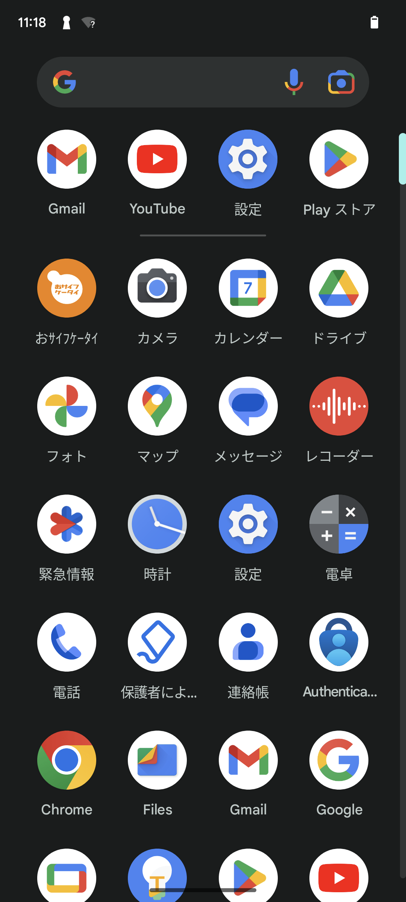
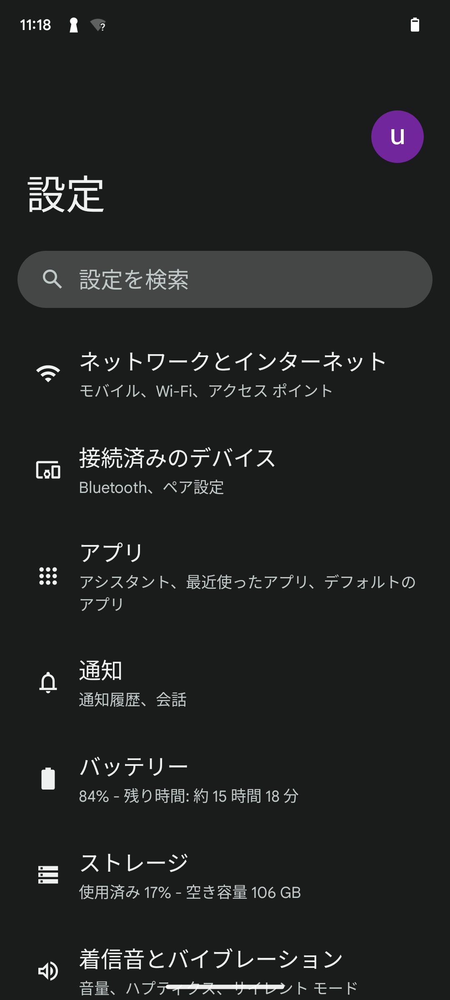
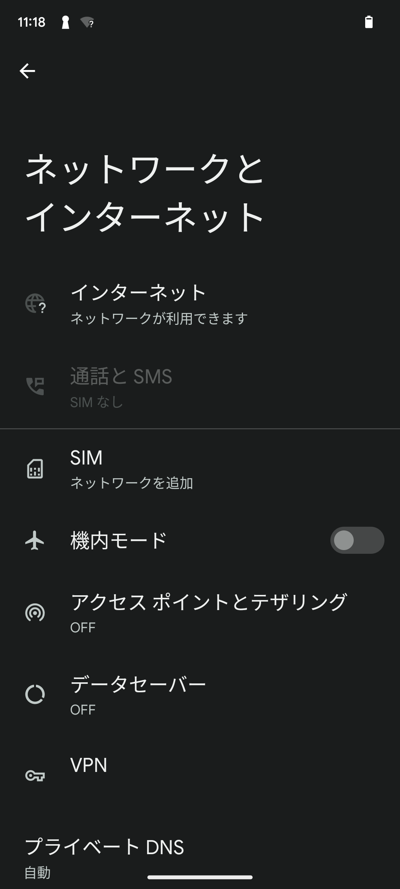
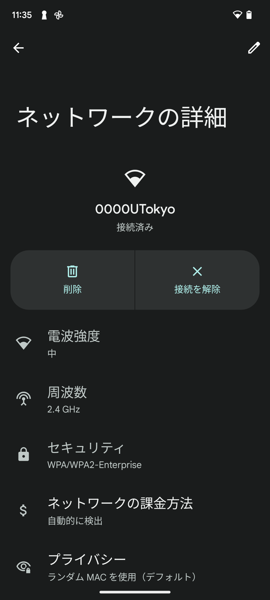
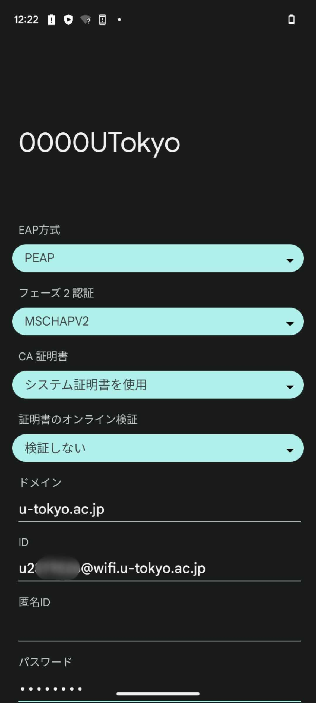

import Intro from "./_Intro.astro"
import IssueAccount from "./_IssueAccount.mdx"
import SelectSsid from "./_SelectSsid.astro"
import DeleteProfile from "./_DeleteProfile.astro"
import TroubleConnect from "./_TroubleConnect.mdx"

import Mfa100 from "./_Mfa100.mdx";

<Mfa100 />

<Intro kindOfTerminal="Androidの端末" confirmedTerminal="（Android 13が搭載されたPixel 6a）"/>

## 準備編：UTokyo Wi-Fiアカウントの発行を申請する
{:#issue-account}
<IssueAccount />

## 利用編：Androidでの手順
{:#procedure}
### 手順1：端末の「設定」アプリでWi-Fi機能をオンにする
{:#turn-on}
設定アプリの「ネットワークとインターネット」メニューの中から「インターネット」という設定項目を探し，Wi-Fi機能をオンにしてください．
ただし，機種によって実際のメニューの名前は異なる場合があります．必要に応じて適当なカテゴリの中から該当する設定項目を探してください．以降の手順でも同様ですので，適宜読み替えながら設定を進めてください．
<figure class="gallery">{:.medium.center.border}{:.medium.center.border}{:.medium.center.border}{:.medium.center.border}</figure>

### 手順2：SSIDの一覧から接続先のSSIDを選択する
{:#select-ssid}
<SelectSsid  userIdField="ID"/>

### 手順3：既存のWi-Fiの設定情報を削除する
{:#delete-profile}
<DeleteProfile  userIdField="ID"/>
手順2で見つけたSSIDをタップし，「ネットワークの詳細」の画面を開きます．ネットワークの詳細画面で，設定情報をいったん削除してください．
{:.medium.center.border}

### 手順4：必要な設定情報を入力し接続する
{:#create-profile}
SSIDの一覧の中から，`0000UTokyo`というSSIDを再度選択してください．
SSIDを選択すると，Wi-Fiの設定情報を入力する画面が表示されます．下記の説明に沿って，必要な設定情報を各欄に入力してください．下で説明されているのに入力画面に表示されなかった項目は，特に設定しなくてかまいません．設定情報を入力したら，接続ボタンを選択してください．

| 設定欄の名称      | 設定内容     |
| :-----------: | :------------------- |
| EAP方式       | 「PEAP」を選択してください       |
| フェーズ2認証     | 「MSCHAPV2」を選択してください         |
| CA証明書       | 「**システム証明書を使用**」を選択してください             |
| 証明書のオンライン検証 | 「検証しない」または「証明書のステータスをリクエストする」を選択してください          |
| ドメイン        | `u-tokyo.ac.jp`と入力してください     |
| ID          | UTokyo Wi-FiのユーザーID（`u`から始まり`@wifi.u-tokyo.ac.jp`で終わるもの）を入力してください |
| 匿名ID        | 空欄のままにしてください          |
| パスワード       | UTokyo Wi-Fiのパスワードを入力してください      |
| IP設定        | 「DHCP」を選択してください      |

{:.medium.center.border}

#### 補足
{:#create-profile-notes}
* 「CA証明書」欄で「システム証明書を使用」を選択できない場合や，選択してもうまくいかない場合は，「初回使用時に信頼する」を選択してみてください．
* 「ID」欄と「パスワード」欄には、UTokyo Wi-FiアカウントのユーザーIDとパスワードをそれぞれ入力してください．UTokyo Accountの共通ID・パスワードではありません．ユーザーIDとパスワードは，「**[準備編](#issue-account)**」の手順で受け取った通知メールから確認できるほか，申請直後であれば「UTokyo Wi-Fiアカウントメニュー」の申請完了画面にも表示されています．
* 上の表に掲げた以外の設定項目は，必要に応じて設定してください．特にお好みがなければ，初期設定のままでかまいません．

## うまくいかないときは
{:#trouble-connect}
<TroubleConnect />
